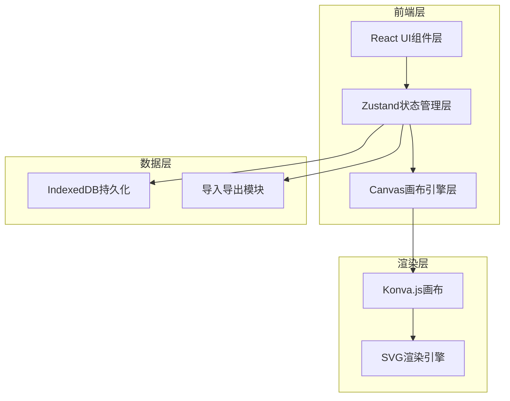
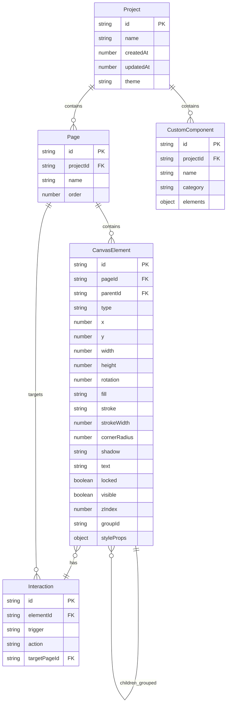

## 1. 架构设计

## 2. 技术说明

- **前端框架**：React@18 + TypeScript + Vite
- **样式方案**：Tailwind CSS@3
- **状态管理**：Zustand（含undo/redo中间件）
- **画布引擎**：Konva.js（react-konva）— 提供高性能2D画布渲染、拖拽、变换、分组能力
- **持久化**：IndexedDB（通过idb库封装）
- **图标**：lucide-react
- **导出**：html-to-image（PNG导出）、原生JSON序列化
- **初始化工具**：vite-init，模板选择 react-ts
- **后端**：无（纯前端应用）

## 3. 路由定义

| 路由 | 用途 |
|------|------|
| / | 项目列表页，管理所有原型项目 |
| /editor/:projectId | 编辑器主页，包含画布/组件库/属性面板 |
| /preview/:projectId | 预览模式页，全屏播放原型 |

## 4. API定义

无后端API，所有数据通过IndexedDB本地持久化。

## 5. 数据模型

### 5.1 数据模型定义

### 5.2 数据定义

所有数据以JSON格式存储在IndexedDB中，包含以下Object Store：

- **projects**：项目主表，keyPath = id
- **pages**：页面表，keyPath = id，索引 projectId
- **elements**：元素表，keyPath = id，索引 pageId
- **interactions**：交互事件表，keyPath = id，索引 elementId
- **customComponents**：自定义组件表，keyPath = id，索引 projectId

## 6. 核心技术方案

### 6.1 画布引擎

使用 Konva.js 作为画布渲染引擎：
- 每个组件渲染为 Konva 对应形状（Rect、Circle、Group等）
- 选中元素显示 Transformer（变换控制器）
- 拖拽添加：组件库项设置 draggable，监听 drop 事件在画布创建元素
- 缩放平移：Konva Stage 的 scale/position 控制

### 6.2 撤销重做

基于 Zustand 中间件实现：
- 每次状态变更记录快照（基于 immer 的 patches）
- 最少保存30步操作历史
- Ctrl+Z 撤销，Ctrl+Shift+Z 重做

### 6.3 交互连线

- 交互数据存储在 Interaction 表中
- 连线渲染：在画布叠加层用 SVG 绘制页面间箭头
- 预览模式：监听元素点击事件，执行页面跳转

### 6.4 导入导出

- PNG导出：使用 Konva stage.toDataURL() 导出每页为PNG
- JSON导出：序列化项目完整数据结构（含所有页面、元素、交互）
- JSON导入：反序列化并写入IndexedDB，刷新画布

### 6.5 主题系统

- CSS变量驱动主题切换
- Zustand store 存储当前主题状态
- 画布内组件风格不随主题变化，仅UI面板切换深浅色
