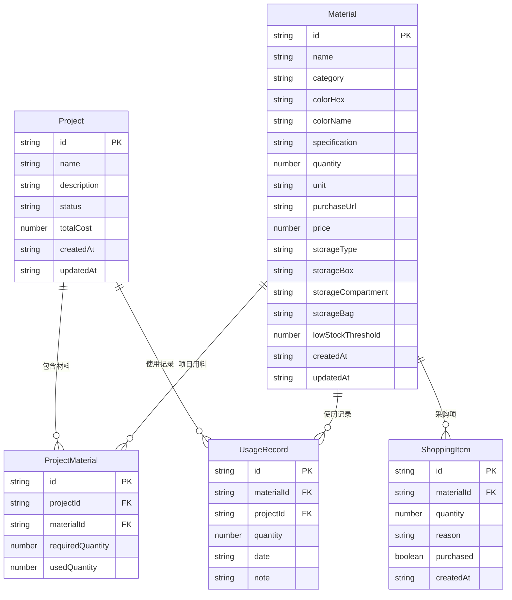

## 1. 架构设计

```mermaid
graph TB
    "React 前端" --> "Zustand 状态管理"
    "Zustand 状态管理" --> "localStorage 持久化"
    "React 前端" --> "颜色工具库"
    "React 前端" --> "React Router"
```

纯前端应用，无后端服务。使用 Zustand 管理全局状态，数据通过 localStorage 持久化存储。颜色搜索使用自定义 HSL 色距算法实现近似颜色匹配。

## 2. 技术说明

- 前端：React@18 + TypeScript + Tailwind CSS@3 + Vite
- 初始化工具：vite-init
- 后端：无（纯前端应用）
- 数据库：localStorage（浏览器本地存储）
- 状态管理：Zustand（含 persist 中间件自动同步 localStorage）
- 颜色算法：自实现 HSL 色距计算（CIE76 简化版），支持色相/饱和度/明度三维距离

## 3. 路由定义

| 路由 | 用途 |
|------|------|
| / | 首页 - 材料抽屉视图 |
| /material/new | 新增材料 |
| /material/:id | 材料详情（使用历史+统计） |
| /material/:id/edit | 编辑材料 |
| /color-search | 近似颜色搜索 |
| /projects | 项目列表 |
| /projects/new | 创建项目 |
| /projects/:id | 项目详情（用料+成本） |
| /shopping-list | 采购清单 |

## 4. API 定义

无后端 API。所有数据操作通过 Zustand store 完成。

## 5. 服务器架构图

不适用（纯前端应用）

## 6. 数据模型

### 6.1 数据模型定义



### 6.2 数据定义

**Material（材料）**
```typescript
interface Material {
  id: string
  name: string
  category: '滴胶' | '串珠' | '布艺' | '模型' | '工具' | '其他'
  colorHex: string
  colorName: string
  specification: string
  quantity: number
  unit: string
  purchaseUrl: string
  price: number
  storageType: '盒子' | '格子' | '袋子'
  storageBox: string
  storageCompartment: string
  storageBag: string
  lowStockThreshold: number
  createdAt: string
  updatedAt: string
}
```

**Project（项目）**
```typescript
interface Project {
  id: string
  name: string
  description: string
  status: '进行中' | '已完成'
  totalCost: number
  createdAt: string
  updatedAt: string
}
```

**ProjectMaterial（项目用料）**
```typescript
interface ProjectMaterial {
  id: string
  projectId: string
  materialId: string
  requiredQuantity: number
  usedQuantity: number
}
```

**UsageRecord（使用记录）**
```typescript
interface UsageRecord {
  id: string
  materialId: string
  projectId: string
  quantity: number
  date: string
  note: string
}
```

**ShoppingItem（采购项）**
```typescript
interface ShoppingItem {
  id: string
  materialId: string
  quantity: number
  reason: '低库存' | '项目缺料'
  purchased: boolean
  createdAt: string
}
```
