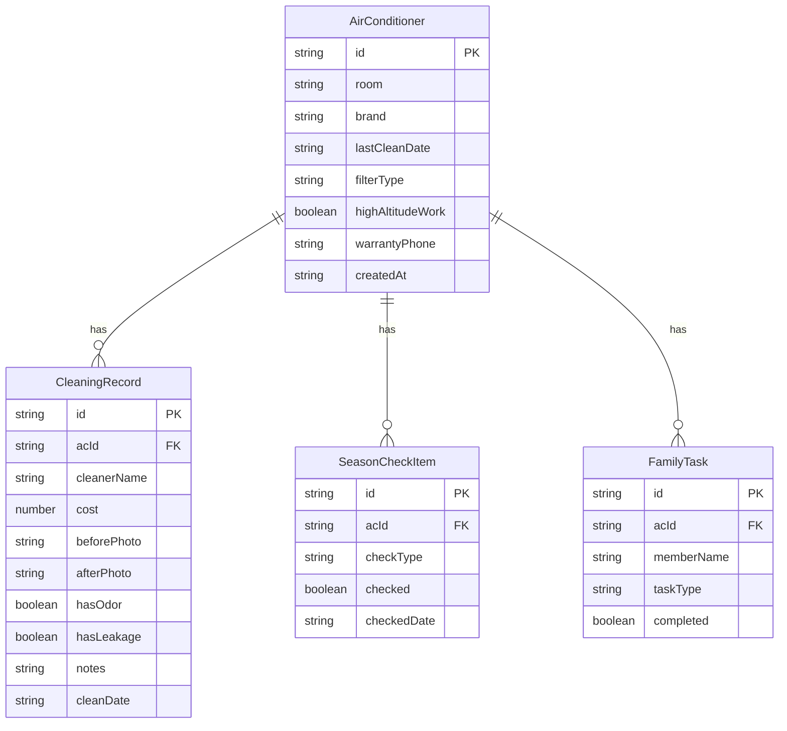

## 1. 架构设计

```mermaid
graph TB
    "前端 React App" --> "Zustand Store"
    "Zustand Store" --> "localStorage 持久化"
    "前端 React App" --> "React Router"
    "React Router" --> "首页"
    "React Router" --> "空调管理页"
    "React Router" --> "空调详情页"
    "React Router" --> "添加记录页"
    "React Router" --> "统计页"
```

纯前端应用，无后端服务。数据通过 Zustand 状态管理 + localStorage 持久化存储在浏览器本地。

## 2. 技术说明
- 前端：React@18 + TypeScript + Tailwind CSS@3 + Vite
- 初始化工具：vite-init (react-ts 模板)
- 状态管理：Zustand（含 persist 中间件自动持久化到 localStorage）
- 路由：React Router DOM v6
- 图标：lucide-react
- 无后端，数据存储在浏览器 localStorage

## 3. 路由定义

| 路由 | 用途 |
|------|------|
| / | 首页 - 空调分组展示、换季提醒 |
| /add | 添加空调 |
| /edit/:id | 编辑空调信息 |
| /ac/:id | 空调详情页（含清洗记录、换季清单、家人分工） |
| /ac/:id/record | 添加清洗记录 |
| /stats | 统计页 |

## 4. API 定义
无后端 API，所有数据操作通过 Zustand Store 完成。

## 5. 数据模型

### 5.1 数据模型定义



### 5.2 数据定义

```typescript
interface AirConditioner {
  id: string
  room: string
  brand: string
  lastCleanDate: string
  filterType: 'normal' | 'hepa' | 'carbon'
  highAltitudeWork: boolean
  warrantyPhone: string
  createdAt: string
}

interface CleaningRecord {
  id: string
  acId: string
  cleanerName: string
  cost: number
  beforePhoto: string
  afterPhoto: string
  hasOdor: boolean
  hasLeakage: boolean
  notes: string
  cleanDate: string
}

interface SeasonCheckItem {
  id: string
  acId: string
  checkType: 'remote_battery' | 'drain_pipe' | 'outdoor_obstacle' | 'filter_status'
  checked: boolean
  checkedDate: string
}

interface FamilyTask {
  id: string
  acId: string
  memberName: string
  taskType: 'contact_technician' | 'wait_at_home' | 'inspect'
  completed: boolean
}
```

数据全部存储在 localStorage，通过 Zustand persist 中间件自动同步。
