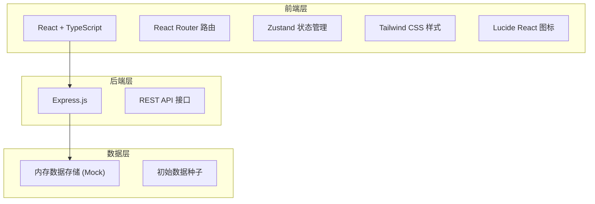
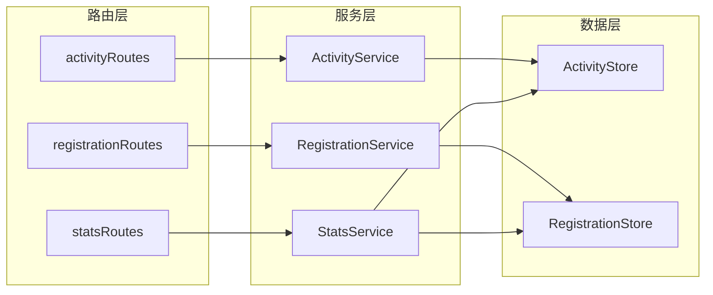
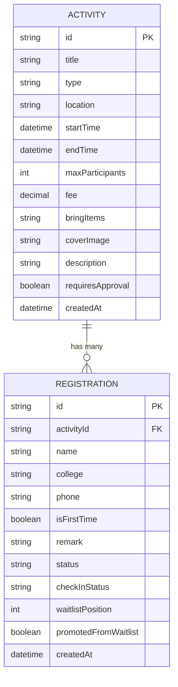

## 1. 架构设计



## 2. 技术说明

- **前端**：React@18 + TypeScript + Vite
- **样式**：Tailwind CSS@3
- **状态管理**：Zustand
- **路由**：react-router-dom
- **图标**：lucide-react
- **后端**：Express@4
- **数据库**：内存存储（Mock 数据演示用）
- **初始化工具**：vite-init
- **项目模板**：react-express-ts

## 3. 路由定义

| 路由路径 | 页面用途 |
|---------|----------|
| `/` | 首页 - 活动分类展示 |
| `/activity/:id` | 活动详情页 - 活动信息与报名 |
| `/admin/create` | 发布活动页 - 管理员创建活动 |
| `/admin/manage/:id` | 活动管理页 - 报名列表与签到 |
| `/admin/checkin/:id` | 签到页 - 扫码/手动签到 |
| `/admin/stats` | 统计页 - 数据看板 |

## 4. API 定义

### 4.1 类型定义

```typescript
// 活动类型
type ActivityType = 'lecture' | 'boardgame' | 'photoshoot' | 'volunteer';

// 活动状态
type ActivityStatus = 'upcoming' | 'ongoing' | 'ended';

// 报名状态
type RegistrationStatus = 'registered' | 'waitlist' | 'cancelled';

// 签到状态
type CheckInStatus = 'pending' | 'checked' | 'absent';

// 活动
interface Activity {
  id: string;
  title: string;
  type: ActivityType;
  location: string;
  startTime: string;
  endTime: string;
  maxParticipants: number;
  fee: number;
  bringItems: string;
  coverImage: string;
  description: string;
  requiresApproval: boolean;
  createdAt: string;
}

// 报名记录
interface Registration {
  id: string;
  activityId: string;
  name: string;
  college: string;
  phone: string;
  isFirstTime: boolean;
  remark: string;
  status: RegistrationStatus;
  checkInStatus: CheckInStatus;
  waitlistPosition: number;
  createdAt: string;
  promotedFromWaitlist: boolean;
}

// 统计数据
interface ActivityStats {
  activityId: string;
  activityTitle: string;
  totalRegistered: number;
  checkedIn: number;
  attendanceRate: number;
  waitlistPromoted: number;
}
```

### 4.2 接口列表

| 方法 | 路径 | 说明 |
|------|------|------|
| GET | `/api/activities` | 获取活动列表 |
| GET | `/api/activities/:id` | 获取活动详情 |
| POST | `/api/activities` | 创建活动 |
| GET | `/api/activities/:id/registrations` | 获取活动报名列表 |
| POST | `/api/activities/:id/register` | 报名活动 |
| PUT | `/api/registrations/:id/cancel` | 取消报名 |
| PUT | `/api/registrations/:id/checkin` | 签到 |
| PUT | `/api/registrations/:id/absent` | 标记缺席 |
| GET | `/api/stats` | 获取统计数据 |

## 5. 服务端架构图



## 6. 数据模型

### 6.1 数据模型定义



### 6.2 初始数据

系统预置以下 Mock 数据用于演示：
- 4 个不同类型的活动（讲座、桌游夜、外拍、志愿服务）
- 10-15 条报名记录，包含不同状态（已报名、候补、已取消）
- 部分签到数据用于统计展示
