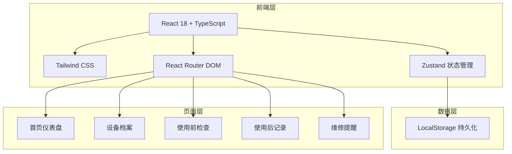
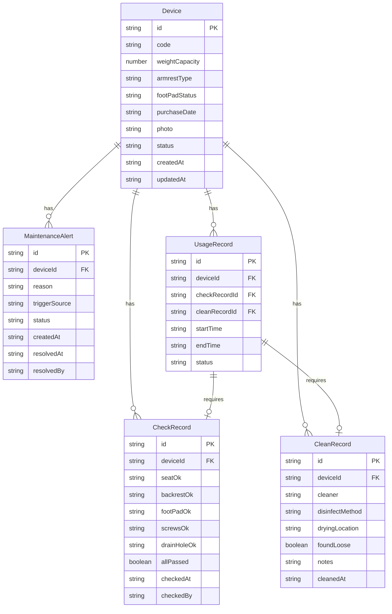

## 1. 架构设计



纯前端项目，数据通过 LocalStorage 持久化存储，无需后端服务。

## 2. 技术说明

- **前端**：React@18 + Tailwind CSS@3 + Vite
- **初始化工具**：vite-init
- **后端**：无（LocalStorage 存储）
- **状态管理**：Zustand（含 persist 中间件实现 LocalStorage 持久化）
- **路由**：React Router DOM v6
- **图标**：lucide-react
- **字体**：Noto Sans SC（正文）+ ZCOOL XiaoWei（标题）

## 3. 路由定义

| 路由 | 用途 |
|------|------|
| `/` | 首页仪表盘，显示统计概览和最近记录 |
| `/devices` | 设备档案列表页 |
| `/devices/:id` | 设备详情页，含设备信息和历史记录 |
| `/devices/new` | 新增设备页 |
| `/devices/:id/edit` | 编辑设备页 |
| `/pre-check` | 使用前检查页，选择设备并完成检查清单 |
| `/post-record` | 使用后清洁记录页 |
| `/maintenance` | 维修提醒列表页 |

## 4. 数据模型

### 4.1 数据模型定义



### 4.2 数据类型定义

```typescript
type DeviceStatus = 'available' | 'in_use' | 'pending_clean' | 'pending_maintenance' | 'disabled'
type ArmrestType = 'fixed' | 'removable' | 'none'
type FootPadStatus = 'good' | 'worn' | 'cracked'
type DisinfectMethod = 'alcohol' | 'chlorine' | 'uv' | 'other'
type DryingLocation = 'bathroom' | 'balcony' | 'other'
type AlertStatus = 'pending' | 'resolved'
type AlertTriggerSource = 'pre_check' | 'post_check' | 'manual'

interface Device {
  id: string
  code: string
  weightCapacity: number
  armrestType: ArmrestType
  footPadStatus: FootPadStatus
  purchaseDate: string
  photo: string
  status: DeviceStatus
  createdAt: string
  updatedAt: string
}

interface CheckRecord {
  id: string
  deviceId: string
  seatOk: boolean
  backrestOk: boolean
  footPadOk: boolean
  screwsOk: boolean
  drainHoleOk: boolean
  allPassed: boolean
  checkedAt: string
  checkedBy: string
}

interface CleanRecord {
  id: string
  deviceId: string
  cleaner: string
  disinfectMethod: DisinfectMethod
  dryingLocation: DryingLocation
  foundLoose: boolean
  notes: string
  cleanedAt: string
}

interface MaintenanceAlert {
  id: string
  deviceId: string
  reason: string
  triggerSource: AlertTriggerSource
  status: AlertStatus
  createdAt: string
  resolvedAt: string | null
  resolvedBy: string | null
}

interface UsageRecord {
  id: string
  deviceId: string
  checkRecordId: string | null
  cleanRecordId: string | null
  startTime: string
  endTime: string | null
  status: 'in_progress' | 'completed'
}
```

### 4.3 初始数据

项目内置3条示例设备数据，覆盖不同状态（可用、使用中、待维修），方便用户快速了解系统功能。
