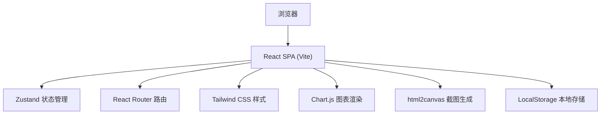

## 1. 架构设计



## 2. 技术描述

- **前端框架**：React 18 + TypeScript
- **构建工具**：Vite 5
- **路由管理**：react-router-dom 6
- **状态管理**：zustand 4
- **样式方案**：Tailwind CSS 3
- **图标库**：lucide-react
- **图表库**：chart.js + react-chartjs-2（雷达图、折线图）
- **图片生成**：html2canvas（分享卡片截图）
- **后端**：无，纯前端应用
- **数据存储**：浏览器 LocalStorage（历史记录）

## 3. 路由定义

| 路由 | 页面 | 用途 |
|------|------|------|
| `/` | 首页 Home | 动画背景、MBTI 介绍、16 型卡片预览 |
| `/test` | 测试页 Test | 60 道题答题界面 |
| `/result` | 结果页 Result | 人格代码、雷达图、维度百分比 |
| `/detail/:type` | 解读页 Detail | 性格特点、职业、名人、配对分析 |
| `/history` | 历史页 History | 测试记录、趋势折线图 |

## 4. 数据模型

### 4.1 核心类型定义

```typescript
// MBTI 四个维度
type Dimension = 'E' | 'I' | 'S' | 'N' | 'T' | 'F' | 'J' | 'P';

// 16 种人格类型代码
type MBIType = 'INTJ' | 'INTP' | 'ENTJ' | 'ENTP' | 
               'INFJ' | 'INFP' | 'ENFJ' | 'ENFP' |
               'ISTJ' | 'ISFJ' | 'ESTJ' | 'ESFJ' |
               'ISTP' | 'ISFP' | 'ESTP' | 'ESFP';

// 题目
interface Question {
  id: number;
  scenario: string;
  options: {
    text: string;
    dimension: Dimension;
    weight: number;
  }[];
}

// 答题记录
interface Answer {
  questionId: number;
  selectedOption: number;
  intensity: number; // 1-5 强度
}

// 测试结果
interface TestResult {
  id: string;
  timestamp: number;
  type: MBIType;
  scores: {
    E: number; I: number;
    S: number; N: number;
    T: number; F: number;
    J: number; P: number;
  };
  percentages: {
    EI: number; // E 百分比
    SN: number; // S 百分比
    TF: number; // T 百分比
    JP: number; // J 百分比
  };
}

// 人格类型详情
interface TypeDetail {
  type: MBIType;
  name: string;
  nickname: string;
  description: string;
  traits: string[];
  careers: string[];
  celebrities: { name: string; role: string }[];
  compatibility: {
    best: MBIType[];
    good: MBIType[];
    challenge: MBIType[];
  };
}
```

### 4.2 状态管理 (Zustand Store)

```typescript
interface TestState {
  currentQuestion: number;
  answers: Answer[];
  questions: Question[];
  result: TestResult | null;
  history: TestResult[];
  
  // actions
  startTest: () => void;
  selectAnswer: (questionId: number, optionIndex: number, intensity: number) => void;
  nextQuestion: () => void;
  prevQuestion: () => void;
  submitTest: () => TestResult;
  saveToHistory: () => void;
  loadHistory: () => void;
  clearHistory: () => void;
  resetTest: () => void;
}
```

## 5. 项目结构

```
src/
├── components/          # 可复用组件
│   ├── ParticleBackground.tsx  # 粒子动画背景
│   ├── TypeCard.tsx           # 16 型人格卡片
│   ├── RadarChart.tsx         # 雷达图组件
│   ├── LineChart.tsx          # 趋势折线图
│   ├── ProgressBar.tsx        # 进度条
│   ├── DimensionBar.tsx       # 维度百分比条
│   └── ShareCard.tsx          # 分享卡片
├── pages/               # 页面组件
│   ├── Home.tsx
│   ├── Test.tsx
│   ├── Result.tsx
│   ├── Detail.tsx
│   └── History.tsx
├── store/               # 状态管理
│   └── useTestStore.ts
├── data/                # 静态数据
│   ├── questions.ts     # 60 道测试题
│   └── typeDetails.ts   # 16 型人格详情
├── utils/               # 工具函数
│   ├── calculateResult.ts  # 计算人格类型
│   └── storage.ts          # LocalStorage 操作
├── types/               # 类型定义
│   └── index.ts
├── App.tsx
├── main.tsx
└── index.css
```

## 6. 核心算法

### 6.1 人格类型计算

1. 每道题的选项对应一个维度（E/I/S/N/T/F/J/P）
2. 根据选项权重和强度计算各维度得分
3. 对比四个维度对（E-I, S-N, T-F, J-P）的得分
4. 每个维度对得分高的字母组成最终四字代码
5. 计算各维度百分比 = (维度得分 / 维度对总分) * 100

## 7. 第三方库说明

- **chart.js**：轻量级图表库，支持雷达图和折线图，动画效果好
- **react-chartjs-2**：Chart.js 的 React 封装
- **html2canvas**：将 DOM 元素转换为 canvas，实现分享图片下载
- **lucide-react**：现代化线性图标库，风格统一
