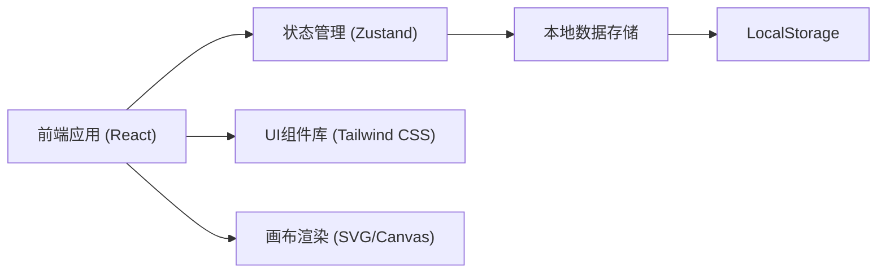

# 马术训练路线记忆板 - 技术架构文档

## 1. 架构设计



## 2. 技术描述

- **前端框架**：React@18 + TypeScript
- **构建工具**：Vite@5
- **样式方案**：Tailwind CSS@3
- **状态管理**：Zustand
- **图标库**：lucide-react
- **路由**：react-router-dom
- **数据存储**：LocalStorage (纯前端本地存储
- **画布技术**：SVG (用于路线元素绘制

## 3. 路由定义

| 路由 | 页面组件 | 用途 |
|------|----------|------|
| / | HomePage | 首页 - 角色选择和快捷入口 |
| /designer | DesignerPage | 路线设计器 - 教练设计障碍路线 |
| /practice | PracticePage | 练习模式 - 学员复述路线训练 |
| /report | ReportPage | 训练报告 - 查看训练结果和分析 |

## 4. 数据模型

### 4.1 数据模型定义

```mermaid
erDiagram
    COURSE {
        string id "路线ID
        string name "路线名称"
        string createdAt "创建时间"
        Array elements "障碍元素列表"
    }
    
    ELEMENT {
        string id "元素ID
        string type "元素类型"
        number x "X坐标"
        number y "Y坐标"
        number order "顺序编号"
    }
    
    STUDENT {
        string id "学员ID"
        string name "学员姓名"
    }
    
    TRAINING_SESSION {
        string id "训练ID"
        string studentId "学员ID"
        string courseId "路线ID"
        string startTime "开始时间"
        string endTime "结束时间"
        Array errors "错误记录"
        number totalTime "总用时(秒)"
    }
    
    ERROR_RECORD {
        string type "错误类型"
        number elementOrder "障碍顺序"
        string description "错误描述"
        number timestamp "时间戳"
    }
```

### 4.2 类型定义

```typescript
// 元素类型
type ElementType = 'jump' | 'arrow' | 'step' | 'turn' | 'forbidden';

// 障碍元素
interface CourseElement {
  id: string;
  type: ElementType;
  x: number;
  y: number;
  order: number;
  rotation?: number;
  label?: string;
  steps?: number;
  radius?: number;
  width?: number;
  height?: number;
}

// 路线
interface Course {
  id: string;
  name: string;
  createdAt: string;
  elements: CourseElement[];
  width: number;
  height: number;
}

// 学员
interface Student {
  id: string;
  name: string;
  avatar?: string;
}

// 错误类型
type ErrorType = 'miss' | 'reverse' | 'detour' | 'pause';

// 错误记录
interface ErrorRecord {
  type: ErrorType;
  elementOrder: number;
  description: string;
  timestamp: number;
}

// 训练记录
interface TrainingSession {
  id: string;
  studentId: string;
  courseId: string;
  startTime: string;
  endTime?: string;
  errors: ErrorRecord[];
  totalTime: number;
  userSequence: number[];
}

// 混淆障碍组合分析
interface ConfusionPair {
  elementA: number;
  elementB: number;
  count: number;
  type: 'order' | 'direction';
}
```

## 5. 核心模块划分

### 5.1 组件结构

```
src/
├── components/
│   ├── layout/
│   │   └── AppLayout.tsx       # 应用布局
│   ├── designer/
│   │   ├── Canvas.tsx           # 设计画布
│   │   ├── Toolbar.tsx        # 工具栏
│   │   ├── ElementItem.tsx    # 可拖拽元素
│   │   └── PropertyPanel.tsx  # 属性面板
│   ├── practice/
│   │   ├── PracticeCanvas.tsx # 练习画布
│   │   └── FeedbackToast.tsx      # 实时反馈
│   └── report/
│       ├── ErrorStats.tsx       # 错误统计
│       ├── ConfusionAnalysis.tsx # 混淆分析
│       └── HistoryList.tsx   # 历史记录
├── pages/
│   ├── HomePage.tsx
│   ├── DesignerPage.tsx
│   ├── PracticePage.tsx
│   └── ReportPage.tsx
├── store/
│   ├── useCourseStore.ts      # 路线状态管理
│   └── useTrainingStore.ts  # 训练状态管理
├── types/
│   └── index.ts               # 类型定义
├── utils/
│   ├── id.ts                 # ID生成
│   └── analysis.ts           # 分析算法
└── App.tsx
```

## 6. 核心功能实现思路

### 6.1 路线设计器
- 使用 SVG 实现画布渲染
- 拖拽交互：mousedown/mousemove/mouseup
- 元素选中与选中状态管理
- 属性编辑面板动态渲染

### 6.2 练习模式
- 按顺序点击障碍验证
- 实时反馈动画效果
- 计时功能
- 错误类型检测算法

### 6.3 混淆分析算法
- 统计相邻障碍错误频率
- 计算混淆矩阵
- 生成最易混淆障碍组合排序

## 7. 本地存储设计

```
localStorage:
  - courses: Course[]
  - students: Student[]
  - trainingSessions: TrainingSession[]
  - currentStudentId: string
```
