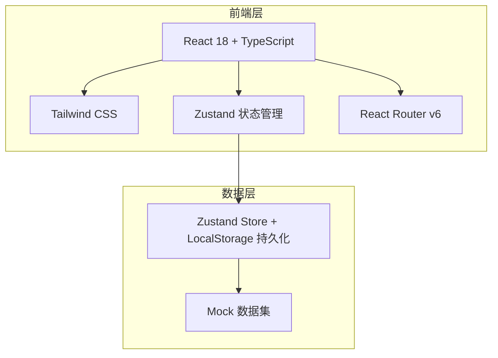
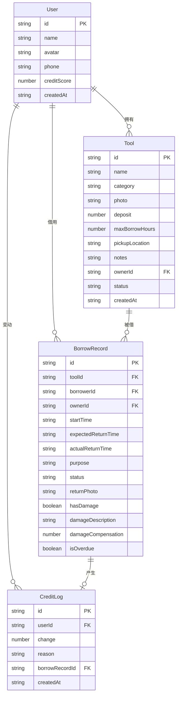
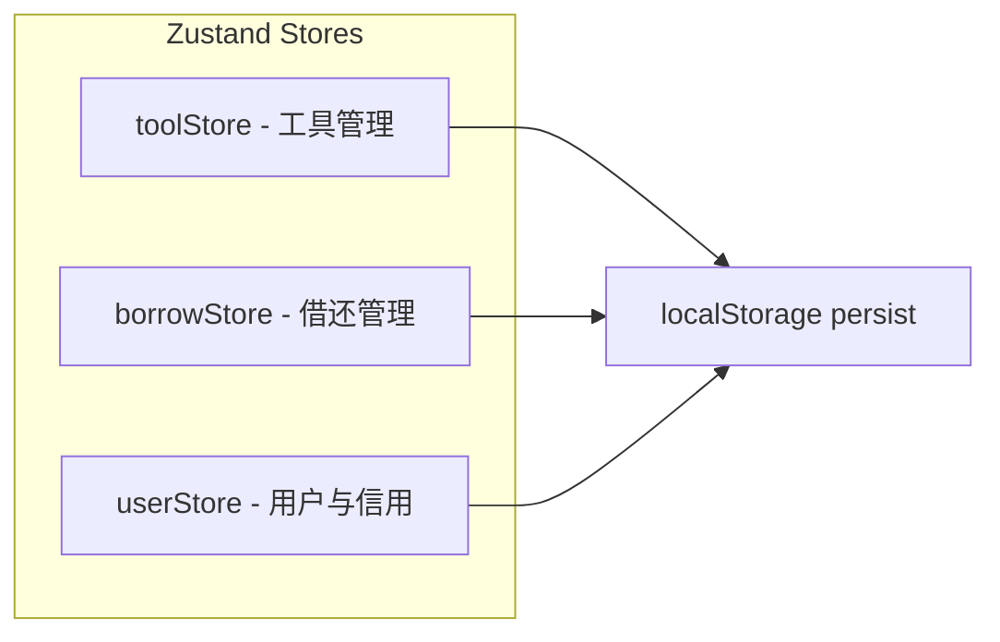

## 1. 架构设计

## 2. 技术说明

- **前端**：React@18 + TypeScript + Tailwind CSS@3 + Vite
- **初始化工具**：vite-init (react-ts 模板)
- **后端**：无（纯前端，数据使用 Zustand + localStorage 持久化）
- **数据库**：无（使用 localStorage + Zustand 持久化中间件模拟数据存储）
- **状态管理**：Zustand（含 persist 中间件）
- **路由**：React Router DOM v6
- **图标**：lucide-react
- **动画**：framer-motion（页面过渡和微交互）

## 3. 路由定义

| 路由 | 用途 |
|------|------|
| `/` | 首页 - 工具柜视图，展示所有工具及状态 |
| `/register` | 工具登记页 - 登记新工具 |
| `/tool/:id` | 工具详情页 - 查看工具详情和预约借用 |
| `/borrowings` | 我的借用页 - 管理借入借出记录 |
| `/stats` | 统计页 - 工具排行和贡献排行 |

## 4. 数据模型

### 4.1 数据模型定义

### 4.2 数据定义

**Tool Status 枚举**：
- `available` - 空闲
- `borrowed` - 已借出
- `maintenance` - 维修中

**BorrowRecord Status 枚举**：
- `pending` - 待确认
- `active` - 借用中
- `returned` - 已归还
- `overdue` - 已逾期

**Tool Category 枚举**：
- `electric` - 电动工具
- `hand` - 手动工具
- `measuring` - 测量工具
- `garden` - 园艺工具
- `other` - 其他

**信用分规则**：
- 初始分：100
- 准时归还：+5
- 逾期归还：-10
- 损坏工具：-20
- 贡献工具登记：+3

## 5. 状态管理架构

### Store 职责划分

- **toolStore**：工具CRUD、状态变更、搜索筛选
- **borrowStore**：借用预约、确认借出、归还处理、逾期检测
- **userStore**：用户信息、信用分计算、信用变动日志
