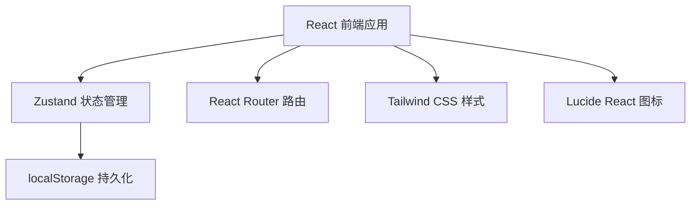
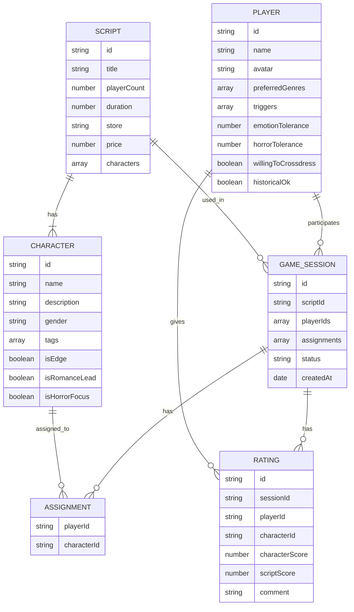

## 1. 架构设计

纯前端单页应用，数据存储在浏览器本地（localStorage），无需后端服务。



## 2. 技术描述

- 前端框架：React@18 + TypeScript
- 构建工具：Vite
- 样式方案：Tailwind CSS@3
- 状态管理：Zustand
- 路由管理：React Router DOM
- 图标库：Lucide React
- 数据存储：localStorage（本地持久化）
- 数据可视化：原生 CSS + 简单图表（不引入额外图表库）

## 3. 路由定义

| 路由 | 页面 | 用途 |
|-------|------|------|
| /players | 玩家档案页 | 玩家列表与偏好管理 |
| /scripts | 剧本管理页 | 剧本列表与录入 |
| /session | 组局分配页 | 角色分配与冲突检测 |
| /stats | 评分统计页 | 评分记录与数据分析 |

## 4. 数据模型

### 4.1 实体关系



### 4.2 类型定义

```typescript
// 玩家
interface Player {
  id: string;
  name: string;
  avatar: string;
  preferredGenres: string[];     // 偏好题材
  triggers: string[];             // 雷点
  emotionTolerance: number;       // 情感接受度 0-10
  horrorTolerance: number;        // 恐怖接受度 0-10
  willingToCrossdress: boolean;   // 是否愿意反串
  historicalOk: boolean;          // 历史角色接受度
}

// 角色
interface Character {
  id: string;
  name: string;
  description: string;
  gender: 'male' | 'female' | 'other';
  tags: string[];                 // 角色标签
  isEdge: boolean;                // 是否边缘位
  isRomanceLead: boolean;         // 是否情侣线主角
  isHorrorFocus: boolean;         // 是否恐怖核心位
  genre: string;                  // 题材类型
}

// 剧本
interface Script {
  id: string;
  title: string;
  playerCount: number;
  duration: number;               // 时长（分钟）
  store: string;                  // 店家
  price: number;                  // 价格
  characters: Character[];
  genre: string;                  // 题材
}

// 分配记录
interface Assignment {
  playerId: string;
  characterId: string;
}

// 局次
interface GameSession {
  id: string;
  scriptId: string;
  playerIds: string[];
  assignments: Assignment[];
  status: 'planning' | 'playing' | 'finished';
  createdAt: number;
}

// 评分
interface Rating {
  id: string;
  sessionId: string;
  playerId: string;
  characterId: string;
  characterScore: number;         // 角色评分 1-5
  scriptScore: number;            // 剧本评分 1-5
  comment: string;
}

// 冲突类型
interface Conflict {
  type: 'romance' | 'horror' | 'edge' | 'trigger' | 'crossdress' | 'gender';
  severity: 'warning' | 'danger';
  playerId: string;
  characterId: string;
  message: string;
}
```

## 5. 项目结构

```
src/
├── components/          # 可复用组件
│   ├── Layout/         # 布局组件
│   ├── PlayerCard/     # 玩家卡片
│   ├── ScriptCard/     # 剧本卡片
│   ├── CharacterCard/  # 角色卡片
│   ├── ConflictAlert/  # 冲突提示
│   ├── StarRating/     # 星级评分
│   └── TagSelector/    # 标签选择器
├── pages/              # 页面组件
│   ├── Players.tsx     # 玩家档案页
│   ├── Scripts.tsx     # 剧本管理页
│   ├── Session.tsx     # 组局分配页
│   └── Stats.tsx       # 评分统计页
├── store/              # 状态管理
│   ├── usePlayerStore.ts
│   ├── useScriptStore.ts
│   └── useSessionStore.ts
├── utils/              # 工具函数
│   ├── conflictDetector.ts   # 冲突检测逻辑
│   ├── statistics.ts         # 统计分析
│   └── storage.ts            # 本地存储
├── types/              # 类型定义
│   └── index.ts
├── data/               # Mock 数据
│   └── mockData.ts
├── App.tsx
├── main.tsx
└── index.css
```

## 6. 核心算法

### 6.1 冲突检测
- 情侣线冲突：检测玩家对情感线的接受度与角色情侣线属性
- 恐怖线冲突：检测玩家恐怖接受度与角色恐怖属性
- 边缘位警告：标记边缘位角色，提醒玩家
- 雷点匹配：角色标签与玩家雷点匹配检测
- 性别/反串：检测角色性别与玩家性别偏好及反串意愿
- 历史角色：检测历史题材与玩家接受度

### 6.2 统计分析
- 玩家角色适配度：按题材/类型统计平均评分
- 雷点踩中频率：统计各雷点被触发的次数
- 剧本评分排行：按平均剧本评分排序
- 角色适配推荐：基于历史评分推荐适合的角色类型
