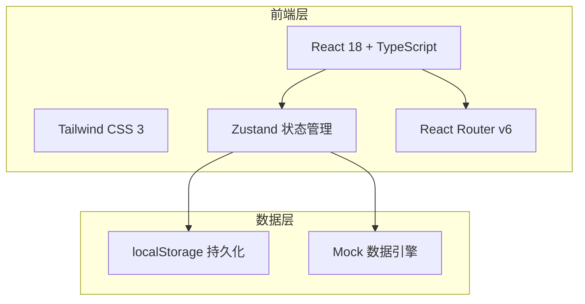
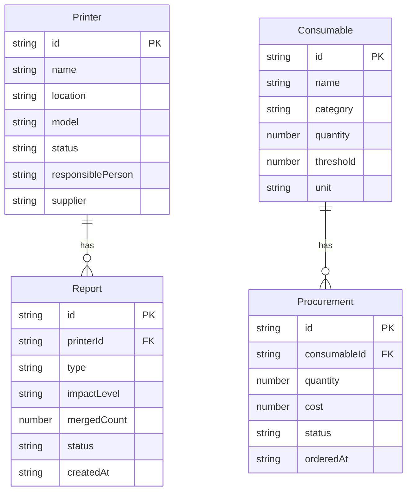

## 1. 架构设计



纯前端架构，数据存储于 localStorage，无需后端服务。

## 2. 技术说明

- **前端**：React@18 + Tailwind CSS@3 + Vite + TypeScript
- **初始化工具**：Vite (react-ts 模板)
- **状态管理**：Zustand（轻量级，支持 persist 中间件自动持久化到 localStorage）
- **路由**：React Router v6
- **图表**：Recharts（轻量级 React 图表库）
- **图标**：Lucide React
- **后端**：无，使用 localStorage + Mock 数据
- **数据库**：无，前端 localStorage 持久化

## 3. 路由定义

| 路由 | 用途 |
|------|------|
| `/` | 首页看板 - 设备状态分组总览 |
| `/printers` | 打印机管理 - 设备列表与登记 |
| `/reports` | 故障报修 - 工单列表与新建报修 |
| `/inventory` | 耗材库存 - 库存总览与出入库 |
| `/procurement` | 采购跟踪 - 采购订单管理 |
| `/statistics` | 统计分析 - 花费与报错统计 |

## 4. API 定义

无后端 API，使用 Zustand store 直接操作数据。核心 Store 如下：

```typescript
interface Printer {
  id: string
  name: string
  location: string
  model: string
  consumableModels: string[]
  responsiblePerson: string
  supplier: string
  status: 'normal' | 'low_supply' | 'fault' | 'procurement'
  createdAt: string
}

interface Report {
  id: string
  printerId: string
  type: 'no_paper' | 'paper_jam' | 'no_ink' | 'faint_print'
  description: string
  photos: string[]
  impactLevel: 'low' | 'medium' | 'high'
  mergedCount: number
  mergedFrom: string[]
  status: 'open' | 'processing' | 'closed'
  createdAt: string
  createdBy: string
}

interface Consumable {
  id: string
  name: string
  category: 'paper' | 'toner' | 'ink_cartridge'
  quantity: number
  unit: string
  threshold: number
  compatibleModels: string[]
}

interface Procurement {
  id: string
  consumableId: string
  quantity: number
  supplier: string
  cost: number
  status: 'ordered' | 'arrived' | 'installed'
  orderedAt: string
  arrivedAt?: string
  installedAt?: string
}
```

## 5. 数据模型

### 5.1 数据模型定义



### 5.2 初始化数据

系统预置以下 Mock 数据：

- 6 台打印机（分布在 3 个楼层，状态各异）
- 10 条报修工单（含 2 组合并工单）
- 5 种耗材（A4 纸、A3 纸、HP 硒鼓、Canon 硒鼓、HP 墨盒）
- 4 条采购记录
- 3 个月的消耗历史数据用于统计

## 6. 项目目录结构

```
src/
├── components/         # 通用组件
│   ├── Layout.tsx      # 整体布局（侧边栏+内容区）
│   ├── Sidebar.tsx     # 侧边导航
│   ├── StatusCard.tsx  # 设备状态卡片
│   └── Modal.tsx       # 通用模态框
├── pages/
│   ├── Dashboard.tsx   # 首页看板
│   ├── Printers.tsx    # 打印机管理
│   ├── Reports.tsx     # 故障报修
│   ├── Inventory.tsx   # 耗材库存
│   ├── Procurement.tsx # 采购跟踪
│   └── Statistics.tsx  # 统计分析
├── stores/
│   ├── printerStore.ts # 打印机状态
│   ├── reportStore.ts  # 报修状态
│   ├── consumableStore.ts # 耗材状态
│   └── procurementStore.ts # 采购状态
├── data/
│   └── mockData.ts     # 初始化 Mock 数据
├── types/
│   └── index.ts        # TypeScript 类型定义
├── App.tsx
├── main.tsx
└── index.css
```
