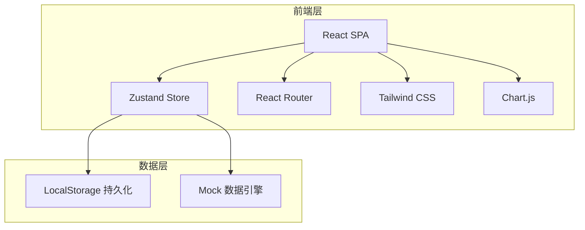
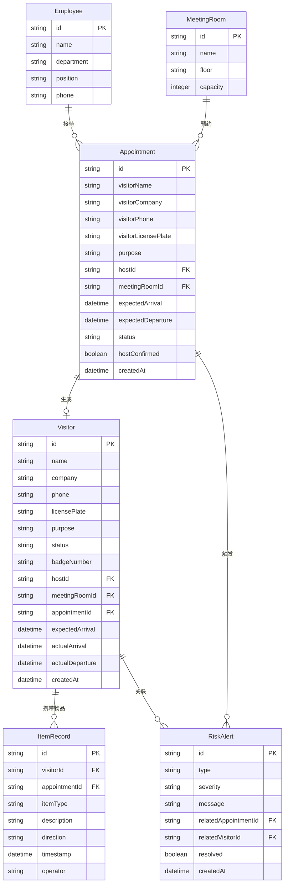

## 1. 架构设计



纯前端应用，使用 LocalStorage 进行数据持久化，无需后端服务。所有数据操作通过 Zustand Store 管理，页面路由使用 React Router。

## 2. 技术说明

- **前端框架**：React@18 + TypeScript + Vite
- **样式方案**：Tailwind CSS@3
- **状态管理**：Zustand（含 persist 中间件实现 LocalStorage 持久化）
- **路由**：React Router DOM v6
- **图表**：Chart.js + react-chartjs-2
- **图标**：Lucide React
- **初始化工具**：vite-init
- **后端**：无（纯前端，数据持久化到 LocalStorage）
- **数据库**：无（使用内存 + LocalStorage）

## 3. 路由定义

| 路由 | 用途 |
|------|------|
| `/` | 前台首页仪表盘，今日访客分组看板 |
| `/appointment` | 预约登记，创建和管理访客预约 |
| `/checkin` | 签到签退管理，访客牌号分配 |
| `/items` | 物品登记，快递/设备携入携出 |
| `/alerts` | 风险提醒，风险项管理和处理 |
| `/stats` | 统计报表，访客数据分析 |

## 4. 数据模型

### 4.1 数据模型定义



### 4.2 类型定义

```typescript
type VisitorStatus = 'expected' | 'checked-in' | 'departed' | 'no-show'
type AppointmentStatus = 'pending' | 'confirmed' | 'cancelled' | 'completed'
type ItemType = 'parcel' | 'equipment' | 'other'
type ItemDirection = 'in' | 'out'
type RiskType = 'no-host-confirm' | 'room-conflict' | 'badge-not-returned' | 'overtime-stay'
type RiskSeverity = 'high' | 'medium' | 'low'

interface Visitor {
  id: string
  name: string
  company: string
  phone: string
  licensePlate: string
  purpose: string
  status: VisitorStatus
  badgeNumber: string | null
  hostId: string
  meetingRoomId: string
  appointmentId: string
  expectedArrival: string
  actualArrival: string | null
  actualDeparture: string | null
  createdAt: string
}

interface Appointment {
  id: string
  visitorName: string
  visitorCompany: string
  visitorPhone: string
  visitorLicensePlate: string
  purpose: string
  hostId: string
  meetingRoomId: string
  expectedArrival: string
  expectedDeparture: string
  status: AppointmentStatus
  hostConfirmed: boolean
  createdAt: string
}

interface Employee {
  id: string
  name: string
  department: string
  position: string
  phone: string
}

interface MeetingRoom {
  id: string
  name: string
  floor: string
  capacity: number
}

interface ItemRecord {
  id: string
  visitorId: string
  appointmentId: string
  itemType: ItemType
  description: string
  direction: ItemDirection
  timestamp: string
  operator: string
}

interface RiskAlert {
  id: string
  type: RiskType
  severity: RiskSeverity
  message: string
  relatedAppointmentId: string
  relatedVisitorId: string | null
  resolved: boolean
  createdAt: string
}
```

## 5. 项目目录结构

```
src/
├── components/
│   ├── Layout.tsx              # 整体布局（侧边栏+内容区）
│   ├── Sidebar.tsx             # 侧边导航
│   ├── StatsCard.tsx           # 统计卡片
│   ├── VisitorCard.tsx         # 访客卡片
│   ├── RiskBanner.tsx          # 风险提醒横幅
│   └── BadgeModal.tsx          # 访客牌号弹窗
├── pages/
│   ├── Dashboard.tsx           # 前台首页
│   ├── Appointment.tsx         # 预约登记
│   ├── CheckIn.tsx             # 签到签退
│   ├── Items.tsx               # 物品登记
│   ├── Alerts.tsx              # 风险提醒
│   └── Stats.tsx               # 统计报表
├── store/
│   └── index.ts                # Zustand Store
├── utils/
│   ├── mockData.ts             # Mock 数据
│   └── helpers.ts              # 工具函数
├── App.tsx
├── main.tsx
└── index.css
```
