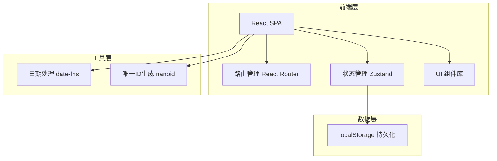
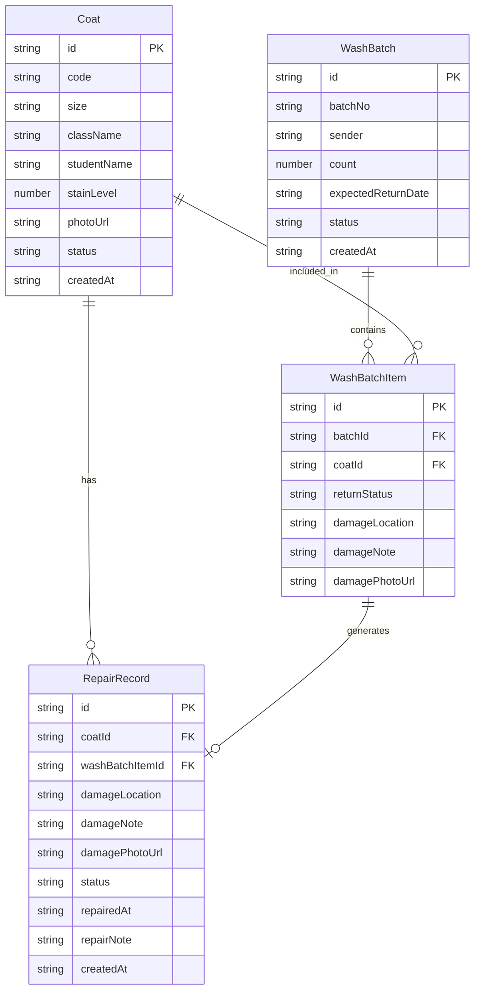

## 1. 架构设计

纯前端单页应用，数据持久化至 localStorage，无需后端服务。

## 2. 技术说明

- **前端框架**：React@18 + TypeScript
- **构建工具**：Vite
- **样式方案**：Tailwind CSS@3
- **路由**：React Router@6
- **状态管理**：Zustand (轻量、支持持久化中间件)
- **图表**：Recharts (轻量 React 图表库)
- **图标**：Phosphor React
- **日期处理**：date-fns
- **ID生成**：nanoid
- **数据持久化**：localStorage (通过 Zustand persist 中间件)
- **后端**：无，纯前端 Mock 数据

## 3. 路由定义

| 路由 | 用途 |
|------|------|
| / | 重定向至 /coats |
| /coats | 实验服档案页 - 档案列表与搜索 |
| /wash | 送洗登记页 - 批次管理 |
| /return | 取回登记页 - 验收与登记 |
| /repair | 待维修区 - 破损件管理 |
| /stats | 统计看板页 - 数据分析与预警 |

## 4. 数据模型

### 4.1 数据模型定义

### 4.2 数据定义

**Coat（实验服档案）**

| 字段 | 类型 | 说明 |
|------|------|------|
| id | string | 主键，nanoid 生成 |
| code | string | 编号，如 LBC-001 |
| size | string | 尺码：S/M/L/XL/XXL |
| className | string | 所属班级 |
| studentName | string | 领用学生 |
| stainLevel | number | 污渍等级 1-5 |
| photoUrl | string | 照片(base64 或占位) |
| status | string | 状态：available/sent/damaged/lost |
| createdAt | string | 创建时间 ISO |

**WashBatch（送洗批次）**

| 字段 | 类型 | 说明 |
|------|------|------|
| id | string | 主键 |
| batchNo | string | 批次号，如 WS-20260613-001 |
| sender | string | 送洗人 |
| count | number | 件数 |
| expectedReturnDate | string | 预计取回日期 |
| status | string | 状态：sent/returned/overdue |
| createdAt | string | 创建时间 ISO |

**WashBatchItem（送洗批次明细）**

| 字段 | 类型 | 说明 |
|------|------|------|
| id | string | 主键 |
| batchId | string | 关联批次ID |
| coatId | string | 关联实验服ID |
| returnStatus | string | 取回状态：pending/clean/damaged/missing |
| damageLocation | string | 破损位置 |
| damageNote | string | 破损备注 |
| damagePhotoUrl | string | 破损照片 |

**RepairRecord（维修记录）**

| 字段 | 类型 | 说明 |
|------|------|------|
| id | string | 主键 |
| coatId | string | 关联实验服ID |
| washBatchItemId | string | 关联送洗明细ID |
| damageLocation | string | 破损位置 |
| damageNote | string | 破损备注 |
| damagePhotoUrl | string | 破损照片 |
| status | string | 状态：pending/repaired |
| repairedAt | string | 维修完成时间 |
| repairNote | string | 维修内容备注 |
| createdAt | string | 创建时间 ISO |
