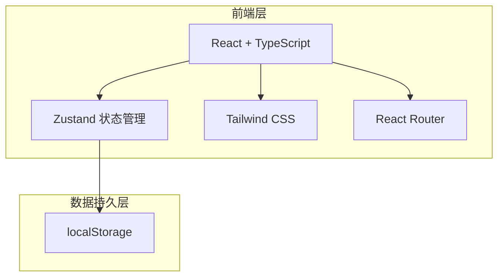
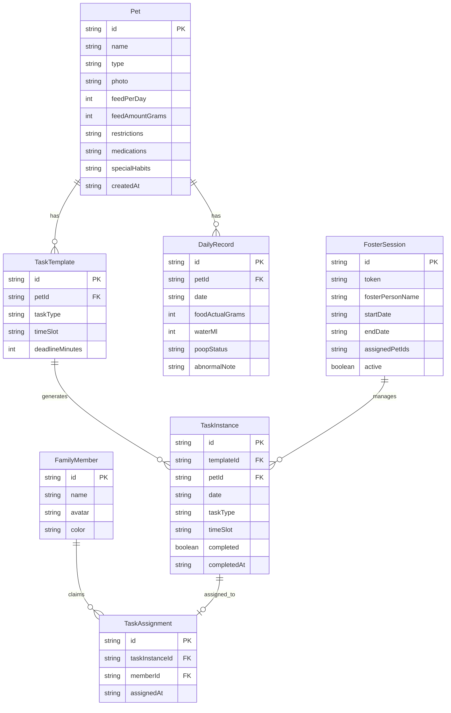

## 1. 架构设计



纯前端应用，所有数据存储在 localStorage，无需后端服务。

## 2. 技术说明

- 前端：React@18 + TypeScript + Tailwind CSS@3 + Vite
- 初始化工具：vite-init
- 后端：无
- 数据库：无（使用 localStorage 持久化）
- 状态管理：Zustand（含 persist 中间件自动持久化）
- 图标：lucide-react
- 动画：framer-motion
- 日期处理：date-fns

## 3. 路由定义

| 路由 | 用途 |
|------|------|
| / | 宠物管理页 - 宠物列表和档案管理 |
| /schedule | 日程排班页 - 排班表和任务管理 |
| /pet/:id | 宠物详情页 - 每日饮食排泄记录 |
| /stats | 统计页 - 一周数据统计和异常分析 |
| /foster/:token | 临时托管页 - 简化版任务清单 |

## 4. API 定义

无后端 API，所有数据通过 Zustand store 管理。

## 5. 服务器架构图

不适用

## 6. 数据模型

### 6.1 数据模型定义



### 6.2 数据定义语言

使用 TypeScript 类型定义：

```typescript
type PetType = 'cat' | 'dog'

type TaskType = 'breakfast' | 'dinner' | 'litter' | 'walk' | 'medicine'

type TimeSlot = 'morning' | 'noon' | 'evening' | 'night'

type PoopStatus = 'normal' | 'soft' | 'loose' | 'constipated'

interface Pet {
  id: string
  name: string
  type: PetType
  photo: string
  feedPerDay: number
  feedAmountGrams: number
  restrictions: string
  medications: string
  specialHabits: string
  createdAt: string
}

interface FamilyMember {
  id: string
  name: string
  avatar: string
  color: string
}

interface TaskTemplate {
  id: string
  petId: string
  taskType: TaskType
  timeSlot: TimeSlot
  deadlineMinutes: number
}

interface TaskInstance {
  id: string
  templateId: string
  petId: string
  date: string
  taskType: TaskType
  timeSlot: TimeSlot
  completed: boolean
  completedAt: string | null
}

interface TaskAssignment {
  id: string
  taskInstanceId: string
  memberId: string
  assignedAt: string
}

interface DailyRecord {
  id: string
  petId: string
  date: string
  foodActualGrams: number
  waterMl: number
  poopStatus: PoopStatus
  abnormalNote: string
}

interface FosterSession {
  id: string
  token: string
  fosterPersonName: string
  startDate: string
  endDate: string
  assignedPetIds: string[]
  active: boolean
}
```
