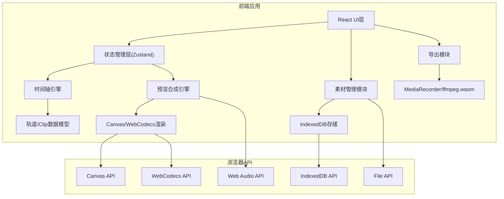
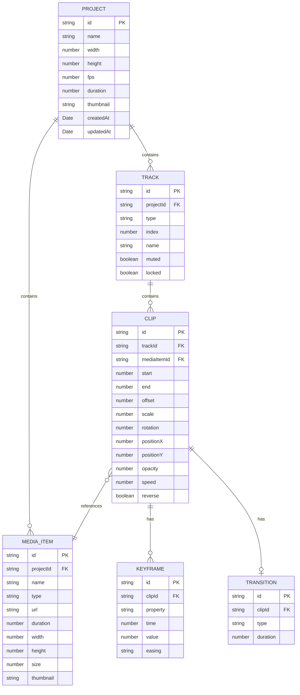

## 1. 架构设计



## 2. 技术描述

- **前端框架**: React@18 + TypeScript
- **构建工具**: Vite@5
- **样式方案**: TailwindCSS@3
- **状态管理**: Zustand (轻量级状态管理)
- **图标库**: Lucide React
- **数据库**: IndexedDB (idb库封装)
- **视频处理**: WebCodecs API + Canvas 2D API
- **音频处理**: Web Audio API
- **导出方案**: MediaRecorder API (优先) / ffmpeg.wasm (备选)
- **拖拽库**: @dnd-kit (现代拖拽解决方案)

## 3. 目录结构

```
src/
├── components/
│   ├── layout/
│   │   ├── AppLayout.tsx
│   │   ├── PanelResizer.tsx
│   │   └── Toolbar.tsx
│   ├── media-library/
│   │   ├── MediaLibraryPanel.tsx
│   │   ├── MediaUploader.tsx
│   │   └── MediaItem.tsx
│   ├── preview/
│   │   ├── PreviewWindow.tsx
│   │   ├── PlaybackControls.tsx
│   │   └── TimecodeDisplay.tsx
│   ├── timeline/
│   │   ├── Timeline.tsx
│   │   ├── Track.tsx
│   │   ├── Clip.tsx
│   │   ├── Transition.tsx
│   │   ├── Ruler.tsx
│   │   └── AudioWaveform.tsx
│   ├── properties/
│   │   ├── PropertiesPanel.tsx
│   │   ├── TransformSection.tsx
│   │   ├── SpeedSection.tsx
│   │   ├── ColorSection.tsx
│   │   ├── FilterSection.tsx
│   │   └── SubtitleSection.tsx
│   ├── export/
│   │   ├── ExportModal.tsx
│   │   └── ProgressBar.tsx
│   └── project/
│       ├── ProjectSelector.tsx
│       └── ProjectCard.tsx
├── store/
│   ├── useProjectStore.ts
│   ├── useTimelineStore.ts
│   ├── usePlaybackStore.ts
│   └── useHistoryStore.ts
├── engine/
│   ├── PreviewEngine.ts
│   ├── VideoCompositor.ts
│   ├── AudioMixer.ts
│   ├── TransitionRenderer.ts
│   └── FilterRenderer.ts
├── hooks/
│   ├── useMediaUpload.ts
│   ├── useKeyboardShortcuts.ts
│   ├── useDragDrop.ts
│   └── useExport.ts
├── utils/
│   ├── timecode.ts
│   ├── indexedDB.ts
│   ├── fileUtils.ts
│   └── srtParser.ts
├── types/
│   ├── media.ts
│   ├── timeline.ts
│   └── project.ts
└── App.tsx
```

## 4. 数据模型

### 4.1 数据模型定义



### 4.2 TypeScript 类型定义

```typescript
// media.ts
export type MediaType = 'video' | 'audio' | 'image';

export interface MediaItem {
  id: string;
  projectId: string;
  name: string;
  type: MediaType;
  url: string;
  duration: number;
  width?: number;
  height?: number;
  size: number;
  thumbnail?: string;
}

// timeline.ts
export type TrackType = 'video' | 'audio' | 'subtitle';

export interface Track {
  id: string;
  projectId: string;
  type: TrackType;
  index: number;
  name: string;
  muted: boolean;
  locked: boolean;
}

export type TransitionType = 'fade' | 'dissolve' | 'push' | 'slide';
export type FilterType = 'none' | 'grayscale' | 'sepia' | 'blur';

export interface Clip {
  id: string;
  trackId: string;
  mediaItemId: string;
  start: number;
  end: number;
  offset: number;
  transform: {
    scale: number;
    rotation: number;
    positionX: number;
    positionY: number;
  };
  opacity: number;
  speed: number;
  reverse: boolean;
  color: {
    brightness: number;
    contrast: number;
    saturation: number;
  };
  filter: FilterType;
  transition?: {
    type: TransitionType;
    duration: number;
  };
  volume?: number;
  volumeKeyframes?: VolumeKeyframe[];
}

export interface VolumeKeyframe {
  time: number;
  value: number;
}

export interface SubtitleClip extends Clip {
  text: string;
  style: {
    fontFamily: string;
    fontSize: number;
    color: string;
    strokeColor?: string;
    strokeWidth?: number;
    shadow?: boolean;
  };
}

// project.ts
export interface Project {
  id: string;
  name: string;
  width: number;
  height: number;
  fps: number;
  duration: number;
  thumbnail?: string;
  createdAt: Date;
  updatedAt: Date;
}

export interface HistoryState {
  past: any[];
  present: any;
  future: any[];
}
```

## 5. 核心引擎设计

### 5.1 预览合成引擎 (PreviewEngine)

```typescript
class PreviewEngine {
  private canvas: HTMLCanvasElement;
  private ctx: CanvasRenderingContext2D;
  private videoElements: Map<string, HTMLVideoElement>;
  private audioContext: AudioContext;
  
  // 按时间戳合成单帧画面
  async composeFrame(time: number): Promise<void>;
  
  // 视频轨道渲染
  private renderVideoTracks(time: number): Promise<void>;
  
  // 字幕轨道渲染
  private renderSubtitleTracks(time: number): void;
  
  // 混合音频
  private mixAudio(time: number): void;
  
  // 应用过渡效果
  private applyTransition(clip1: Clip, clip2: Clip, progress: number): void;
  
  // 应用滤镜
  private applyFilter(ctx: CanvasRenderingContext2D, filter: FilterType): void;
}
```

### 5.2 导出引擎 (ExportEngine)

```typescript
class ExportEngine {
  private canvas: HTMLCanvasElement;
  private mediaRecorder: MediaRecorder;
  private stream: MediaStream;
  
  async export(settings: ExportSettings, onProgress: (p: number) => void): Promise<Blob>;
  
  private async renderFrame(time: number): Promise<void>;
  
  private async encodeWithMediaRecorder(): Promise<Blob>;
  
  // 备选：使用ffmpeg.wasm编码
  private async encodeWithFFmpeg(): Promise<Blob>;
}
```

## 6. 状态管理设计

使用Zustand实现模块化状态管理：

- **useProjectStore**: 项目元数据、项目列表CRUD
- **useTimelineStore**: 轨道、Clip、过渡、关键帧数据
- **usePlaybackStore**: 播放状态、当前时间、播放速度
- **useHistoryStore**: 撤销重做历史（30步限制）

## 7. 性能优化策略

1. **视频解码缓存**: 使用OffscreenCanvas预解码关键帧
2. **懒渲染**: 只渲染可视区域内的Clip
3. **Web Workers**: 波形图生成、SRT解析等耗时操作移至Worker
4. **节流防抖**: 滑块调节、时间轴缩放等高频操作节流
5. **内存管理**: 及时释放不再使用的video元素和Blob URL
