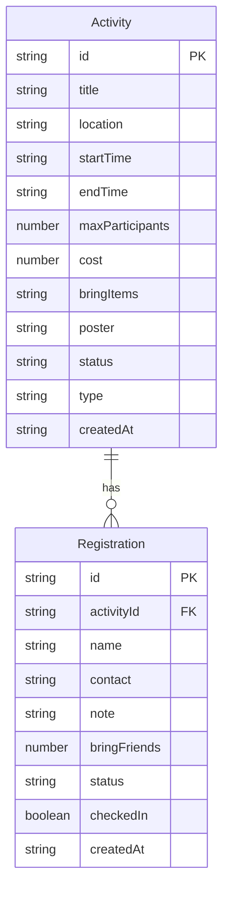

## 1. 架构设计

```mermaid
flowchart TB
    subgraph "前端层"
        "React + TypeScript"
        "Tailwind CSS"
        "Zustand 状态管理"
        "React Router"
    end
    subgraph "后端层"
        "Express + TypeScript"
        "REST API"
    end
    subgraph "数据层"
        "SQLite + better-sqlite3"
    end
    "React + TypeScript" --> "REST API"
    "REST API" --> "SQLite + better-sqlite3"
```

## 2. 技术说明

- 前端：React@18 + TypeScript + Tailwind CSS + Zustand + React Router
- 初始化工具：vite-init（react-express-ts 模板）
- 后端：Express@4 + TypeScript（ESM 格式）
- 数据库：SQLite（better-sqlite3），轻量级嵌入式数据库
- 图表：recharts（历史活动统计）

## 3. 路由定义

| 路由 | 用途 |
|------|------|
| / | 首页看板，四列展示活动 |
| /activity/:id | 活动详情页，报名/签到/统计 |
| /activity/new | 创建新活动 |
| /activity/:id/edit | 编辑活动 |
| /history | 历史活动页，出勤率和活动类型统计 |

## 4. API 定义

### 活动相关

```typescript
interface Activity {
  id: string
  title: string
  location: string
  startTime: string
  endTime: string
  maxParticipants: number
  cost: number
  bringItems: string
  poster: string
  status: "not_started" | "registering" | "full" | "ended"
  createdAt: string
}

// GET /api/activities - 获取所有活动（支持 status 筛选）
// GET /api/activities/:id - 获取活动详情
// POST /api/activities - 创建活动
// PUT /api/activities/:id - 更新活动
// DELETE /api/activities/:id - 删除活动
```

### 报名相关

```typescript
interface Registration {
  id: string
  activityId: string
  name: string
  contact: string
  note: string
  bringFriends: number
  status: "confirmed" | "waitlisted" | "cancelled"
  checkedIn: boolean
  createdAt: string
}

// GET /api/activities/:id/registrations - 获取活动报名列表
// POST /api/activities/:id/registrations - 报名
// PUT /api/registrations/:id/cancel - 取消报名（触发候补补位）
// PUT /api/registrations/:id/checkin - 签到
// GET /api/activities/:id/export - 导出报名名单 CSV
```

### 统计相关

```typescript
// GET /api/stats/history - 历史活动统计
// GET /api/stats/activity-types - 活动类型参与人数统计

interface HistoryStats {
  totalActivities: number
  avgAttendanceRate: number
  activities: Array<{
    id: string
    title: string
    attendanceRate: number
    participantCount: number
    type: string
  }>
}
```

## 5. 服务器架构图

```mermaid
flowchart LR
    "Router" --> "Controller"
    "Controller" --> "Service"
    "Service" --> "Repository"
    "Repository" --> "SQLite"
```

## 6. 数据模型

### 6.1 数据模型定义



### 6.2 数据定义语言

```sql
CREATE TABLE IF NOT EXISTS activities (
  id TEXT PRIMARY KEY,
  title TEXT NOT NULL,
  location TEXT NOT NULL,
  start_time TEXT NOT NULL,
  end_time TEXT NOT NULL,
  max_participants INTEGER NOT NULL,
  cost REAL DEFAULT 0,
  bring_items TEXT DEFAULT '',
  poster TEXT DEFAULT '',
  status TEXT NOT NULL DEFAULT 'not_started',
  type TEXT DEFAULT '其他',
  created_at TEXT NOT NULL
);

CREATE TABLE IF NOT EXISTS registrations (
  id TEXT PRIMARY KEY,
  activity_id TEXT NOT NULL,
  name TEXT NOT NULL,
  contact TEXT NOT NULL,
  note TEXT DEFAULT '',
  bring_friends INTEGER DEFAULT 0,
  status TEXT NOT NULL DEFAULT 'confirmed',
  checked_in INTEGER DEFAULT 0,
  created_at TEXT NOT NULL,
  FOREIGN KEY (activity_id) REFERENCES activities(id) ON DELETE CASCADE
);

CREATE INDEX idx_registrations_activity ON registrations(activity_id);
CREATE INDEX idx_registrations_status ON registrations(status);
CREATE INDEX idx_activities_status ON activities(status);
```
