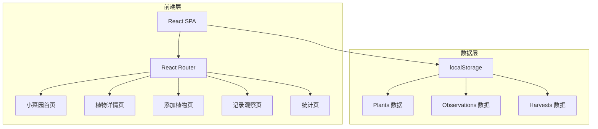
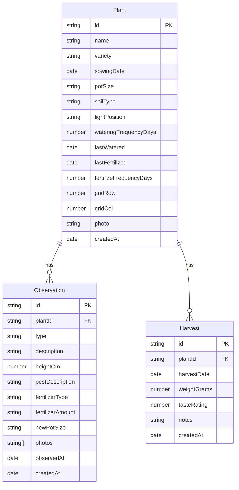

## 1. 架构设计



纯前端应用，数据持久化使用浏览器 localStorage，无需后端服务。

## 2. 技术说明
- 前端：React@18 + TypeScript + TailwindCSS@3 + Vite
- 初始化工具：Vite
- 后端：无（纯前端应用）
- 数据库：localStorage（浏览器本地存储，无需外部数据库）
- 状态管理：React Context + useReducer
- 图表：recharts（统计页数据可视化）
- 路由：react-router-dom@6
- 日期处理：date-fns
- 图片处理：FileReader API 转 Base64 存储于 localStorage

## 3. 路由定义
| 路由 | 用途 |
|------|------|
| / | 小菜园首页 — 阳台平面图展示所有花盆卡片与状态提醒 |
| /plant/:id | 植物详情页 — 基本信息卡、成长时间线、观察记录、收获记录 |
| /add | 添加植物页 — 填写新植物信息表单 |
| /observe/:id | 记录观察页 — 为指定植物添加观察记录 |
| /stats | 统计页 — 品种分析、收获总览、问题花盆 |

## 4. API 定义
无后端 API，所有数据通过 localStorage 操作。

### 数据操作接口（Context 层）
```typescript
interface PlantService {
  addPlant(plant: Omit<Plant, 'id' | 'createdAt'>): Plant
  updatePlant(id: string, updates: Partial<Plant>): Plant
  deletePlant(id: string): void
  getPlant(id: string): Plant | undefined
  getAllPlants(): Plant[]
}

interface ObservationService {
  addObservation(observation: Omit<Observation, 'id' | 'createdAt'>): Observation
  getObservationsByPlant(plantId: string): Observation[]
  deleteObservation(id: string): void
}

interface HarvestService {
  addHarvest(harvest: Omit<Harvest, 'id' | 'createdAt'>): Harvest
  getHarvestsByPlant(plantId: string): Harvest[]
  deleteHarvest(id: string): void
}
```

## 5. 服务器架构图
不适用 — 纯前端应用无服务器架构。

## 6. 数据模型

### 6.1 数据模型定义



### 6.2 数据定义语言

```typescript
type PotSize = 'small' | 'medium' | 'large'
type LightPosition = 'full-sun' | 'partial-sun' | 'shade'
type ObservationType = 'growth' | 'flowering' | 'fruiting' | 'yellowing' | 'pest' | 'fertilizing' | 'repotting' | 'other'

interface Plant {
  id: string
  name: string
  variety: string
  sowingDate: string
  potSize: PotSize
  soilType: string
  lightPosition: LightPosition
  wateringFrequencyDays: number
  lastWatered: string
  lastFertilized: string
  fertilizeFrequencyDays: number
  gridRow: number
  gridCol: number
  photo: string
  createdAt: string
}

interface Observation {
  id: string
  plantId: string
  type: ObservationType
  description: string
  heightCm: number | null
  pestDescription: string | null
  fertilizerType: string | null
  fertilizerAmount: string | null
  newPotSize: string | null
  photos: string[]
  observedAt: string
  createdAt: string
}

interface Harvest {
  id: string
  plantId: string
  harvestDate: string
  weightGrams: number
  tasteRating: number
  notes: string
  createdAt: string
}
```
