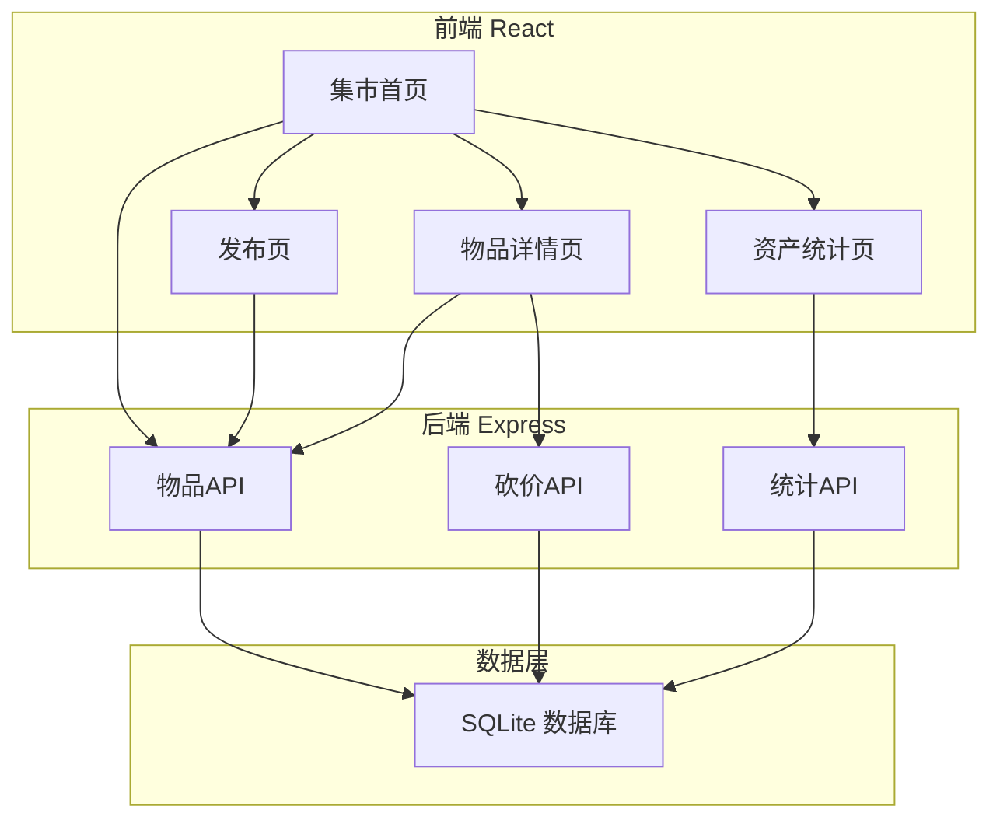
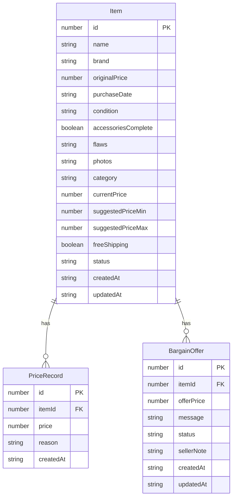

## 1. 架构设计



## 2. 技术说明
- 前端：React@18 + tailwindcss@3 + vite
- 初始化工具：vite-init
- 后端：Express@4 + TypeScript (ESM)
- 数据库：SQLite (better-sqlite3)
- 状态管理：zustand
- 图表：recharts
- 路由：react-router-dom

## 3. 路由定义
| 路由 | 用途 |
|------|------|
| / | 集市首页，展示物品列表和筛选 |
| /publish | 发布闲置物品页面 |
| /item/:id | 物品详情页，含价格曲线和砍价区 |
| /stats | 闲置资产统计页面 |

## 4. API定义

### 4.1 物品API
```typescript
interface Item {
  id: number
  name: string
  brand: string
  originalPrice: number
  purchaseDate: string
  condition: "全新" | "9成新" | "8成新" | "7成新" | "6成新及以下"
  accessoriesComplete: boolean
  flaws: string
  photos: string[]
  category: "数码" | "家电" | "服装" | "书籍" | "家居" | "其他"
  currentPrice: number
  suggestedPriceMin: number
  suggestedPriceMax: number
  freeShipping: boolean
  status: "selling" | "sold"
  createdAt: string
  updatedAt: string
}

interface PriceRecord {
  id: number
  itemId: number
  price: number
  reason: string
  createdAt: string
}

// GET /api/items - 获取物品列表（支持筛选查询参数）
// GET /api/items/:id - 获取物品详情
// POST /api/items - 创建物品
// PUT /api/items/:id - 更新物品（改价等）
// DELETE /api/items/:id - 删除物品

// GET /api/items/:id/prices - 获取价格历史
// POST /api/items/:id/prices - 添加价格记录（降价）

// POST /api/items/estimate - 估价计算（传入物品信息返回建议价格区间）
```

### 4.2 砍价API
```typescript
interface BargainOffer {
  id: number
  itemId: number
  offerPrice: number
  message: string
  status: "pending" | "accepted" | "rejected"
  sellerNote: string
  createdAt: string
  updatedAt: string
}

// GET /api/items/:id/bargains - 获取砍价记录
// POST /api/items/:id/bargains - 提交砍价出价
// PUT /api/bargains/:id - 卖家处理砍价（接受/拒绝/备注）
```

### 4.3 统计API
```typescript
interface Stats {
  totalListedValue: number
  totalListedCount: number
  totalSoldValue: number
  totalSoldCount: number
  recycledSpaceEstimate: number
  categoryBreakdown: { category: string; count: number; value: number }[]
}

// GET /api/stats - 获取资产统计
```

## 5. 服务器架构图


## 6. 数据模型

### 6.1 数据模型定义



### 6.2 数据定义语言

```sql
CREATE TABLE items (
  id INTEGER PRIMARY KEY AUTOINCREMENT,
  name TEXT NOT NULL,
  brand TEXT NOT NULL DEFAULT '',
  original_price REAL NOT NULL,
  purchase_date TEXT NOT NULL,
  condition TEXT NOT NULL CHECK(condition IN ('全新', '9成新', '8成新', '7成新', '6成新及以下')),
  accessories_complete INTEGER NOT NULL DEFAULT 1,
  flaws TEXT NOT NULL DEFAULT '',
  photos TEXT NOT NULL DEFAULT '[]',
  category TEXT NOT NULL CHECK(category IN ('数码', '家电', '服装', '书籍', '家居', '其他')),
  current_price REAL NOT NULL,
  suggested_price_min REAL NOT NULL,
  suggested_price_max REAL NOT NULL,
  free_shipping INTEGER NOT NULL DEFAULT 0,
  status TEXT NOT NULL DEFAULT 'selling' CHECK(status IN ('selling', 'sold')),
  created_at TEXT NOT NULL DEFAULT (datetime('now')),
  updated_at TEXT NOT NULL DEFAULT (datetime('now'))
);

CREATE TABLE price_records (
  id INTEGER PRIMARY KEY AUTOINCREMENT,
  item_id INTEGER NOT NULL,
  price REAL NOT NULL,
  reason TEXT NOT NULL DEFAULT '',
  created_at TEXT NOT NULL DEFAULT (datetime('now')),
  FOREIGN KEY (item_id) REFERENCES items(id) ON DELETE CASCADE
);

CREATE TABLE bargain_offers (
  id INTEGER PRIMARY KEY AUTOINCREMENT,
  item_id INTEGER NOT NULL,
  offer_price REAL NOT NULL,
  message TEXT NOT NULL DEFAULT '',
  status TEXT NOT NULL DEFAULT 'pending' CHECK(status IN ('pending', 'accepted', 'rejected')),
  seller_note TEXT NOT NULL DEFAULT '',
  created_at TEXT NOT NULL DEFAULT (datetime('now')),
  updated_at TEXT NOT NULL DEFAULT (datetime('now')),
  FOREIGN KEY (item_id) REFERENCES items(id) ON DELETE CASCADE
);

CREATE INDEX idx_items_category ON items(category);
CREATE INDEX idx_items_status ON items(status);
CREATE INDEX idx_items_condition ON items(condition);
CREATE INDEX idx_price_records_item ON price_records(item_id);
CREATE INDEX idx_bargain_offers_item ON bargain_offers(item_id);
```
