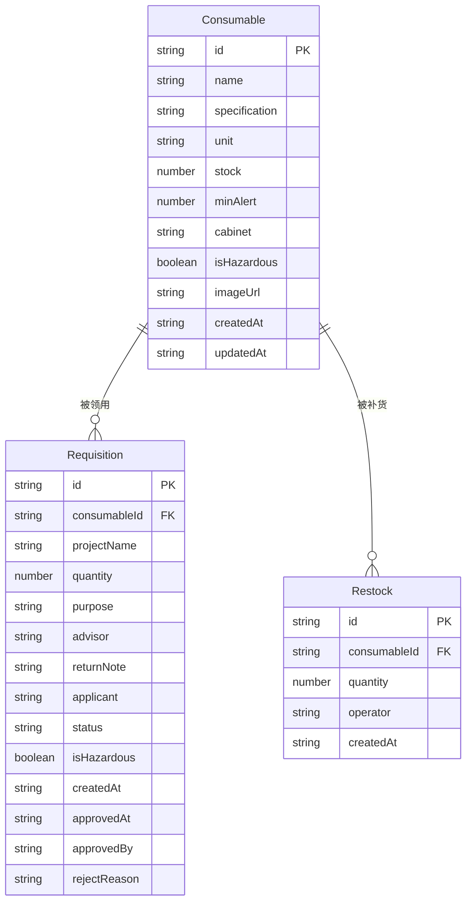

## 1. 架构设计

```mermaid
graph TB
    subgraph "前端层"
        "React SPA" --> "React Router"
        "React Router" --> "首页仪表盘"
        "React Router" --> "耗材管理"
        "React Router" --> "领用申请"
        "React Router" --> "审批管理"
        "React Router" --> "统计分析"
    end
    subgraph "数据层"
        "React SPA" --> "Zustand Store"
        "Zustand Store" --> "LocalStorage 持久化"
    end
    subgraph "工具层"
        "React SPA" --> "Recharts 图表"
        "React SPA" --> "date-fns 日期处理"
    end
```

纯前端方案，使用 Zustand + LocalStorage 实现数据持久化，无需后端服务。

## 2. 技术说明

- **前端**：React@18 + TypeScript + TailwindCSS@3 + Vite
- **初始化工具**：Vite (react-ts 模板)
- **状态管理**：Zustand（轻量、支持持久化中间件）
- **路由**：React Router v6
- **图表**：Recharts
- **日期处理**：date-fns
- **图标**：Lucide React
- **后端**：无（纯前端 + LocalStorage）
- **数据库**：无（LocalStorage + mock 初始数据）

## 3. 路由定义

| 路由 | 用途 |
|------|------|
| `/` | 首页仪表盘，四大分区概览 |
| `/consumables` | 耗材管理，列表 + 新增/编辑 |
| `/request` | 领用申请，提交表单 + 我的申请 |
| `/approval` | 审批管理，待审批列表 + 审批操作 |
| `/statistics` | 统计分析，消耗/补货/短缺图表 |

## 4. API 定义

无后端 API，所有数据操作通过 Zustand Store 完成。

### 4.1 数据操作接口

```typescript
interface Consumable {
  id: string;
  name: string;
  specification: string;
  unit: string;
  stock: number;
  minAlert: number;
  cabinet: string;
  isHazardous: boolean;
  imageUrl: string;
  createdAt: string;
  updatedAt: string;
}

interface Requisition {
  id: string;
  consumableId: string;
  projectName: string;
  quantity: number;
  purpose: string;
  advisor: string;
  returnNote: string;
  applicant: string;
  status: 'pending' | 'approved' | 'rejected' | 'hazardous_pending';
  isHazardous: boolean;
  createdAt: string;
  approvedAt?: string;
  approvedBy?: string;
  rejectReason?: string;
}

interface Restock {
  id: string;
  consumableId: string;
  quantity: number;
  operator: string;
  createdAt: string;
}
```

## 5. 服务端架构

不适用（纯前端项目）

## 6. 数据模型

### 6.1 数据模型定义



### 6.2 数据定义

使用 Zustand persist 中间件将数据存储在 LocalStorage 中，初始化时注入 mock 数据（含手套、枪头、培养皿等常见耗材及示例领用记录），确保系统开箱即用。
