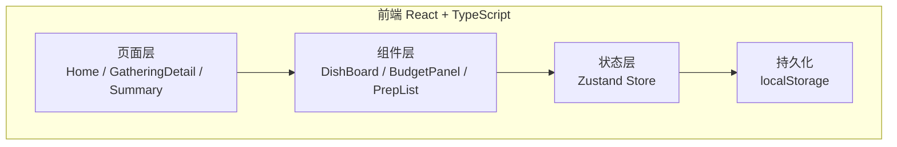
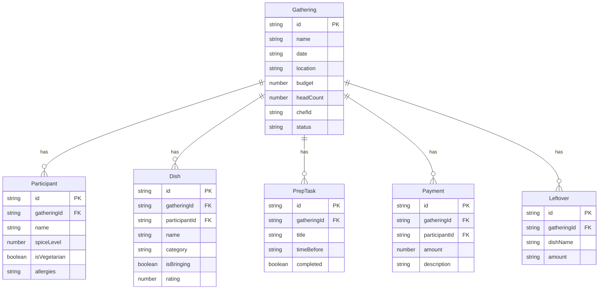

# 朋友聚会菜单协调器 - 技术架构文档

## 1. 架构设计



纯前端应用，无后端服务，所有数据通过 localStorage 持久化。

## 2. 技术说明
- 前端：React@18 + TypeScript + Tailwind CSS@3 + Zustand
- 初始化工具：vite-init（react-ts 模板）
- 后端：无
- 数据库：localStorage（浏览器本地存储）
- 图表：纯 CSS/SVG 实现简单图表，不引入第三方图表库

## 3. 路由定义
| 路由 | 用途 |
|------|------|
| `/` | 首页 - 聚会列表和快速统计 |
| `/gathering/new` | 创建新聚会 |
| `/gathering/:id` | 聚会详情 - 菜品看板、忌口、预算、准备清单 |
| `/gathering/:id/summary` | 聚会总结 - 花费、剩菜、评分、统计 |

## 4. 数据模型

### 4.1 数据模型定义



### 4.2 数据定义（TypeScript 类型）

```typescript
type DishCategory = 'staple' | 'hot' | 'cold' | 'dessert' | 'drink'

type GatheringStatus = 'preparing' | 'ongoing' | 'completed'

interface Gathering {
  id: string
  name: string
  date: string
  location: string
  budget: number
  headCount: number
  chefId: string
  status: GatheringStatus
  createdAt: string
}

interface Participant {
  id: string
  gatheringId: string
  name: string
  spiceLevel: 0 | 1 | 2 | 3
  isVegetarian: boolean
  allergies: string
  avatar: string
}

interface Dish {
  id: string
  gatheringId: string
  participantId: string
  name: string
  category: DishCategory
  isBringing: boolean
  rating?: number
}

interface PrepTask {
  id: string
  gatheringId: string
  title: string
  timeBefore: string
  completed: boolean
  assignee?: string
}

interface Payment {
  id: string
  gatheringId: string
  participantId: string
  amount: number
  description: string
}

interface Leftover {
  id: string
  gatheringId: string
  dishName: string
  amount: 'none' | 'little' | 'some' | 'lot'
}
```
