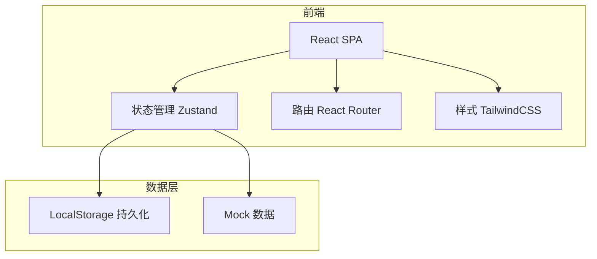
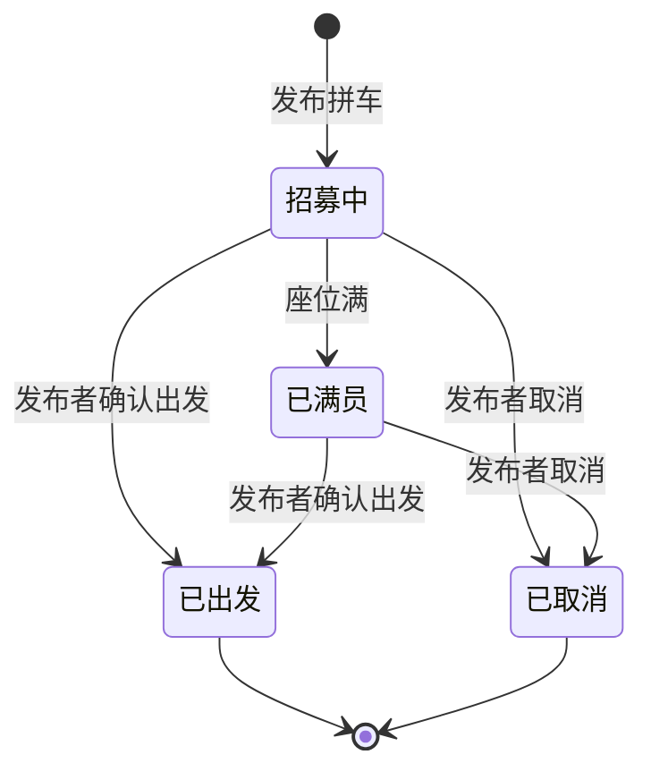

## 1. 架构设计



纯前端应用，使用 LocalStorage 作为数据持久化方案，无需后端服务。

## 2. 技术选型

- **前端框架**：React@18 + TypeScript
- **构建工具**：Vite
- **样式方案**：TailwindCSS@3
- **路由**：React Router DOM@6
- **状态管理**：Zustand（轻量级，适合中小型应用）
- **数据持久化**：LocalStorage + Zustand persist 中间件
- **图标**：Lucide React
- **日期处理**：date-fns
- **动画**：Framer Motion

## 3. 路由定义

| 路由 | 用途 |
|------|------|
| / | 拼车首页（时间轴 + 筛选） |
| /publish | 发布拼车 |
| /carpool/:id | 拼车详情（加入/取消/留言/费用计算） |
| /history | 历史记录 + 常用路线 |
| /calculator | 费用计算器 |

## 4. 数据模型定义

### 4.1 TypeScript 类型定义

```typescript
type CarpoolStatus = 'recruiting' | 'full' | 'departed' | 'cancelled'

interface Passenger {
  id: string
  name: string
  joinedAt: string
}

interface Message {
  id: string
  authorId: string
  authorName: string
  content: string
  createdAt: string
}

interface Carpool {
  id: string
  departure: string
  destination: string
  departureTime: string
  totalSeats: number
  passengers: Passenger[]
  totalCost: number
  allowLuggage: boolean
  contact: string
  status: CarpoolStatus
  messages: Message[]
  createdAt: string
  publisherId: string
  publisherName: string
}

interface FrequentRoute {
  id: string
  departure: string
  destination: string
  count: number
  lastUsed: string
}
```

### 4.2 状态流转



## 5. 项目目录结构

```
src/
├── components/
│   ├── CarpoolCard.tsx        # 拼车卡片组件
│   ├── Timeline.tsx           # 时间轴布局
│   ├── FilterBar.tsx          # 筛选栏
│   ├── StatusBadge.tsx        # 状态徽章
│   ├── SeatIndicator.tsx      # 座位指示器
│   ├── MessageList.tsx        # 留言列表
│   ├── CostCalculator.tsx     # 费用计算器组件
│   ├── RouteCard.tsx          # 常用路线卡片
│   └── Layout.tsx             # 全局布局
├── pages/
│   ├── Home.tsx               # 首页
│   ├── Publish.tsx            # 发布页
│   ├── CarpoolDetail.tsx      # 详情页
│   ├── History.tsx            # 历史页
│   └── Calculator.tsx         # 费用计算器页
├── store/
│   └── useCarpoolStore.ts     # Zustand 状态管理
├── types/
│   └── index.ts               # 类型定义
├── utils/
│   ├── time.ts                # 时间工具函数
│   └── cost.ts                # 费用计算工具
├── data/
│   └── mock.ts                # Mock 数据
├── App.tsx
└── main.tsx
```

## 6. 关键技术实现

### 6.1 时间轴分组逻辑

- 获取当前日期，判断每条拼车的 `departureTime` 属于"今天""明天"还是"本周"
- 使用 date-fns 的 `isToday`、`isTomorrow`、`isThisWeek` 判断
- 分组后按 `departureTime` 升序排列
- 已过期的拼车自动标记为"已出发"

### 6.2 筛选逻辑

- 目的地：关键词模糊匹配
- 时间段：下拉选择"今天""明天""本周""自定义范围"
- 座位数：最少剩余座位数滑块筛选

### 6.3 费用计算

- 基础分摊：总费用 ÷ 当前乘客数（含发布者）
- 显示每人应付金额，精确到小数点后两位

### 6.4 数据持久化

- Zustand persist 中间件将状态自动同步到 LocalStorage
- 页面刷新后数据不丢失
- 首次访问加载 Mock 数据

### 6.5 常用路线提取

- 从历史拼车记录中统计出发地-目的地组合出现频次
- 取频次 ≥ 2 的路线作为常用路线
- 支持一键再发，预填出发地、目的地、费用等信息
