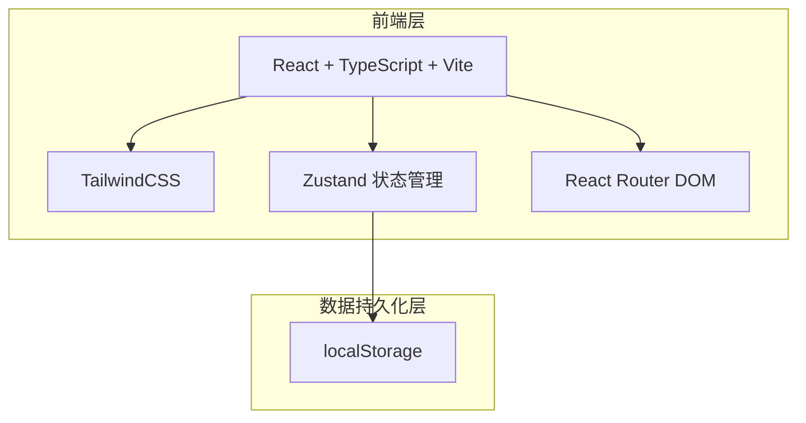
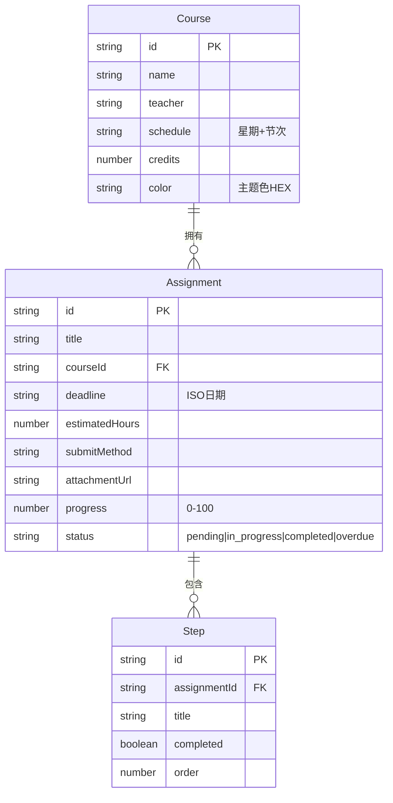

## 1. 架构设计



纯前端项目，数据通过 localStorage 持久化，无需后端服务。

## 2. 技术说明

- 前端：React@18 + TailwindCSS@3 + Vite
- 初始化工具：vite-init
- 后端：无
- 数据库：无，使用 localStorage + Zustand persist 中间件

## 3. 路由定义

| 路由 | 用途 |
|------|------|
| / | 雷达首页 - 雷达盘 + 紧急任务列表 |
| /courses | 课程管理 - 课程列表和增删改 |
| /assignments | 作业管理 - 作业列表和增删改、步骤拆分 |
| /week | 周视图 - 按周查看作业安排 |
| /stats | 统计页 - 课程拖延分析和月度统计 |

## 4. 数据模型

### 4.1 数据模型定义



### 4.2 数据定义

```typescript
interface Course {
  id: string;
  name: string;
  teacher: string;
  schedule: string;
  credits: number;
  color: string;
}

interface Assignment {
  id: string;
  title: string;
  courseId: string;
  deadline: string;
  estimatedHours: number;
  submitMethod: string;
  attachmentUrl: string;
  progress: number;
  status: 'pending' | 'in_progress' | 'completed' | 'overdue';
  steps: Step[];
}

interface Step {
  id: string;
  title: string;
  completed: boolean;
  order: number;
}

interface AssignmentStore {
  courses: Course[];
  assignments: Assignment[];
  addCourse: (course: Omit<Course, 'id'>) => void;
  updateCourse: (id: string, course: Partial<Course>) => void;
  deleteCourse: (id: string) => void;
  addAssignment: (assignment: Omit<Assignment, 'id'>) => void;
  updateAssignment: (id: string, assignment: Partial<Assignment>) => void;
  deleteAssignment: (id: string) => void;
  toggleStep: (assignmentId: string, stepId: string) => void;
  addStep: (assignmentId: string, step: Omit<Step, 'id'>) => void;
  deleteStep: (assignmentId: string, stepId: string) => void;
}
```

## 5. 关键算法

### 5.1 雷达距离计算

作业在雷达上的位置由紧急度决定：

```
urgencyScore = (1 - daysUntilDeadline / maxDays) * (1 - progress / 100)
```

- 角度：根据课程分类分配（同一课程的作业聚集在同一扇区）
- 距中心距离：urgencyScore 越大越靠近中心
- 点大小：与预计耗时成正比

### 5.2 红色预警判断

```
isUrgent = (hoursUntilDeadline < 24 && progress < 50) || (hoursUntilDeadline < 48 && progress < 30)
```

### 5.3 课程拖延指数

```
procrastinationIndex = avg(1 - progress / expectedProgressByTime)
```

其中 expectedProgressByTime = (1 - hoursRemaining / totalHours) * 100
