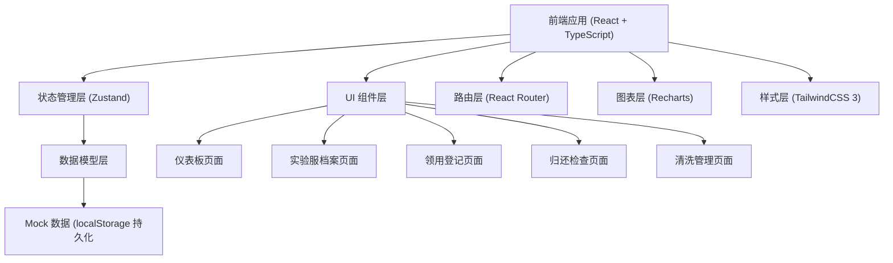
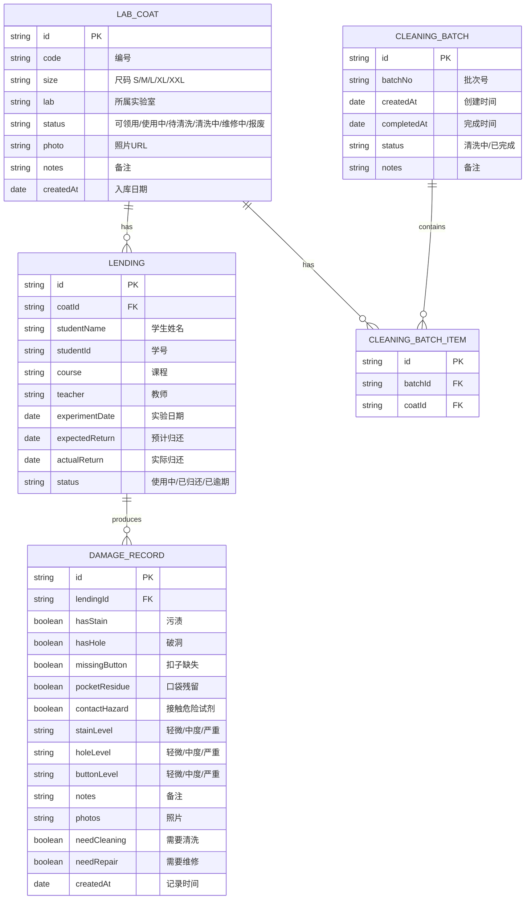

## 1. 架构设计



## 2. 技术描述

- **前端**：React@18 + TypeScript + Vite@5
- **初始化工具**：vite-init
- **状态管理**：Zustand@4
- **路由**：React Router@6
- **样式**：TailwindCSS@3
- **图表**：Recharts@2
- **图标**：Lucide React
- **后端**：无后端，使用 Mock 数据 + localStorage 持久化
- **数据存储**：浏览器 localStorage

## 3. 路由定义

| 路由 | 用途 |
|------|------|
| /dashboard | 仪表板 - 统计概览、库存、破损原因、逾期列表 |
| /coats | 实验服档案管理 |
| /coats/:id | 实验服档案详情 |
| /lendings | 领用登记 - 领用列表、新建领用 |
| /return/:lendingId | 归还检查表单 |
| /cleaning | 清洗批次管理 |

## 4. 数据模型

### 4.1 数据模型定义



### 4.2 TypeScript 类型定义

```typescript
type CoatSize = 'S' | 'M' | 'L' | 'XL' | 'XXL';
type CoatStatus = 'available' | 'in_use' | 'pending_cleaning' | 'cleaning' | 'repairing' | 'scrapped';
type DamageLevel = 'none' | 'minor' | 'moderate' | 'severe';
type LendingStatus = 'active' | 'returned' | 'overdue';
type BatchStatus = 'cleaning' | 'completed';

interface LabCoat {
  id: string;
  code: string;
  size: CoatSize;
  lab: string;
  status: CoatStatus;
  photo?: string;
  notes?: string;
  createdAt: string;
  lastCleaningBatchId?: string;
}

interface Lending {
  id: string;
  coatId: string;
  studentName: string;
  studentId: string;
  course: string;
  teacher: string;
  experimentDate: string;
  expectedReturn: string;
  actualReturn?: string;
  status: LendingStatus;
  createdAt: string;
}

interface DamageRecord {
  id: string;
  lendingId: string;
  hasStain: boolean;
  hasHole: boolean;
  missingButton: boolean;
  pocketResidue: boolean;
  contactHazard: boolean;
  stainLevel: DamageLevel;
  holeLevel: DamageLevel;
  buttonLevel: DamageLevel;
  notes?: string;
  photos: string[];
  needCleaning: boolean;
  needRepair: boolean;
  createdAt: string;
}

interface CleaningBatch {
  id: string;
  batchNo: string;
  createdAt: string;
  completedAt?: string;
  status: BatchStatus;
  notes?: string;
  coatIds: string[];
}
```

## 5. 目录结构

```
src/
├── types/              # 类型定义
│   └── index.ts
├── store/              # Zustand 状态管理
│   └── useStore.ts
├── data/               # Mock 数据
│   └── mockData.ts
├── components/         # 公共组件
│   ├── Layout/
│   ├── Sidebar.tsx
│   ├── StatCard.tsx
│   ├── CoatCard.tsx
│   └── Modal.tsx
│   └── StatusBadge.tsx
├── pages/              # 页面组件
│   ├── Dashboard.tsx
│   ├── CoatList.tsx
│   ├── CoatDetail.tsx
│   ├── LendingList.tsx
│   ├── ReturnCheck.tsx
│   └── CleaningManagement.tsx
├── utils/              # 工具函数
│   └── helpers.ts
├── App.tsx
├── main.tsx
└── index.css
```
