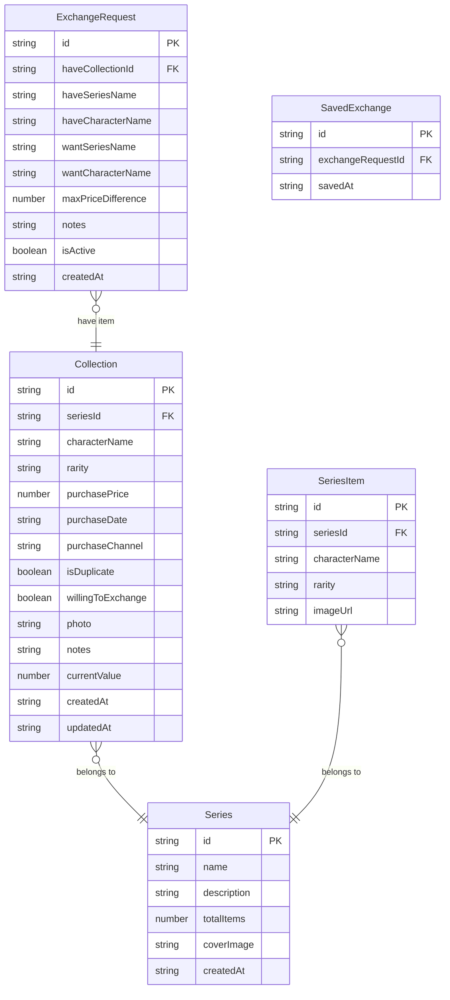

## 1. 架构设计

```mermaid
flowchart TD
    "前端 React 应用" --> "Zustand 状态管理"
    "Zustand 状态管理" --> "localStorage 持久化"
    "前端 React 应用" --> "页面路由 (react-router-dom)"
    "页面路由" --> "展示柜首页"
    "页面路由" --> "新增/编辑收藏页"
    "页面路由" --> "详情页"
    "页面路由" --> "交换区"
    "页面路由" --> "系列进度页"
    "页面路由" --> "统计页"
```

纯前端应用，无需后端服务。所有数据存储在浏览器 localStorage 中，支持导出为 JSON 文件备份和导入恢复。

## 2. 技术说明

- **前端框架**: React@18 + TypeScript
- **样式方案**: Tailwind CSS@3
- **构建工具**: Vite
- **状态管理**: Zustand（带 persist 中间件实现 localStorage 持久化）
- **路由**: react-router-dom@6
- **图标**: lucide-react
- **数据存储**: localStorage（浏览器本地）
- **数据备份**: JSON 导出/导入

## 3. 路由定义

| 路由 | 用途 |
|------|------|
| / | 展示柜首页，按系列分层展示所有收藏 |
| /add | 新增收藏页，录入盲盒信息 |
| /edit/:id | 编辑收藏页，修改已有盲盒信息 |
| /detail/:id | 详情页，查看入手记录、估值、交换意愿 |
| /exchange | 交换区，发布和浏览交换需求 |
| /progress | 系列进度页，查看收集进度和缺失清单 |
| /stats | 统计页，查看收藏数据分析 |

## 4. API 定义

无后端 API，所有数据通过 Zustand store 直接操作 localStorage。

## 5. 服务器架构图

不适用（纯前端应用）

## 6. 数据模型

### 6.1 数据模型定义



### 6.2 数据定义语言

```typescript
type Rarity = 'common' | 'rare' | 'hidden'

interface Collection {
  id: string
  seriesId: string
  characterName: string
  rarity: Rarity
  purchasePrice: number
  purchaseDate: string
  purchaseChannel: string
  isDuplicate: boolean
  willingToExchange: boolean
  photo: string
  notes: string
  currentValue: number
  createdAt: string
  updatedAt: string
}

interface Series {
  id: string
  name: string
  description: string
  totalItems: number
  coverImage: string
  createdAt: string
}

interface SeriesItem {
  id: string
  seriesId: string
  characterName: string
  rarity: Rarity
  imageUrl: string
}

interface ExchangeRequest {
  id: string
  haveCollectionId: string
  haveSeriesName: string
  haveCharacterName: string
  wantSeriesName: string
  wantCharacterName: string
  maxPriceDifference: number
  notes: string
  isActive: boolean
  createdAt: string
}

interface SavedExchange {
  id: string
  exchangeRequestId: string
  savedAt: string
}
```
