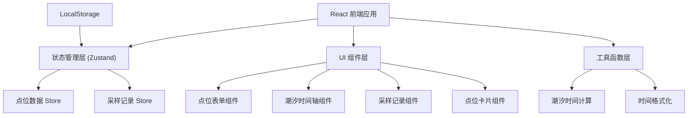
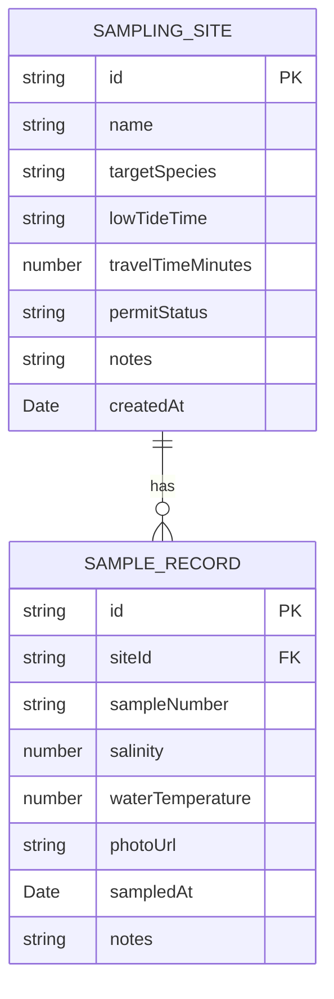

## 1. 架构设计



## 2. 技术描述

- **前端框架**：React@18 + TypeScript
- **构建工具**：Vite
- **样式方案**：TailwindCSS@3
- **状态管理**：Zustand
- **路由**：React Router DOM
- **图标库**：Lucide React
- **数据持久化**：LocalStorage（前端 mock）

## 3. 路线定义

| 路由 | 用途 |
|-------|---------|
| /tidal-sampling | 潮汐采样安排主页 |
| / | 重定向到潮汐采样页 |

## 4. 数据模型

### 4.1 数据模型定义



### 4.2 TypeScript 类型定义

```typescript
type PermitStatus = 'approved' | 'pending' | 'denied';

interface SamplingSite {
  id: string;
  name: string;
  targetSpecies: string;
  lowTideTime: string; // ISO datetime string
  travelTimeMinutes: number;
  permitStatus: PermitStatus;
  notes: string;
  createdAt: string;
}

interface SampleRecord {
  id: string;
  siteId: string;
  sampleNumber: string;
  salinity: number; // ‰
  waterTemperature: number; // °C
  photoUrl?: string;
  sampledAt: string;
  notes: string;
}

interface TideWindow {
  siteId: string;
  lowTide: Date;
  tideStart: Date;  // 退潮到可作业时间
  tideEnd: Date;    // 回涨到必须撤离时间
  latestDeparture: Date;
  mustEvacuate: Date;
  workDuration: number; // minutes
}
```

## 5. 目录结构

```
src/
├── pages/
│   └── TidalSamplingPage.tsx   # 主页面
├── components/
│   ├── SiteForm.tsx            # 点位录入表单
│   ├── SiteCard.tsx            # 点位卡片
│   ├── TideTimeline.tsx        # 潮汐时间轴
│   ├── SampleRecordPanel.tsx   # 采样记录面板
│   └── StatusBadge.tsx         # 状态徽章
├── stores/
│   └── useSamplingStore.ts     # Zustand store
├── utils/
│   ├── tideCalculations.ts     # 潮汐时间计算
│   └── formatters.ts           # 格式化工具
├── types/
│   └── index.ts                # 类型定义
├── App.tsx
├── main.tsx
└── index.css
```
