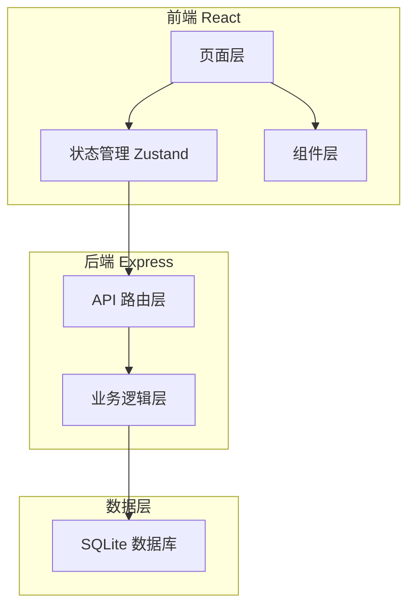
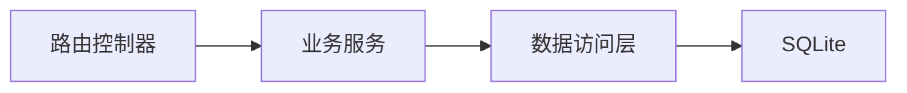
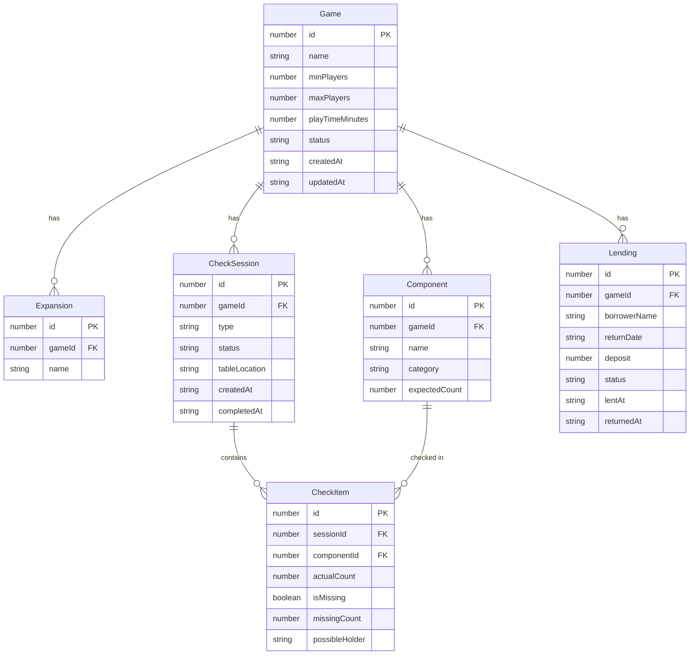

## 1. 架构设计



## 2. 技术说明

- 前端：React@18 + TypeScript + Tailwind CSS@3 + Vite
- 初始化工具：vite-init（react-express-ts 模板）
- 后端：Express@4 + TypeScript（ESM）
- 数据库：SQLite（better-sqlite3），本地文件存储
- 状态管理：Zustand
- 路由：react-router-dom

## 3. 路由定义

| 路由 | 用途 |
|------|------|
| / | 首页仪表盘，展示缺件游戏、逾期外借、热门游戏 |
| /games | 游戏库列表，搜索与筛选 |
| /games/:id | 游戏详情页，含配件明细与操作按钮 |
| /games/:id/checkin | 开盒清点页面 |
| /games/:id/checkout | 收盒清点页面 |
| /games/:id/lend | 外借登记页面 |
| /lending | 外借管理总览页面 |

## 4. API 定义

### 4.1 游戏管理

```typescript
interface Game {
  id: number;
  name: string;
  minPlayers: number;
  maxPlayers: number;
  playTimeMinutes: number;
  expansions: string[];
  status: "complete" | "missing" | "lent";
  createdAt: string;
  updatedAt: string;
}

interface Component {
  id: number;
  gameId: number;
  name: string;
  category: "deck" | "piece" | "dice" | "manual" | "scoreboard" | "other";
  expectedCount: number;
}

// GET /api/games - 获取游戏列表
// GET /api/games/:id - 获取游戏详情（含配件列表）
// POST /api/games - 创建游戏
// PUT /api/games/:id - 更新游戏
// DELETE /api/games/:id - 删除游戏
```

### 4.2 清点管理

```typescript
interface CheckSession {
  id: number;
  gameId: number;
  type: "open" | "close";
  status: "in_progress" | "completed";
  tableLocation?: string;
  createdAt: string;
  completedAt?: string;
}

interface CheckItem {
  id: number;
  sessionId: number;
  componentId: number;
  actualCount: number;
  isMissing: boolean;
  missingCount: number;
  possibleHolder?: string;
}

// POST /api/games/:id/check - 创建清点会话
// PUT /api/check-sessions/:id/items - 更新清点项
// POST /api/check-sessions/:id/complete - 完成清点
// GET /api/games/:id/check-history - 获取清点历史
```

### 4.3 外借管理

```typescript
interface Lending {
  id: number;
  gameId: number;
  borrowerName: string;
  returnDate: string;
  deposit: number;
  status: "active" | "returned" | "overdue";
  lentAt: string;
  returnedAt?: string;
}

// POST /api/games/:id/lend - 创建外借记录
// PUT /api/lendings/:id/return - 归还确认
// GET /api/lendings - 获取外借列表（支持状态筛选）
// GET /api/lendings/overdue - 获取逾期列表
```

### 4.4 仪表盘

```typescript
interface DashboardData {
  missingGames: Array<{ id: number; name: string; missingCount: number }>;
  overdueLendings: Array<Lending & { gameName: string }>;
  topPlayedGames: Array<{ id: number; name: string; playCount: number }>;
}

// GET /api/dashboard - 获取仪表盘数据
```

## 5. 服务器架构图



## 6. 数据模型

### 6.1 数据模型定义



### 6.2 数据定义语言

```sql
CREATE TABLE games (
  id INTEGER PRIMARY KEY AUTOINCREMENT,
  name TEXT NOT NULL,
  min_players INTEGER NOT NULL,
  max_players INTEGER NOT NULL,
  play_time_minutes INTEGER NOT NULL,
  status TEXT NOT NULL DEFAULT 'complete',
  created_at TEXT NOT NULL DEFAULT (datetime('now')),
  updated_at TEXT NOT NULL DEFAULT (datetime('now'))
);

CREATE TABLE expansions (
  id INTEGER PRIMARY KEY AUTOINCREMENT,
  game_id INTEGER NOT NULL REFERENCES games(id) ON DELETE CASCADE,
  name TEXT NOT NULL
);

CREATE TABLE components (
  id INTEGER PRIMARY KEY AUTOINCREMENT,
  game_id INTEGER NOT NULL REFERENCES games(id) ON DELETE CASCADE,
  name TEXT NOT NULL,
  category TEXT NOT NULL CHECK(category IN ('deck', 'piece', 'dice', 'manual', 'scoreboard', 'other')),
  expected_count INTEGER NOT NULL DEFAULT 1
);

CREATE TABLE check_sessions (
  id INTEGER PRIMARY KEY AUTOINCREMENT,
  game_id INTEGER NOT NULL REFERENCES games(id) ON DELETE CASCADE,
  type TEXT NOT NULL CHECK(type IN ('open', 'close')),
  status TEXT NOT NULL DEFAULT 'in_progress',
  table_location TEXT,
  created_at TEXT NOT NULL DEFAULT (datetime('now')),
  completed_at TEXT
);

CREATE TABLE check_items (
  id INTEGER PRIMARY KEY AUTOINCREMENT,
  session_id INTEGER NOT NULL REFERENCES check_sessions(id) ON DELETE CASCADE,
  component_id INTEGER NOT NULL REFERENCES components(id) ON DELETE CASCADE,
  actual_count INTEGER NOT NULL DEFAULT 0,
  is_missing INTEGER NOT NULL DEFAULT 0,
  missing_count INTEGER NOT NULL DEFAULT 0,
  possible_holder TEXT
);

CREATE TABLE lendings (
  id INTEGER PRIMARY KEY AUTOINCREMENT,
  game_id INTEGER NOT NULL REFERENCES games(id) ON DELETE CASCADE,
  borrower_name TEXT NOT NULL,
  return_date TEXT NOT NULL,
  deposit REAL NOT NULL DEFAULT 0,
  status TEXT NOT NULL DEFAULT 'active',
  lent_at TEXT NOT NULL DEFAULT (datetime('now')),
  returned_at TEXT
);

CREATE INDEX idx_games_status ON games(status);
CREATE INDEX idx_check_sessions_game ON check_sessions(game_id);
CREATE INDEX idx_lendings_status ON lendings(status);
CREATE INDEX idx_lendings_return_date ON lendings(return_date);
```
