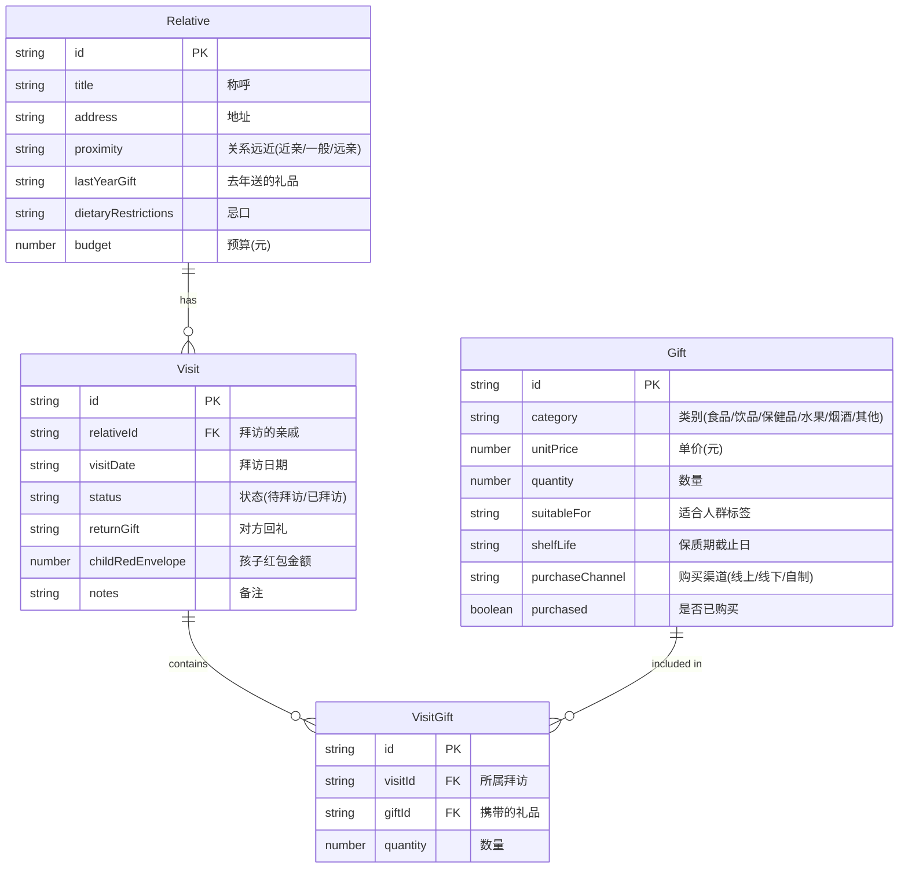

## 1. 架构设计

```mermaid
flowchart TD
    "前端 React + TypeScript" --> "状态管理 Zustand"
    "状态管理 Zustand" --> "本地存储 localStorage"
    "前端 React + TypeScript" --> "路由 React Router"
    "前端 React + TypeScript" --> "UI组件 Tailwind CSS"
    "前端 React + TypeScript" --> "图标 Lucide React"
```

纯前端应用，数据存储在浏览器 localStorage 中，无需后端服务。

## 2. 技术说明

- **前端**：React@18 + TypeScript + Tailwind CSS + Vite
- **初始化工具**：vite-init（react-ts 模板）
- **后端**：无
- **数据库**：无，使用 localStorage 持久化
- **状态管理**：Zustand（含 persist 中间件自动同步 localStorage）
- **路由**：React Router DOM v6
- **图标**：lucide-react

## 3. 路由定义

| 路由 | 用途 |
|------|------|
| / | 首页 - 今日拜访、智能提醒、路线概览 |
| /relatives | 亲戚管理 - 亲戚列表与增删改查 |
| /gifts | 礼品管理 - 礼品列表与增删改查 |
| /visits | 拜访安排 - 拜访计划与回礼记录 |
| /stats | 统计页 - 花费总览、礼品热度、安排进度 |

## 4. API定义

无后端API，所有数据操作通过 Zustand store 完成。

## 5. 服务端架构

不适用

## 6. 数据模型

### 6.1 数据模型定义



### 6.2 数据定义

使用 TypeScript 接口定义，存储在 Zustand store 中，通过 persist 中间件自动同步到 localStorage。

```typescript
interface Relative {
  id: string
  title: string
  address: string
  proximity: 'close' | 'normal' | 'distant'
  lastYearGift: string
  dietaryRestrictions: string
  budget: number
}

interface Gift {
  id: string
  category: 'food' | 'drink' | 'health' | 'fruit' | 'tobacco_alcohol' | 'other'
  name: string
  unitPrice: number
  quantity: number
  suitableFor: string
  shelfLife: string
  purchaseChannel: 'online' | 'offline' | 'homemade'
  purchased: boolean
}

interface Visit {
  id: string
  relativeId: string
  visitDate: string
  status: 'pending' | 'visited'
  returnGift: string
  childRedEnvelope: number
  notes: string
}

interface VisitGift {
  id: string
  visitId: string
  giftId: string
  quantity: number
}
```
