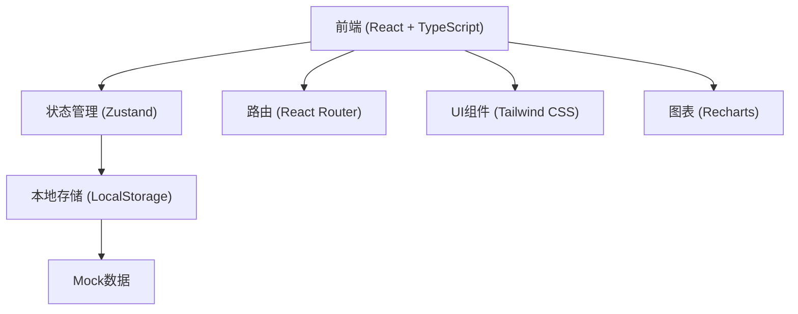
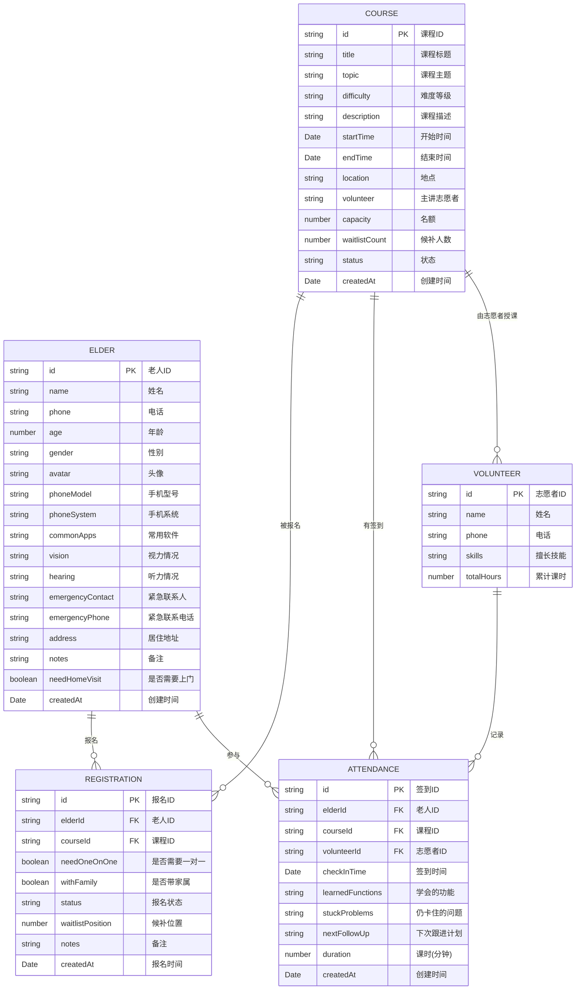

## 1. 架构设计



## 2. 技术描述

- **前端框架**：React@18 + TypeScript
- **构建工具**：Vite
- **样式方案**：TailwindCSS@3
- **状态管理**：Zustand
- **路由方案**：react-router-dom
- **图表库**：Recharts
- **图标库**：lucide-react
- **数据存储**：LocalStorage（前端模拟，内置Mock数据）
- **后端服务**：无（纯前端应用，数据本地持久化）

## 3. 路由定义

| 路由 | 页面 | 功能描述 |
|------|------|----------|
| / | 首页仪表盘 | 数据概览、今日课程、快捷操作 |
| /elders | 老人档案列表 | 老人档案管理、搜索筛选 |
| /elders/new | 新增老人 | 新建老人档案表单 |
| /elders/:id | 老人详情 | 查看老人详细信息和学习历史 |
| /elders/:id/edit | 编辑老人 | 编辑老人档案 |
| /courses | 课程列表 | 课程管理、状态筛选 |
| /courses/new | 新建课程 | 创建新课程表单 |
| /courses/:id | 课程详情 | 课程信息、报名名单、候补名单 |
| /courses/:id/edit | 编辑课程 | 编辑课程信息 |
| /registrations | 报名列表 | 所有报名记录管理 |
| /registrations/new | 新建报名 | 选择老人和课程报名 |
| /attendance | 签到记录 | 课堂签到和学习记录 |
| /attendance/new | 新建签到 | 签到和学习记录表单 |
| /statistics | 数据统计 | 各类统计图表和报表 |

## 4. 数据模型

### 4.1 数据模型定义



### 4.2 数据结构说明

#### 老人档案 (Elder)
- 基本信息：姓名、电话、年龄、性别、头像
- 手机信息：手机型号、手机系统、常用软件
- 健康状况：视力情况、听力情况
- 联系信息：紧急联系人、紧急联系电话、居住地址
- 特殊需求：是否需要上门辅导、备注

#### 课程 (Course)
- 基本信息：标题、主题、难度、描述
- 时间地点：开始时间、结束时间、地点
- 人员安排：主讲志愿者
- 名额管理：总名额、候补人数、状态

#### 报名记录 (Registration)
- 关联信息：老人ID、课程ID
- 特殊需求：是否一对一、是否带家属
- 状态管理：报名状态、候补位置
- 备注信息

#### 签到记录 (Attendance)
- 关联信息：老人ID、课程ID、志愿者ID
- 学习记录：学会的功能、卡住的问题、下次跟进计划
- 课时统计：课时时长、签到时间

### 4.3 枚举值

**课程主题 (Topic)**
- 微信使用
- 手机挂号
- 手机支付
- 清理内存
- 拍照修图
- 打车出行
- 短视频
- 其他

**难度等级 (Difficulty)**
- 入门级
- 初级
- 中级
- 高级

**报名状态 (RegistrationStatus)**
- 已报名 (confirmed)
- 候补 (waitlist)
- 已取消 (cancelled)
- 已完成 (completed)

**课程状态 (CourseStatus)**
- 未开始 (upcoming)
- 进行中 (ongoing)
- 已结束 (finished)
- 已取消 (cancelled)

## 5. 项目结构

```
src/
├── components/          # 公共组件
│   ├── Layout/         # 布局组件
│   ├── Card/           # 卡片组件
│   ├── Modal/          # 弹窗组件
│   ├── Form/           # 表单组件
│   └── Table/          # 表格组件
├── pages/              # 页面组件
│   ├── Dashboard/      # 首页仪表盘
│   ├── Elders/         # 老人档案
│   ├── Courses/        # 课程管理
│   ├── Registrations/  # 报名管理
│   ├── Attendance/     # 签到记录
│   └── Statistics/     # 数据统计
├── store/              # 状态管理 (Zustand)
│   ├── elderStore.ts
│   ├── courseStore.ts
│   ├── registrationStore.ts
│   └── attendanceStore.ts
├── types/              # TypeScript类型定义
│   └── index.ts
├── utils/              # 工具函数
│   ├── storage.ts
│   ├── format.ts
│   └── mockData.ts
├── App.tsx
├── main.tsx
└── index.css
```
