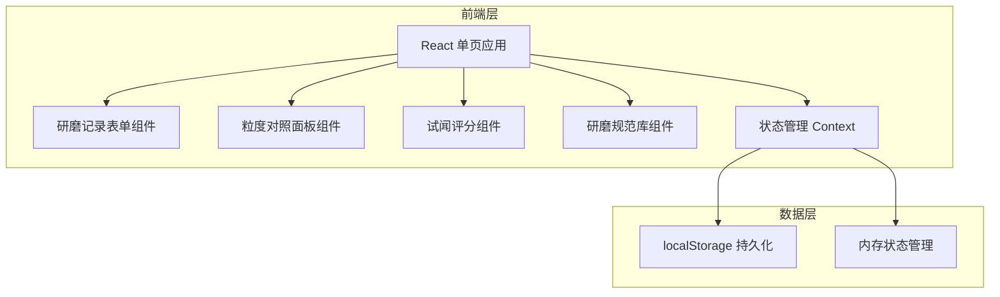
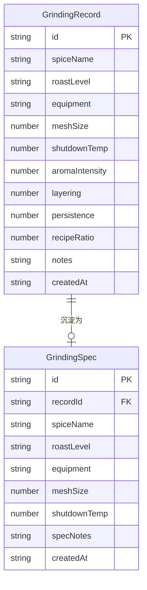

## 1. 架构设计

## 2. 技术说明
- 前端：React@18 + Tailwind CSS@3 + Vite
- 初始化工具：Vite
- 后端：无（纯前端应用）
- 数据库：localStorage（浏览器本地持久化）

## 3. 路由定义
| 路由 | 用途 |
|------|------|
| / | 主页面，包含研磨记录、粒度对照、评分、规范库 |

## 4. 数据模型

### 4.1 数据模型定义

### 4.2 数据定义
- GrindingRecord：研磨记录，包含所有录入参数和评分数据
- GrindingSpec：研磨规范，由记录沉淀而来，可额外添加规范说明备注
- 数据存储在 localStorage，键名分别为 `grinding_records` 和 `grinding_specs`
