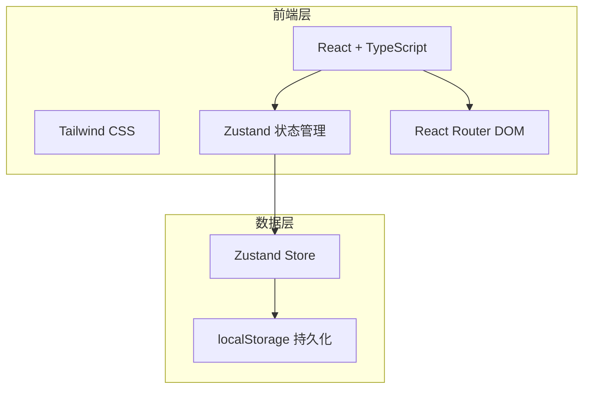
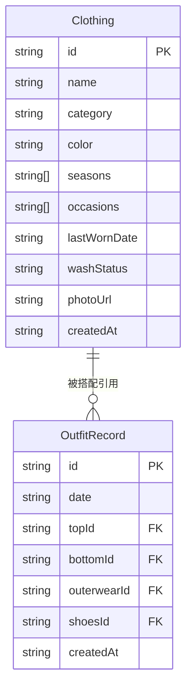

## 1. 架构设计

纯前端应用，所有数据存储在浏览器 localStorage 中，无需后端服务。

## 2. 技术说明
- 前端：React@18 + Tailwind CSS@3 + Vite + TypeScript
- 初始化工具：vite-init
- 后端：无
- 数据库：无，使用 localStorage + Zustand persist 中间件持久化

## 3. 路由定义
| 路由 | 用途 |
|------|------|
| / | 衣橱管理页，展示所有衣物卡片，支持增删改查和筛选 |
| /outfit | 每日搭配页，选择四品类组合穿搭，智能提示 |
| /idle | 闲置提醒区，展示长期未穿衣物，支持标记操作 |
| /stats | 穿搭统计页，展示颜色频次、闲置排行、搭配频率 |

## 4. API 定义
- 无后端 API，所有数据通过 Zustand Store 在前端管理

## 5. 服务端架构图
- 不适用

## 6. 数据模型

### 6.1 数据模型定义

### 6.2 数据定义

#### Clothing（衣物）
| 字段 | 类型 | 说明 |
|------|------|------|
| id | string | UUID，主键 |
| name | string | 衣物名称 |
| category | string | 类别：top / bottom / outerwear / shoes / accessory |
| color | string | 主颜色：black / white / red / blue / green / yellow / brown / gray / pink / orange / purple / beige |
| seasons | string[] | 适合季节：spring / summer / autumn / winter |
| occasions | string[] | 适合场合：casual / work / date / sport / formal / party |
| lastWornDate | string | 上次穿着日期（ISO 格式） |
| washStatus | string | 清洗状态：clean / dirty / washing |
| photoUrl | string | 照片 URL（base64 或占位图） |
| createdAt | string | 创建日期 |

#### OutfitRecord（穿搭记录）
| 字段 | 类型 | 说明 |
|------|------|------|
| id | string | UUID，主键 |
| date | string | 穿搭日期 |
| topId | string | 上衣 ID |
| bottomId | string | 下装 ID |
| outerwearId | string | 外套 ID（可选） |
| shoesId | string | 鞋子 ID |
| createdAt | string | 创建时间 |
