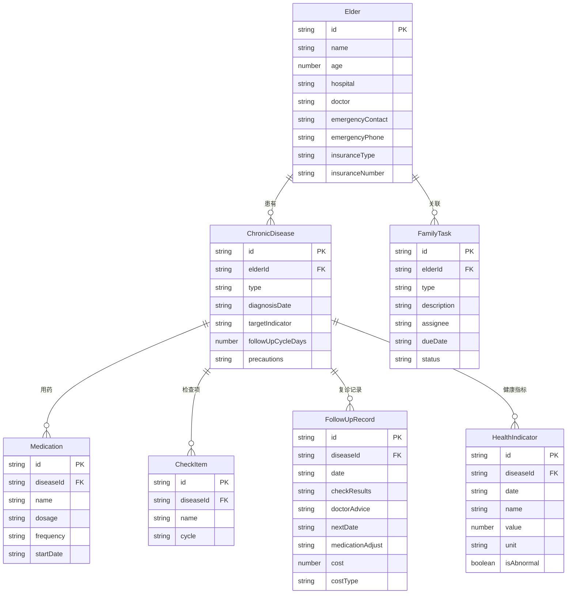

## 1. 架构设计

```mermaid
graph TB
    "前端 React + Vite" --> "Zustand 状态管理"
    "Zustand 状态管理" --> "localStorage 持久化"
    "前端 React + Vite" --> "React Router 页面路由"
    "前端 React + Vite" --> "TailwindCSS 样式"
    "前端 React + Vite" --> "date-fns 日期处理"
```

纯前端架构，使用 localStorage 做数据持久化，无需后端服务。

## 2. 技术说明
- 前端：React@18 + TypeScript + TailwindCSS@3 + Vite
- 初始化工具：vite-init
- 后端：无（纯前端）
- 数据持久化：localStorage（通过 Zustand persist 中间件）
- 日期处理：date-fns
- 图标：lucide-react
- 状态管理：Zustand

## 3. 路由定义
| 路由 | 用途 |
|-------|---------|
| / | 首页 - 看护日历，今日待办，异常预警 |
| /elders | 老人档案列表页 |
| /elders/:id | 老人档案详情页 |
| /elders/new | 新增老人档案 |
| /chronic/:elderId | 慢病管理页 |
| /followup/:elderId | 复诊记录页 |
| /tasks | 家属分工页 |
| /stats | 统计页 |

## 4. 数据模型

### 4.1 数据模型定义



### 4.2 数据定义

所有数据存储在 localStorage 中，通过 Zustand persist 中间件自动序列化/反序列化。核心数据结构用 TypeScript interface 定义：

- `Elder`：老人档案
- `ChronicDisease`：慢病信息（type 枚举：hypertension / diabetes / heartDisease / other）
- `Medication`：长期用药记录
- `CheckItem`：定期检查项目
- `FollowUpRecord`：复诊记录（含费用：cost + costType 枚举 medication / examination）
- `HealthIndicator`：日常健康指标（含 isAbnormal 标记）
- `FamilyTask`：家属分工任务（type 枚举：registration / accompany / purchase / other，status 枚举：pending / inProgress / completed）
