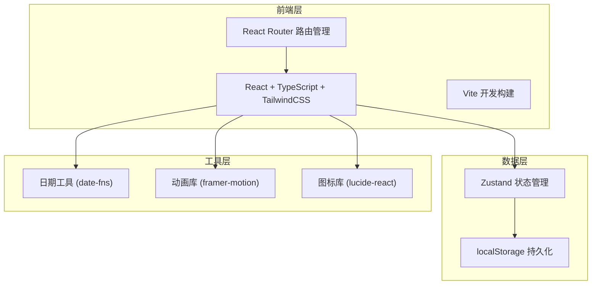
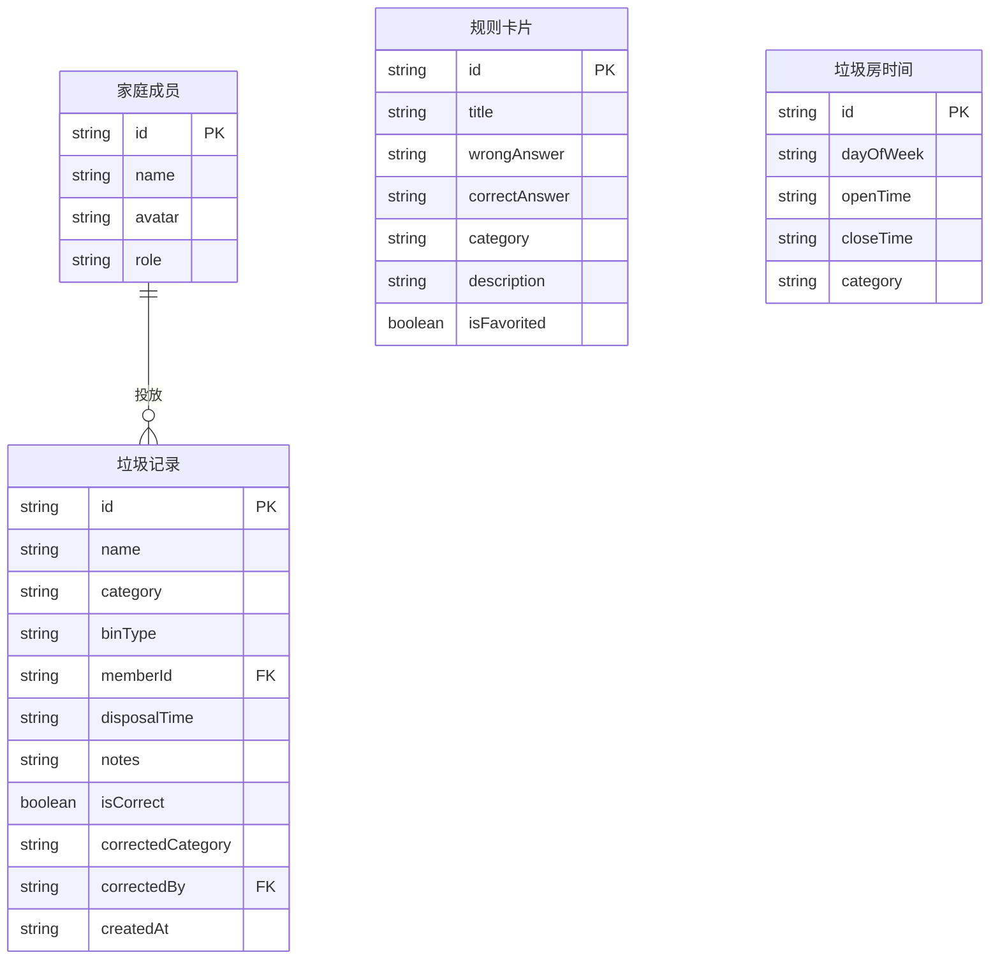

## 1. 架构设计



## 2. 技术说明
- 前端：React@18 + TypeScript + TailwindCSS@3 + Vite
- 初始化工具：Vite (react-ts 模板)
- 后端：无（纯前端应用）
- 数据库：无（使用 localStorage 持久化 + Zustand 状态管理）
- 状态管理：Zustand（轻量、TypeScript 友好）
- 动画：framer-motion
- 图标：lucide-react
- 日期：date-fns

## 3. 路由定义
| 路由 | 用途 |
|------|------|
| / | 首页 - 今日待扔/回收积攒/易错提醒/垃圾房提醒 |
| /record | 添加垃圾记录 - 录入信息/选择分类/投放人/桶类型 |
| /rules | 规则卡页 - 易错规则/分类搜索/规则收藏 |
| /stats | 统计页 - 分错统计/回收积攒/家庭排行/垃圾房设置 |

## 4. 数据模型

### 4.1 数据模型定义



### 4.2 数据定义

```typescript
type GarbageCategory = "kitchen" | "recyclable" | "hazardous" | "other"

interface FamilyMember {
  id: string
  name: string
  avatar: string
  role: "admin" | "member"
}

interface GarbageRecord {
  id: string
  name: string
  category: GarbageCategory
  binType: GarbageCategory
  memberId: string
  disposalTime: string
  notes: string
  isCorrect: boolean
  correctedCategory?: GarbageCategory
  correctedBy?: string
  createdAt: string
}

interface RuleCard {
  id: string
  title: string
  wrongAnswer: string
  correctAnswer: string
  category: GarbageCategory
  description: string
  isFavorited: boolean
}

interface GarbageRoomSchedule {
  id: string
  dayOfWeek: number
  openTime: string
  closeTime: string
  category: GarbageCategory
}
```

## 5. 项目目录结构

```
src/
├── App.tsx                    # 根组件 + 路由
├── main.tsx                   # 入口
├── index.css                  # 全局样式 + Tailwind
├── stores/
│   ├── useGarbageStore.ts     # 垃圾记录状态
│   ├── useFamilyStore.ts      # 家庭成员状态
│   └── useScheduleStore.ts    # 垃圾房时间状态
├── pages/
│   ├── Home.tsx               # 首页
│   ├── Record.tsx             # 记录页
│   ├── Rules.tsx              # 规则卡页
│   └── Stats.tsx              # 统计页
├── components/
│   ├── BottomNav.tsx          # 底部导航栏
│   ├── GarbageCard.tsx        # 垃圾卡片组件
│   ├── CategoryPicker.tsx     # 分类选择器
│   ├── MemberPicker.tsx       # 投放人选择器
│   ├── RuleFlipCard.tsx       # 规则翻转卡片
│   ├── ScheduleBanner.tsx     # 垃圾房提醒横幅
│   ├── StatRing.tsx           # 统计环形图
│   └── MemberRank.tsx         # 成员排行组件
├── data/
│   ├── defaultRules.ts        # 默认规则卡片数据
│   └── defaultMembers.ts      # 默认家庭成员
└── utils/
    ├── category.ts            # 分类工具函数
    └── time.ts                # 时间工具函数
```
