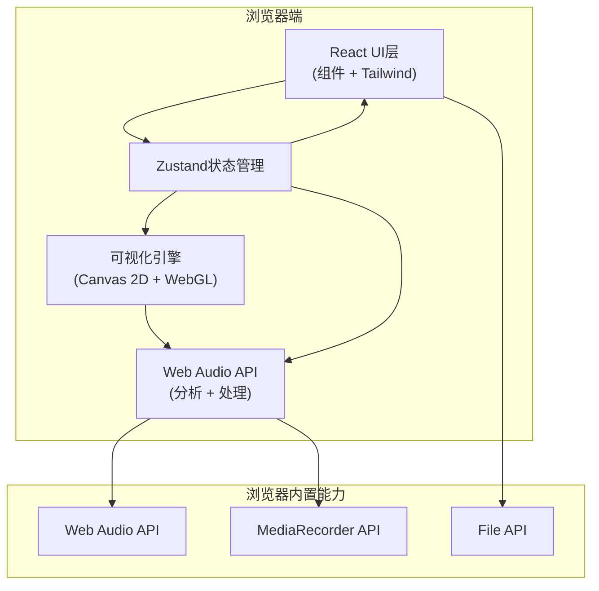

## 1. 架构设计



## 2. 技术描述

- **前端框架**：React@18 + TypeScript
- **构建工具**：Vite@5
- **样式方案**：TailwindCSS@3
- **状态管理**：Zustand
- **图标库**：lucide-react
- **音频处理**：原生 Web Audio API
- **可视化**：Canvas 2D API
- **音频导出**：Web Audio API + lamejs (MP3编码)

## 3. 目录结构

```
src/
├── components/          # UI组件
│   ├── AudioUploader.tsx
│   ├── Visualizer.tsx
│   ├── Equalizer.tsx
│   ├── PlayerControls.tsx
│   ├── MarkersPanel.tsx
│   ├── SlicerPanel.tsx
│   └── InfoPanel.tsx
├── hooks/               # 自定义Hooks
│   ├── useAudioEngine.ts
│   ├── useVisualizer.ts
│   └── useBpmDetector.ts
├── store/               # Zustand状态
│   └── audioStore.ts
├── utils/               # 工具函数
│   ├── audioAnalyzer.ts
│   ├── mp3Encoder.ts
│   └── visualizers.ts
├── types/               # 类型定义
│   └── index.ts
├── App.tsx
├── main.tsx
└── index.css
```

## 4. 核心状态定义 (Zustand)

```typescript
interface AudioState {
  audioFile: File | null;
  audioBuffer: AudioBuffer | null;
  isPlaying: boolean;
  currentTime: number;
  duration: number;
  volume: number;
  isRecording: boolean;
  visualMode: 'spectrum' | 'waveform' | 'circular' | 'mountain';
  eqBands: number[]; // 10段EQ增益值
  markers: Marker[];
  sliceStart: number;
  sliceEnd: number;
  audioInfo: AudioInfo | null;
}
```

## 5. Web Audio API 处理链路

```
音源 (AudioBufferSourceNode / MediaStreamSourceNode)
    ↓
GainNode (音量控制)
    ↓
10 x BiquadFilterNode (均衡器)
    ↓
AnalyserNode (频谱分析)
    ↓
GainNode (主输出)
    ↓
AudioDestinationNode (扬声器)
```

## 6. 可视化算法

1. **频谱柱状图**：`AnalyserNode.getByteFrequencyData()` → FFT数组 → 柱状图绘制
2. **波形线**：`AnalyserNode.getByteTimeDomainData()` → 时域数据 → 贝塞尔曲线
3. **圆环旋转**：频谱数据映射为极坐标 → 旋转动画 + 辉光效果
4. **3D山脉**：频谱数据生成高度场 → 透视投影 → 连线网格
