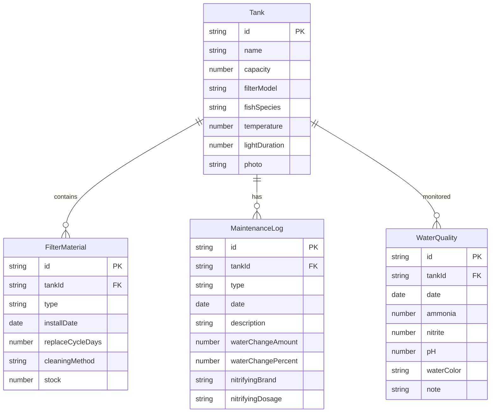

## 1. 架构设计

```mermaid
flowchart TD
    "前端 React + Vite" --> "状态管理 Zustand"
    "状态管理 Zustand" --> "本地存储 localStorage"
    "前端 React + Vite" --> "页面路由 React Router"
    "页面路由 React Router" --> "首页仪表盘"
    "页面路由 React Router" --> "鱼缸档案页"
    "页面路由 React Router" --> "滤材管理页"
    "页面路由 React Router" --> "维护日志页"
    "页面路由 React Router" --> "水质监测页"
    "首页仪表盘" --> "预警计算引擎"
    "水质监测页" --> "异常关联引擎"
    "异常关联引擎" --> "维护日志页"
```

## 2. 技术说明

- **前端框架**: React@18 + TypeScript + Vite
- **样式方案**: Tailwind CSS@3 + CSS Variables 主题系统
- **状态管理**: Zustand（轻量、持久化到 localStorage）
- **路由**: React Router@6
- **图表**: Recharts（水质趋势折线图）
- **图标**: Lucide React
- **字体**: Google Fonts - Noto Serif SC + Noto Sans SC
- **后端**: 无，纯前端应用，数据持久化到 localStorage
- **数据库**: 无，使用 localStorage + Zustand persist 中间件

## 3. 路由定义

| 路由 | 用途 |
|------|------|
| `/` | 首页仪表盘 - 临期滤材/异常水质/库存不足/换水提醒 |
| `/tank` | 鱼缸档案页 - 基本信息/鱼种/温度/灯光/照片 |
| `/filter-materials` | 滤材管理页 - 五类滤材状态/更换记录/库存 |
| `/maintenance` | 维护日志页 - 换水/清洗过滤桶/加硝化细菌 |
| `/water-quality` | 水质监测页 - 氨氮/亚硝酸盐/pH/异常关联 |

## 4. API 定义

无后端 API，所有数据通过 Zustand store 管理，持久化到 localStorage。

## 5. 数据模型

### 5.1 数据模型定义



### 5.2 数据定义

```typescript
interface Tank {
  id: string;
  name: string;
  capacity: number;
  filterModel: string;
  fishSpecies: string[];
  temperature: number;
  lightDuration: number;
  photo: string | null;
  createdAt: string;
}

type FilterMaterialType = '过滤棉' | '生化棉' | '陶瓷环' | '活性炭' | '除藻棉';

interface FilterMaterial {
  id: string;
  tankId: string;
  type: FilterMaterialType;
  installDate: string;
  replaceCycleDays: number;
  cleaningMethod: string;
  stock: number;
  replaceHistory: ReplaceRecord[];
}

interface ReplaceRecord {
  id: string;
  date: string;
  note: string;
}

type MaintenanceType = '换水' | '清洗过滤桶' | '添加硝化细菌';

interface MaintenanceLog {
  id: string;
  tankId: string;
  type: MaintenanceType;
  date: string;
  description: string;
  waterChangeAmount?: number;
  waterChangePercent?: number;
  nitrifyingBrand?: string;
  nitrifyingDosage?: string;
}

interface WaterQuality {
  id: string;
  tankId: string;
  date: string;
  ammonia: number;
  nitrite: number;
  pH: number;
  waterColor: '清澈' | '微黄' | '发绿' | '浑浊';
  note: string;
}
```
