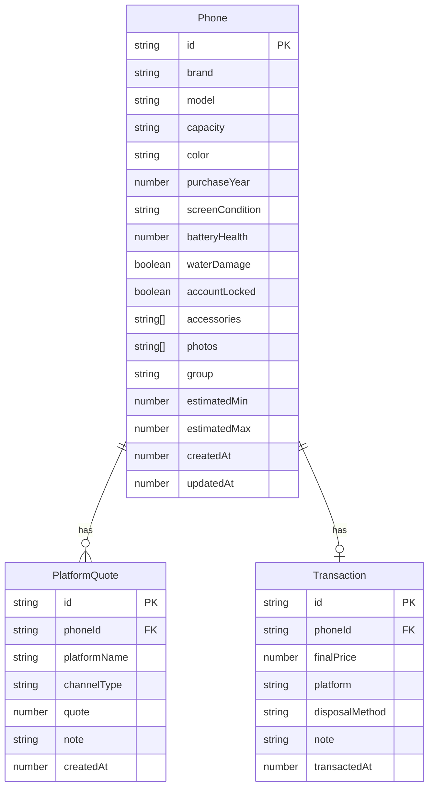

## 1. 架构设计

```mermaid
flowchart TD
    "前端 React SPA" --> "本地状态管理 Zustand"
    "本地状态管理 Zustand" --> "LocalStorage 持久化"
    "前端 React SPA" --> "本地估价引擎"
    "本地估价引擎" --> "品牌基础价表"
    "本地估价引擎" --> "扣分规则表"
    "本地估价引擎" --> "增值规则表"
```

纯前端架构，无后端服务。所有数据存储在浏览器 LocalStorage，估价逻辑在本地执行。

## 2. 技术说明

- **前端**：React@18 + TypeScript + Tailwind CSS@3 + Vite
- **初始化工具**：Vite（react-ts 模板）
- **状态管理**：Zustand（轻量、支持持久化中间件）
- **后端**：无
- **数据库**：LocalStorage（通过 Zustand persist 中间件）
- **路由**：React Router v6
- **图标**：Lucide React
- **图表**：Recharts（统计页柱状图）
- **图片处理**：浏览器 File API + Canvas 压缩，Base64 存储

## 3. 路由定义

| 路由 | 用途 |
|------|------|
| / | 首页，按分组展示手机列表 |
| /add | 添加新手机页面 |
| /phone/:id | 手机详情页（估价报告+平台报价+成交记录） |
| /phone/:id/edit | 编辑手机信息 |
| /stats | 统计页面 |

## 4. API定义

无后端API，所有逻辑在本地执行。

## 5. 服务端架构

无服务端。

## 6. 数据模型

### 6.1 数据模型定义



### 6.2 数据定义

#### Phone 数据结构

```typescript
interface Phone {
  id: string;
  brand: string;
  model: string;
  capacity: string;
  color: string;
  purchaseYear: number;
  screenCondition: 'intact' | 'scratched' | 'cracked';
  batteryHealth: number;
  waterDamage: boolean;
  accountLocked: boolean;
  accessories: string[];
  photos: string[];
  group: 'recyclable' | 'backup' | 'parts';
  estimatedMin: number;
  estimatedMax: number;
  createdAt: number;
  updatedAt: number;
}
```

#### PlatformQuote 数据结构

```typescript
interface PlatformQuote {
  id: string;
  phoneId: string;
  platformName: string;
  channelType: 'door-to-door' | 'mail-in' | 'store';
  quote: number;
  note: string;
  createdAt: number;
}
```

#### Transaction 数据结构

```typescript
interface Transaction {
  id: string;
  phoneId: string;
  finalPrice: number;
  platform: string;
  disposalMethod: 'recycle' | 'resell' | 'donate' | 'keep-parts';
  note: string;
  transactedAt: number;
}
```

### 6.3 估价引擎规则

#### 品牌基础价表（单位：元，基于常见型号容量）

| 品牌 | 基础价范围 |
|------|-----------|
| Apple | 200 - 4500 |
| Samsung | 100 - 3000 |
| Huawei | 80 - 2500 |
| Xiaomi | 50 - 1800 |
| OPPO | 50 - 1500 |
| vivo | 50 - 1500 |
| 其他 | 30 - 800 |

#### 扣分规则

| 问题 | 扣分比例 |
|------|----------|
| 屏幕划痕 | -10% ~ -15% |
| 屏幕碎裂 | -30% ~ -50% |
| 电池健康 < 80% | -10% ~ -20% |
| 电池健康 < 60% | -20% ~ -35% |
| 进水 | -40% ~ -60% |
| 账号未退出 | -15% ~ -25% |

#### 增值规则

| 配件/条件 | 增值金额 |
|-----------|----------|
| 原装充电器 | +20 ~ +50 |
| 原装数据线 | +10 ~ +30 |
| 原装盒 | +30 ~ +80 |
| 原装耳机 | +20 ~ +60 |
| 贴膜 | +5 ~ +15 |
| 手机壳 | +5 ~ +20 |

#### 分组规则

- **可回收**：估价区间最低值 ≥ 100元，且无进水
- **建议自用备机**：估价区间最低值 < 100元但 > 30元，或电池健康尚可
- **只适合拆件**：估价区间最低值 ≤ 30元，或进水+屏幕碎裂双重损伤
