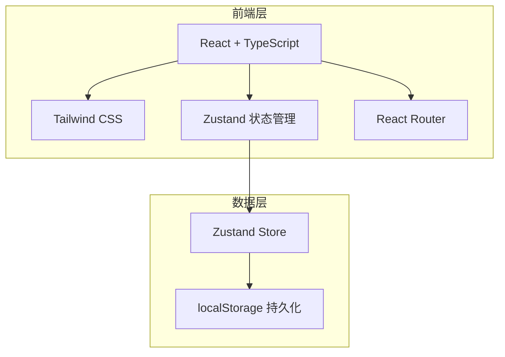
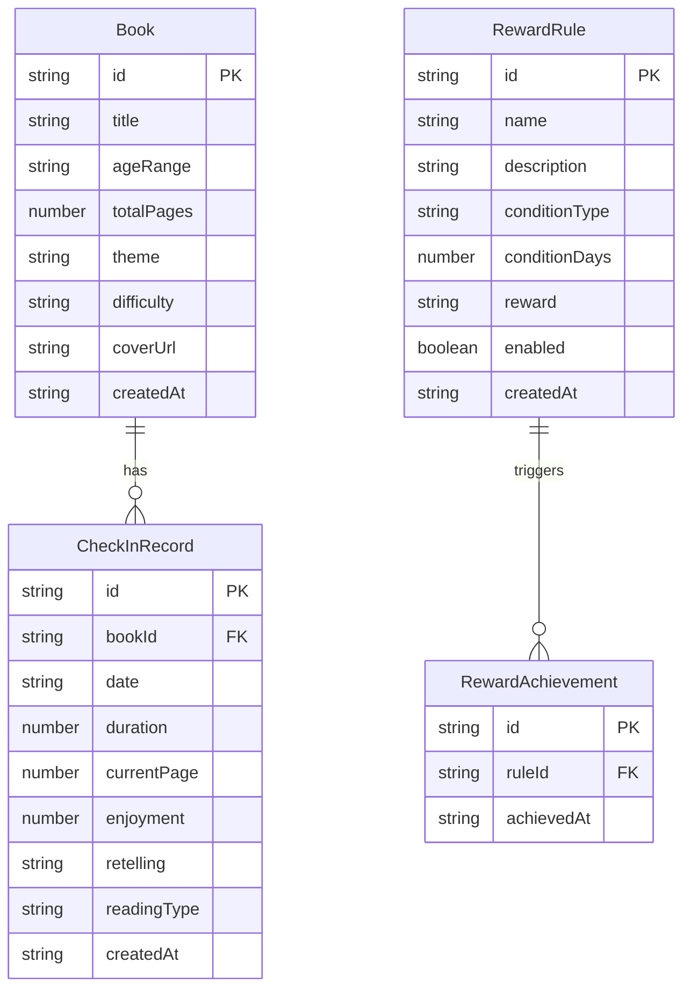

## 1. 架构设计



纯前端架构，使用localStorage进行数据持久化，无需后端服务。

## 2. 技术说明

- **前端**：React@18 + TypeScript + Tailwind CSS@3 + Vite
- **初始化工具**：vite-init
- **后端**：无（纯前端应用，数据存储在localStorage）
- **数据库**：无（使用localStorage模拟持久化存储）
- **状态管理**：Zustand（带persist中间件自动同步localStorage）
- **路由**：React Router DOM v6
- **图标**：lucide-react

## 3. 路由定义

| 路由 | 用途 |
|------|------|
| `/` | 首页，展示今日阅读状态概览 |
| `/books` | 书籍管理页，书架列表 |
| `/books/add` | 添加书籍 |
| `/books/:id/edit` | 编辑书籍 |
| `/checkin` | 打卡页面，记录阅读 |
| `/rewards` | 奖励中心，规则和进度 |
| `/stats` | 统计页面，月度数据分析 |

## 4. API定义

无后端API，所有数据通过Zustand Store + localStorage管理。

### 4.1 核心数据类型

```typescript
interface Book {
  id: string;
  title: string;
  ageRange: string;
  totalPages: number;
  theme: string;
  difficulty: 'easy' | 'medium' | 'hard';
  coverUrl: string;
  createdAt: string;
}

interface CheckInRecord {
  id: string;
  bookId: string;
  date: string;
  duration: number;
  currentPage: number;
  enjoyment: 1 | 2 | 3 | 4 | 5;
  retelling: string;
  readingType: 'together' | 'independent';
  createdAt: string;
}

interface RewardRule {
  id: string;
  name: string;
  description: string;
  condition: {
    type: 'consecutive_days';
    days: number;
  };
  reward: string;
  enabled: boolean;
  createdAt: string;
}

interface RewardAchievement {
  id: string;
  ruleId: string;
  achievedAt: string;
}

interface ReadingStats {
  monthlyBooks: number;
  monthlyDuration: number;
  currentStreak: number;
  longestStreak: number;
  favoriteThemes: { theme: string; count: number }[];
  stuckBooks: { bookId: string; lastReadDate: string; daysSinceLastRead: number }[];
}
```

## 5. 服务端架构

无后端服务。

## 6. 数据模型

### 6.1 数据模型定义



### 6.2 存储方案

使用localStorage存储，键名设计：

- `reading-app-books`：书籍列表
- `reading-app-checkins`：打卡记录
- `reading-app-reward-rules`：奖励规则
- `reading-app-reward-achievements`：奖励达成记录

Zustand persist中间件自动处理序列化和反序列化。
