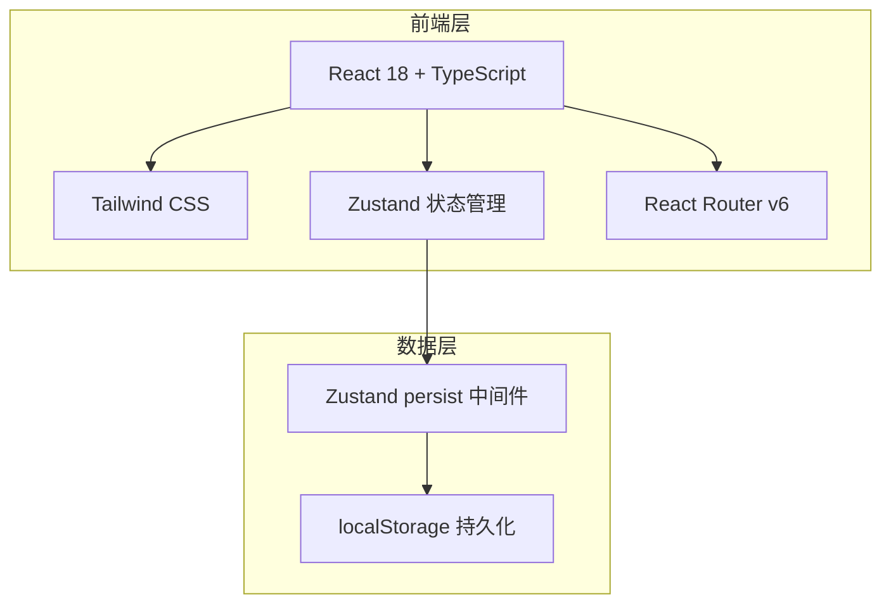
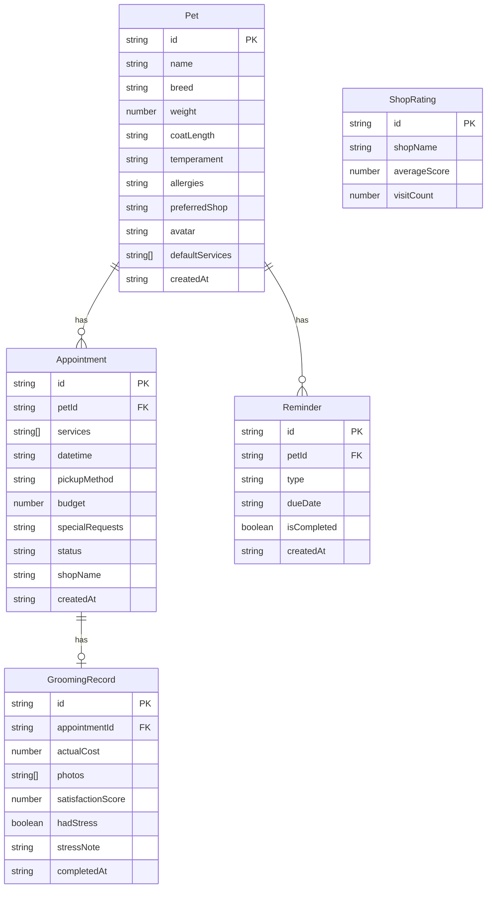

## 1. 架构设计



## 2. 技术说明

- 前端：React@18 + TypeScript + Tailwind CSS@3 + Vite
- 初始化工具：vite-init（react-ts 模板）
- 后端：无（纯前端，数据存储在 localStorage）
- 数据库：无（使用 localStorage + Zustand persist）
- 状态管理：Zustand（含 persist 中间件实现本地持久化）
- 图表：recharts
- 日期处理：date-fns
- 图标：lucide-react
- 路由：react-router-dom@6

## 3. 路由定义

| 路由 | 用途 |
|------|------|
| / | 首页，预约看板与提醒 |
| /pets | 宠物档案列表 |
| /pets/:id | 宠物详情/编辑 |
| /appointments | 预约管理列表 |
| /appointments/new | 创建新预约 |
| /appointments/:id | 预约详情 |
| /stats | 统计页面 |

## 4. API 定义

无后端 API，所有数据通过 Zustand store 在前端管理。

## 5. 服务器架构图

不适用

## 6. 数据模型

### 6.1 数据模型定义



### 6.2 数据定义语言

```typescript
type CoatLength = 'short' | 'medium' | 'long'
type Temperament = 'gentle' | 'nervous' | 'aggressive' | 'excited'
type ServiceType = 'bath' | 'haircut' | 'nail_trim' | 'ear_clean' | 'teeth_clean' | 'gland_expression' | 'flea_treatment'
type AppointmentStatus = 'pending' | 'today' | 'pickup' | 'completed'
type PickupMethod = 'self_drop' | 'shop_pickup' | 'delivery'
type ReminderType = 'bath' | 'deworming'

interface Pet {
  id: string
  name: string
  breed: string
  weight: number
  coatLength: CoatLength
  temperament: Temperament
  allergies: string
  preferredShop: string
  avatar: string
  defaultServices: ServiceType[]
  createdAt: string
}

interface Appointment {
  id: string
  petId: string
  services: ServiceType[]
  datetime: string
  pickupMethod: PickupMethod
  budget: number
  specialRequests: string
  status: AppointmentStatus
  shopName: string
  createdAt: string
}

interface GroomingRecord {
  id: string
  appointmentId: string
  actualCost: number
  photos: string[]
  satisfactionScore: number
  hadStress: boolean
  stressNote: string
  completedAt: string
}

interface Reminder {
  id: string
  petId: string
  type: ReminderType
  dueDate: string
  isCompleted: boolean
  createdAt: string
}

interface ShopRating {
  id: string
  shopName: string
  averageScore: number
  visitCount: number
}
```
