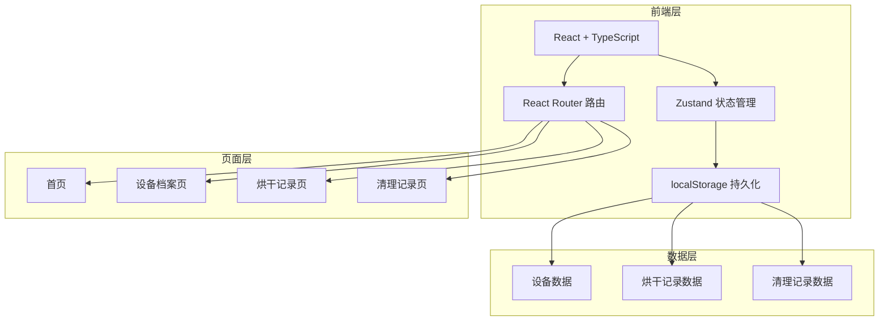
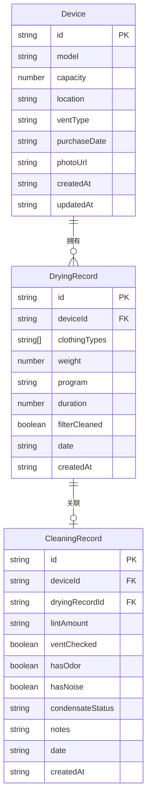

## 1. 架构设计



## 2. 技术说明
- 前端：React@18 + TypeScript + Tailwind CSS@3 + Vite
- 初始化工具：vite-init (react-ts 模板)
- 后端：无（纯前端，数据存储于 localStorage）
- 数据库：无（使用 localStorage 模拟持久化）
- 状态管理：Zustand（含 persist 中间件自动同步 localStorage）
- 图标库：lucide-react

## 3. 路由定义
| 路由 | 用途 |
|------|------|
| / | 首页：今日待清理、最近烘干批次、异常耗时警告、下次深度清洁 |
| /device | 设备档案页：烘干机信息管理 |
| /drying | 烘干记录页：新增/查看烘干记录 |
| /cleaning | 清理记录页：新增/查看清理记录 |

## 4. API定义
不适用（纯前端项目，无后端API）

## 5. 服务端架构图
不适用（纯前端项目）

## 6. 数据模型

### 6.1 数据模型定义



### 6.2 数据定义语言

```typescript
interface Device {
  id: string
  model: string
  capacity: number
  location: string
  ventType: "排风管外排" | "冷凝式" | "热泵式"
  purchaseDate: string
  photoUrl: string
  createdAt: string
  updatedAt: string
}

interface DryingRecord {
  id: string
  deviceId: string
  clothingTypes: ("棉织物" | "化纤" | "羊毛" | "丝绸" | "混合" | "毛巾" | "床单")[]
  weight: number
  program: "标准" | "快速" | "轻柔" | "强力" | "节能" | "定时"
  duration: number
  filterCleaned: boolean
  date: string
  createdAt: string
}

interface CleaningRecord {
  id: string
  deviceId: string
  dryingRecordId: string
  lintAmount: "少量" | "中等" | "大量" | "极多"
  ventChecked: boolean
  hasOdor: boolean
  hasNoise: boolean
  condensateStatus: "正常" | "需清理" | "已满"
  notes: string
  date: string
  createdAt: string
}

interface AppState {
  devices: Device[]
  dryingRecords: DryingRecord[]
  cleaningRecords: CleaningRecord[]
  nextDeepCleanDate: string
}
```
