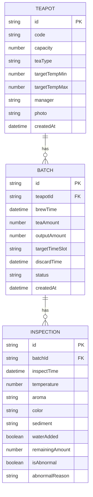

## 1. 架构设计

本系统为纯前端单页应用，使用 React 构建，数据存储在浏览器 localStorage 中，无需后端服务。整体采用组件化架构，状态管理使用 React 内置的 useState 和 useContext。

```mermaid
graph TB
    subgraph "前端应用"
        A["视图层 (Pages)"]
        B["组件层 (Components)"]
        C["状态管理层 (Context)"]
        D["工具函数 (Utils)"]
    </subgraph
    A --> B
    B --> C
    C --> D
    E["本地存储 (localStorage)"]
    C --> E
```

## 2. 技术选型

- **前端框架**：React@18 + TypeScript
- **构建工具**：Vite@5
- **样式方案**：TailwindCSS@3
- **图表库**：Recharts（数据可视化）
- **路由**：React Router v6
- **图标**：Lucide React
- **数据存储**：localStorage（模拟数据 + 本地持久化）
- **日期处理**：date-fns

## 3. 路由定义

| 路由 | 页面名称 | 说明 |
|-------|---------|------|
| / | 茶桶档案页 | 茶桶列表和管理 |
| /batches | 批次记录页 | 茶汤批次管理 |
| /inspection | 巡查记录页 | 巡查打卡和历史 |
| /statistics | 统计分析页 | 数据统计和建议 |

## 4. 数据模型

### 4.1 数据模型定义



### 4.2 数据类型定义

```typescript
// 茶桶
interface Teapot {
  id: string;
  code: string;           // 编号
  capacity: number;   // 容量 (ml)
  teaType: string;    // 茶底类型
  targetTempMin: number; // 保温目标最低温度
  targetTempMax: number; // 保温目标最高温度
  manager: string;   // 负责人
  photo: string;      // 照片URL
  createdAt: string;
}

// 茶汤批次
interface TeaBatch {
  id: string;
  teapotId: string;   // 关联茶桶ID
  brewTime: string;    // 煮制时间
  teaAmount: number; // 投茶量 (g)
  outputAmount: number; // 出汤量 (ml)
  targetTimeSlot: string; // 目标售卖时段
  discardTime: string;  // 废弃时间
  status: 'active' | 'discarded' | 'sold_out'; // 状态
  createdAt: string;
}

// 巡查记录
interface InspectionRecord {
  id: string;
  batchId: string;    // 关联批次ID
  inspectTime: string; // 巡查时间
  temperature: number; // 当前温度
  aroma: 'excellent' | 'good' | 'fair' | 'poor'; // 香气
  color: 'excellent' | 'good' | 'fair' | 'poor'; // 颜色
  sediment: 'none' | 'slight' | 'moderate' | 'heavy'; // 沉淀
  waterAdded: boolean; // 是否补水
  remainingAmount: number; // 剩余量 (ml)
  isAbnormal: boolean; // 是否异常
  abnormalReason?: string; // 异常原因
}
```

## 5. 目录结构

```
src/
├── components/        # 公共组件
│   ├── Layout/      # 布局组件
│   ├── TeapotCard/
│   ├── BatchCard/
│   └── common/    # 通用组件（按钮、表单等）
├── pages/         # 页面组件
│   ├── Teapots/
│   ├── Batches/
│   ├── Inspection/
│   └── Statistics/
├── context/       # 状态管理
│   ├── TeapotContext.tsx
│   ├── BatchContext.tsx
│   └── InspectionContext.tsx
├── utils/         # 工具函数
│   ├── storage.ts
│   ├── date.ts
│   └── statistics.ts
├── types/         # TypeScript 类型定义
├── data/          # Mock 数据
├── App.tsx
└── main.tsx
```

## 6. 核心功能实现思路

### 6.1 异常判断逻辑
- 温度异常：当前温度 < 茶桶目标最低温度 或 > 茶桶目标最高温度
- 时间异常：当前时间 > 批次废弃时间
- 任一异常即标红，状态置为异常，禁止继续售卖

### 6.2 统计分析
- 按茶底类型统计报废量 = 各批次出汤量 - 巡查记录的剩余量之和
- 温度异常次数 = 巡查记录中 isAbnormal 为 true 的记录数
- 时段消耗 = 按时段分组统计各批次出汤量变化
- 建议煮制量 = 历史同时段平均消耗量 + 安全余量
