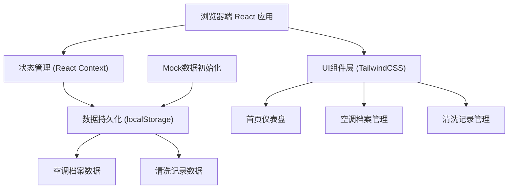
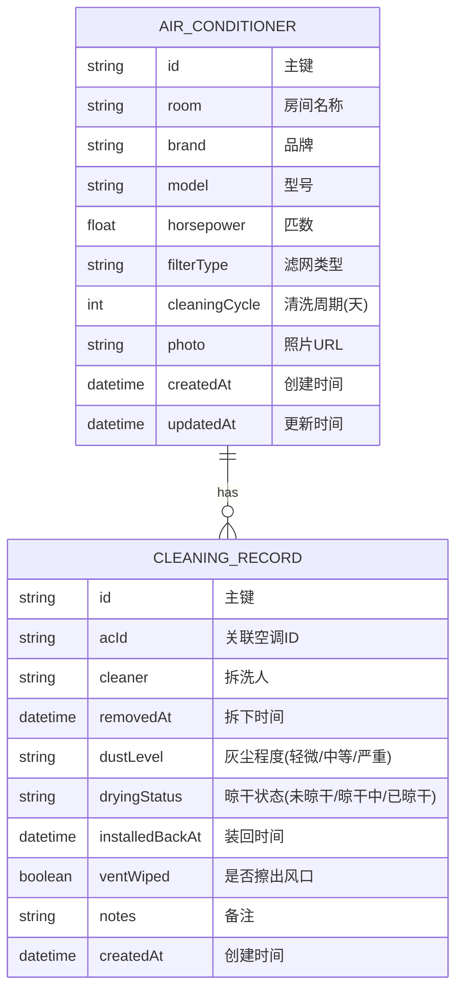

## 1. 架构设计



## 2. 技术描述

- **前端框架**：React@18 + TypeScript
- **构建工具**：Vite@5
- **样式方案**：TailwindCSS@3
- **路由管理**：React Router@6
- **图标库**：Lucide React
- **状态管理**：React Context + useReducer
- **数据持久化**：localStorage（无需后端）
- **数据初始化**：内置Mock数据，首次访问自动初始化
- **日期处理**：date-fns

## 3. 路由定义

| 路由 | 页面名称 | 页面说明 |
|-------|---------|----------|
| `/` | 首页仪表盘 | 状态概览、统计数据、智能提醒 |
| `/air-conditioners` | 空调档案列表 | 所有空调列表展示、搜索筛选 |
| `/air-conditioners/new` | 新增空调档案 | 空调信息录入表单 |
| `/air-conditioners/:id` | 空调详情/编辑 | 查看详情、编辑信息、删除操作 |
| `/cleaning-records` | 清洗记录列表 | 所有清洗记录时间线展示 |
| `/cleaning-records/new/:acId` | 新建清洗记录 | 记录清洗流程表单 |

## 4. 数据模型

### 4.1 数据模型定义



### 4.2 TypeScript 类型定义

```typescript
// 空调状态枚举
type ACStatus = 'pending' | 'drying' | 'completed' | 'overdue';

// 灰尘程度
type DustLevel = 'light' | 'medium' | 'heavy';

// 晾干状态
type DryingStatus = 'not_dried' | 'drying' | 'dried';

// 空调档案
interface AirConditioner {
  id: string;
  room: string;
  brand: string;
  model: string;
  horsepower: number;
  filterType: string;
  cleaningCycle: number;
  photo: string;
  createdAt: string;
  updatedAt: string;
}

// 清洗记录
interface CleaningRecord {
  id: string;
  acId: string;
  cleaner: string;
  removedAt: string;
  dustLevel: DustLevel;
  dryingStatus: DryingStatus;
  installedBackAt?: string;
  ventWiped: boolean;
  notes?: string;
  createdAt: string;
}

// 首页统计数据
interface DashboardStats {
  monthlyCleanCount: number;
  dirtiestRoom: { room: string; count: number };
  nextPriority: {
    ac: AirConditioner;
    daysOverdue: number;
    status: ACStatus;
  };
  statusCounts: {
    pending: number;
    drying: number;
    completed: number;
    overdue: number;
  };
}

// 空调状态扩展
interface ACWithStatus extends AirConditioner {
  status: ACStatus;
  lastCleanDate?: string;
  daysSinceLastClean: number;
  nextCleanDate: string;
}
```

## 5. 核心业务规则实现

### 5.1 状态计算规则
- **待清洗 (pending)**：距上次清洗天数 < 清洗周期，且无进行中的清洗
- **超期 (overdue)**：距上次清洗天数 >= 清洗周期
- **晾干中 (drying)**：有清洗记录且dryingStatus = 'drying'，无装回时间
- **已完成 (completed)**：有清洗记录且dryingStatus = 'dried'，有装回时间

### 5.2 装回校验规则
```typescript
// 装回前校验
function canInstallBack(record: CleaningRecord): boolean {
  return record.dryingStatus === 'dried';
}

// 若未晾干尝试装回，抛出错误
if (!canInstallBack(record)) {
  throw new Error('滤网未晾干，不能装回！请等待滤网完全干燥后再操作。');
}
```

### 5.3 优先级排序算法
```typescript
// 按优先级排序：超期天数 > 灰尘程度历史 > 距上次清洗天数
function sortByPriority(acs: ACWithStatus[]): ACWithStatus[] {
  return [...acs].sort((a, b) => {
    // 超期优先
    if (a.status === 'overdue' && b.status !== 'overdue') return -1;
    if (a.status !== 'overdue' && b.status === 'overdue') return 1;
    // 超期天数多的优先
    if (a.status === 'overdue' && b.status === 'overdue') {
      return b.daysSinceLastClean - a.daysSinceLastClean;
    }
    // 待清洗的按距下次清洗天数
    return a.daysSinceLastClean - b.daysSinceLastClean;
  });
}
```

## 6. 目录结构

```
src/
├── components/
│   ├── layout/           # 布局组件
│   │   ├── Sidebar.tsx
│   │   └── Header.tsx
│   ├── dashboard/        # 首页组件
│   │   ├── StatusCard.tsx
│   │   ├── StatsPanel.tsx
│   │   └── PriorityCard.tsx
│   ├── air-conditioner/  # 空调档案组件
│   │   ├── ACCard.tsx
│   │   └── ACForm.tsx
│   └── cleaning-record/  # 清洗记录组件
│       ├── RecordCard.tsx
│       └── RecordForm.tsx
├── contexts/
│   └── AppContext.tsx    # 全局状态管理
├── hooks/
│   ├── useACStatus.ts    # 空调状态计算
│   └── useDashboard.ts   # 仪表盘数据计算
├── types/
│   └── index.ts          # 类型定义
├── utils/
│   ├── storage.ts        # localStorage封装
│   └── mockData.ts       # Mock数据
├── pages/
│   ├── Dashboard.tsx
│   ├── ACList.tsx
│   ├── ACEdit.tsx
│   ├── RecordList.tsx
│   └── RecordNew.tsx
├── App.tsx
└── main.tsx
```
