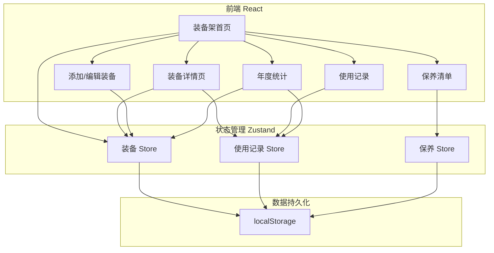
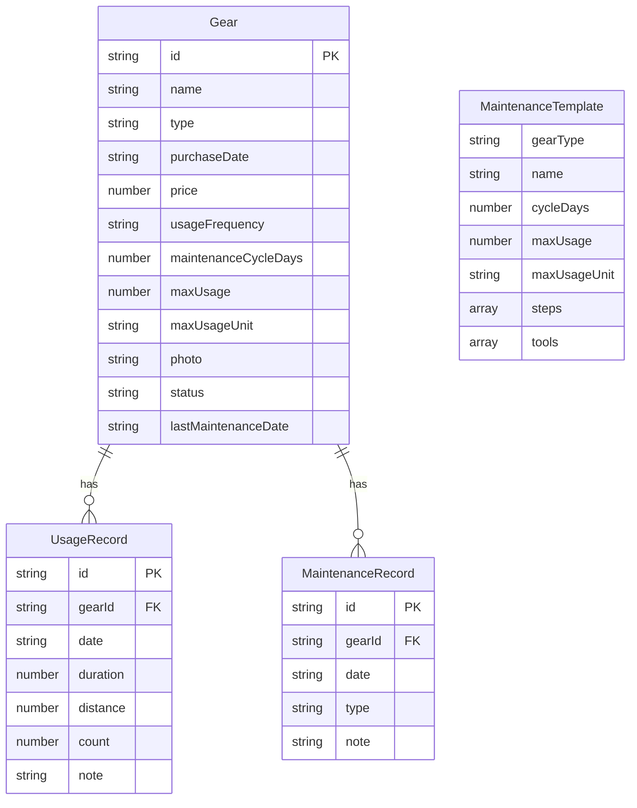

## 1. 架构设计



## 2. 技术说明
- **前端框架**：React 18 + TypeScript + Vite
- **样式方案**：Tailwind CSS 3
- **状态管理**：Zustand（带 persist 中间件持久化到 localStorage）
- **路由**：react-router-dom v6
- **图标**：lucide-react
- **后端**：无（纯前端，数据存储在 localStorage）
- **图表**：自定义 SVG 组件（环形图、进度条、柱状图）

## 3. 路由定义
| 路由 | 用途 |
|------|------|
| `/` | 装备架首页，展示所有装备状态 |
| `/add` | 添加新装备 |
| `/edit/:id` | 编辑已有装备 |
| `/gear/:id` | 装备详情页（使用历史+折旧估算） |
| `/record` | 记录使用（选择装备+输入数据） |
| `/maintenance` | 保养清单（按类型分组） |
| `/stats` | 年度统计（花费+使用排行） |

## 4. 数据模型

### 4.1 数据模型定义



### 4.2 数据定义

**装备类型枚举**：`running_shoe` | `racket` | `bicycle` | `yoga_mat` | `other`

**使用量单位**：`km`（跑鞋/自行车）| `hours`（瑜伽垫）| `times`（球拍）

**保养模板预设**：

| 装备类型 | 保养名称 | 周期 | 上限 | 步骤 | 工具 |
|----------|----------|------|------|------|------|
| 跑鞋 | 清洗 | 30天 | 500km | 取出鞋垫→温水浸泡→中性洗涤剂擦洗→阴干→放回鞋垫 | 软毛刷、中性洗涤剂、毛巾 |
| 跑鞋 | 退役 | - | 800km | 检查鞋底磨损→检查缓震→如已失效则退役 | 无 |
| 球拍 | 换线 | 90天 | 50次 | 剪旧线→清洁拍框→穿新线→调磅数 | 穿线机、新拍线、剪线钳 |
| 球拍 | 更换吸汗带 | 60天 | 30次 | 撕旧吸汗带→清洁拍柄→缠绕新吸汗带→固定末端 | 新吸汗带 |
| 自行车 | 打气 | 14天 | - | 检查胎压→前轮打气→后轮打气→检查气门芯 | 打气筒、胎压计 |
| 自行车 | 上油 | 60天 | 200km | 清洁链条→滴润滑油→转动踏板均匀分布→擦去多余油 | 链条油、抹布、旧报纸 |
| 自行车 | 退役 | - | 3000km | 检查车架裂纹→检查变速系统→检查刹车系统 | 无 |
| 瑜伽垫 | 清洗 | 14天 | 30小时 | 喷清洁液→用湿布擦拭→自然晾干→卷起存放 | 瑜伽垫清洁喷雾、湿布 |
| 瑜伽垫 | 退役 | - | 500小时 | 检查表面防滑性→检查厚度→如已失效则退役 | 无 |

**装备状态计算逻辑**：
- `good`：距下次保养天数 > 周期的 50%，且使用量 < 上限的 70%
- `due_soon`：距下次保养天数 ≤ 周期的 50%，或使用量 ≥ 上限的 70%
- `overdue`：已超过保养周期天数，或使用量 ≥ 上限的 90%
- `retired`：使用量 ≥ 上限 100%

**折旧估算**：
- 折旧率 = 累计使用量 / 最大使用量 × 100%
- 剩余价值 = 购买价格 × (1 - 折旧率)

## 5. 项目目录结构

```
src/
├── components/
│   ├── GearCard.tsx          # 装备卡片组件
│   ├── StatusBadge.tsx       # 状态标签组件
│   ├── ProgressBar.tsx       # 进度条组件
│   ├── RingChart.tsx         # 环形图组件
│   ├── BarChart.tsx          # 柱状图组件
│   ├── Timeline.tsx          # 时间线组件
│   ├── MaintenanceStep.tsx   # 保养步骤组件
│   └── Layout.tsx            # 页面布局组件
├── pages/
│   ├── Dashboard.tsx         # 装备架首页
│   ├── AddGear.tsx           # 添加装备
│   ├── EditGear.tsx          # 编辑装备
│   ├── GearDetail.tsx        # 装备详情
│   ├── RecordUsage.tsx       # 记录使用
│   ├── Maintenance.tsx       # 保养清单
│   └── Stats.tsx             # 年度统计
├── store/
│   ├── gearStore.ts          # 装备状态管理
│   ├── usageStore.ts         # 使用记录状态管理
│   └── maintenanceStore.ts   # 保养记录状态管理
├── utils/
│   ├── statusCalc.ts         # 状态计算工具
│   ├── depreciationCalc.ts   # 折旧计算工具
│   └── maintenanceTemplates.ts # 保养模板数据
├── types/
│   └── index.ts              # TypeScript 类型定义
├── App.tsx
├── main.tsx
└── index.css
```
