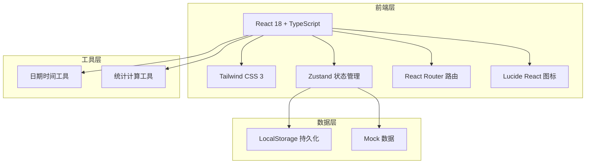
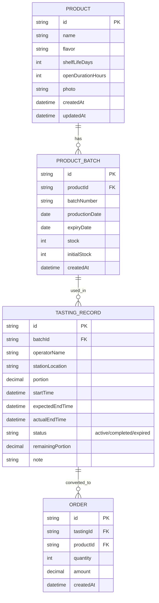

## 1. 架构设计



## 2. 技术描述

- **前端框架**: React 18 + TypeScript
- **构建工具**: Vite
- **样式方案**: Tailwind CSS 3
- **状态管理**: Zustand
- **路由管理**: React Router DOM v6
- **图标库**: Lucide React
- **数据持久化**: LocalStorage
- **图表库**: 自研 SVG 简易图表（轻量无依赖）

## 3. 路由定义

| 路由 | 页面组件 | 功能说明 |
|-------|---------|---------|
| `/` | Dashboard | 仪表盘首页 - 数据概览 + 提醒 |
| `/products` | ProductList | 商品档案列表 |
| `/products/new` | ProductForm | 新增商品 |
| `/products/:id/edit` | ProductForm | 编辑商品 |
| `/tasting` | TastingMonitor | 试吃台监控 |
| `/tasting/new` | TastingForm | 试吃领用登记 |
| `/statistics` | Statistics | 统计分析 |

## 4. 数据模型

### 4.1 数据模型ER图



### 4.2 类型定义

```typescript
// 商品
interface Product {
  id: string;
  name: string;
  flavor: string;
  shelfLifeDays: number;
  openDurationHours: number;
  photo: string;
  createdAt: string;
  updatedAt: string;
}

// 商品批次
interface ProductBatch {
  id: string;
  productId: string;
  batchNumber: string;
  productionDate: string;
  expiryDate: string;
  stock: number;
  initialStock: number;
  createdAt: string;
}

// 试吃记录
interface TastingRecord {
  id: string;
  batchId: string;
  operatorName: string;
  stationLocation: string;
  portion: number;
  startTime: string;
  expectedEndTime: string;
  actualEndTime?: string;
  status: 'active' | 'completed' | 'expired';
  remainingPortion: number;
  note?: string;
}

// 关联订单
interface Order {
  id: string;
  tastingId?: string;
  productId: string;
  quantity: number;
  amount: number;
  createdAt: string;
}
```

## 5. 状态管理设计

### 5.1 Store 结构

- `useProductStore`: 商品及批次管理
  - products: Product[]
  - batches: ProductBatch[]
  - addProduct / updateProduct / deleteProduct
  - addBatch / updateBatchStock / getBatchById

- `useTastingStore`: 试吃记录管理
  - records: TastingRecord[]
  - activeRecords: TastingRecord[]
  - createTasting / endTasting / getExpiringSoon

- `useOrderStore`: 订单管理
  - orders: Order[]
  - addOrder / getOrdersByDate

- `useStatsStore`: 统计计算
  - dailyStats: DailyStats
  - topProducts: ProductRank[]
  - wasteRanking: WasteItem[]

## 6. 核心业务逻辑

### 6.1 临期批次优先推荐

- 距离保质期 7 天内的批次标记为"临期"
- 距离保质期 3 天内的批次标记为"紧急"
- 试吃领用选择商品时，按临期紧急程度排序推荐
- 过期批次禁止领用，自动标记

### 6.2 过期提醒机制

- 实时计算每个试吃台的剩余时间
- 剩余时间 < 30 分钟：黄色警告
- 剩余时间 < 0：红色过期，脉冲动画
- 仪表盘显示所有即将过期和已过期的试吃台

### 6.3 统计指标

- **试吃消耗量**：已结束试吃的份量总和
- **转化率**：试吃后产生的订单数 / 试吃次数
- **浪费量**：撤台时剩余份量 / 领用份量 的比例
- **最佳商品**：综合转化率和浪费量的评分排序

## 7. 项目目录结构

```
src/
├── components/        # 通用组件
│   ├── Layout/        # 布局组件
│   ├── Card/          # 卡片组件
│   ├── Modal/         # 弹窗组件
│   └── Chart/         # 图表组件
├── pages/             # 页面组件
│   ├── Dashboard/
│   ├── Products/
│   ├── Tasting/
│   └── Statistics/
├── store/             # Zustand stores
│   ├── productStore.ts
│   ├── tastingStore.ts
│   └── orderStore.ts
├── types/             # TypeScript 类型
│   └── index.ts
├── utils/             # 工具函数
│   ├── date.ts
│   ├── storage.ts
│   └── stats.ts
├── data/              # Mock 数据
│   └── mockData.ts
├── App.tsx
├── main.tsx
└── index.css
```
