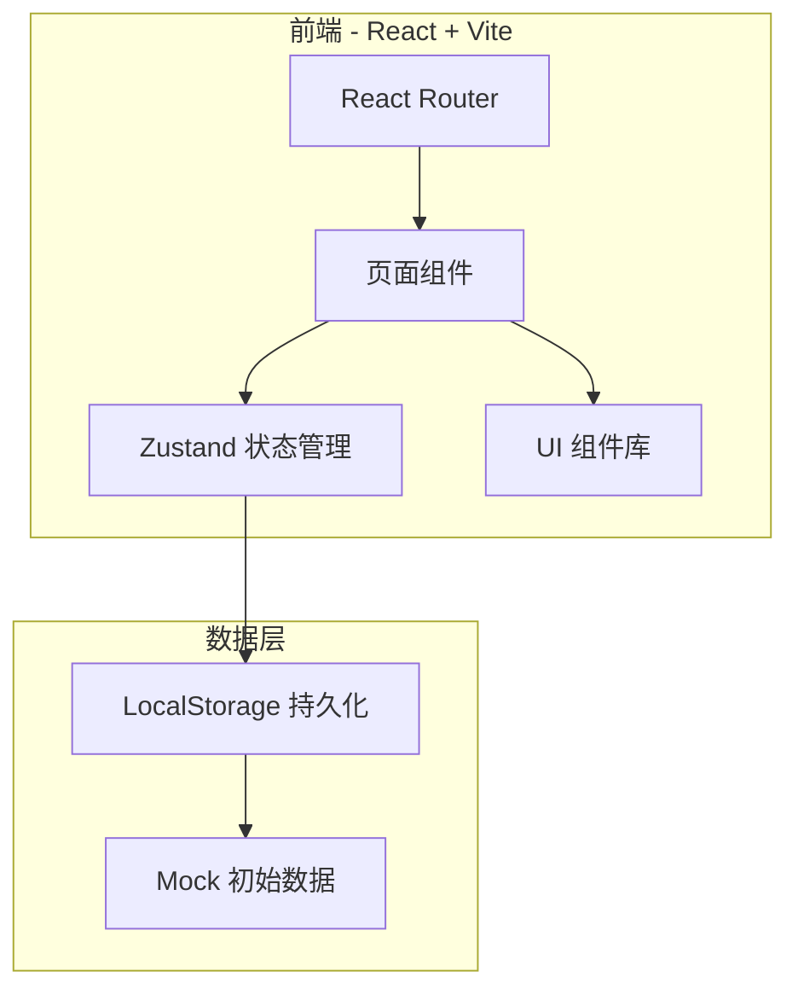
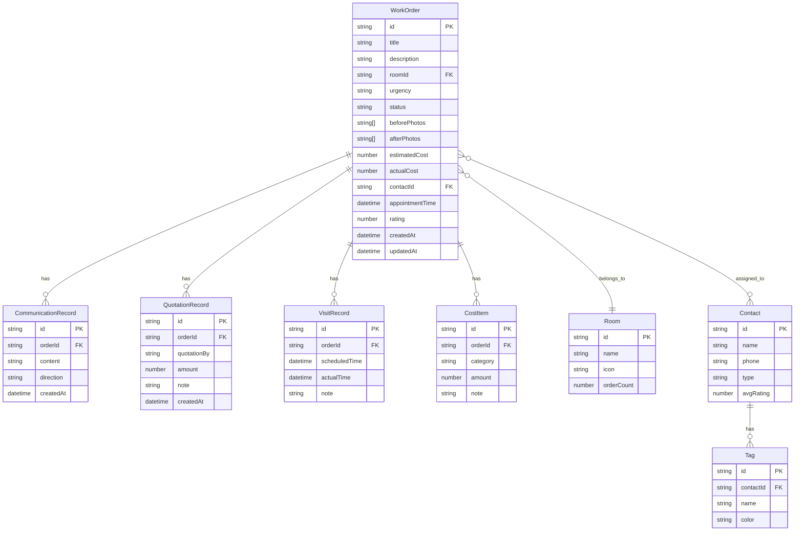

## 1. 架构设计

## 2. 技术说明
- 前端框架：React@18 + TypeScript
- 构建工具：Vite
- 样式方案：Tailwind CSS@3
- 状态管理：Zustand（轻量级，支持持久化中间件）
- 路由：React Router@6
- 图表：Recharts
- 图标：Lucide React
- 动画：Framer Motion
- 数据持久化：LocalStorage（通过 Zustand persist 中间件）
- 后端：无（纯前端应用，数据存储在浏览器本地）

## 3. 路由定义
| 路由 | 用途 |
|------|------|
| / | 维修白板首页，看板式展示所有工单 |
| /order/:id | 工单详情页，展示完整工单信息和操作 |
| /order/new | 新增工单页面 |
| /rooms | 房间视图，按房间分类查看历史问题 |
| /rooms/:roomId | 单个房间的历史维修记录 |
| /stats | 统计页面，费用、区域分布、超时提醒 |

## 4. API 定义
无后端 API，所有数据通过 Zustand store 管理，持久化到 LocalStorage。

## 5. 服务器架构图
不适用（纯前端应用）

## 6. 数据模型

### 6.1 数据模型定义

### 6.2 数据定义语言

**WorkOrder 状态枚举**：
- `pending` - 待处理
- `scheduled` - 已预约
- `in_progress` - 维修中
- `completed` - 已完成

**Urgency 紧急程度枚举**：
- `low` - 低
- `medium` - 中
- `high` - 高
- `urgent` - 紧急

**Room 预设房间**：
- `kitchen` - 厨房
- `bathroom` - 卫生间
- `bedroom` - 卧室
- `living_room` - 客厅
- `balcony` - 阳台
- `entrance` - 玄关
- `study` - 书房
- `other` - 其他

**Contact 类型**：
- `repairman` - 维修师傅
- `property` - 物业
- `other` - 其他

**CostItem 类别**：
- `labor` - 人工费
- `material` - 材料费
- `other` - 其他费用
