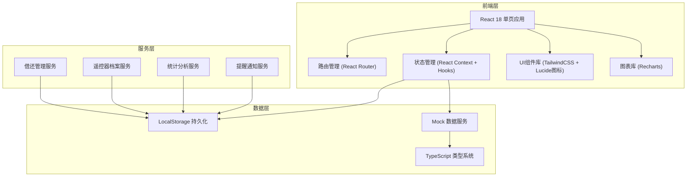
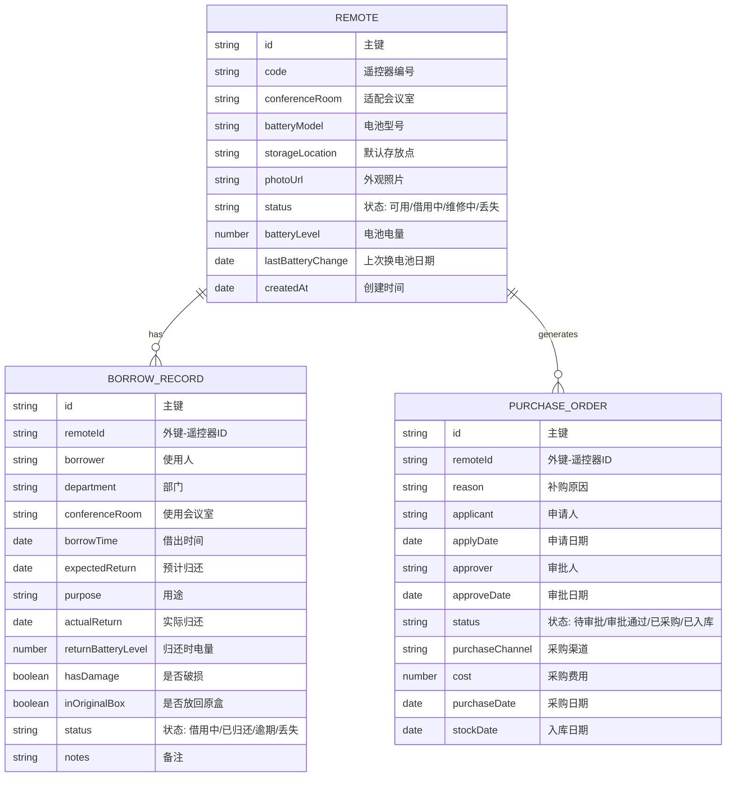

## 1. 架构设计



## 2. 技术描述

- **前端框架**：React 18.2.0
- **构建工具**：Vite 5.0
- **开发语言**：TypeScript 5.0
- **样式方案**：TailwindCSS 3.4
- **路由管理**：React Router DOM 6.20
- **图表组件**：Recharts 2.10
- **图标库**：Lucide React 0.294
- **状态管理**：React Context + useReducer
- **数据持久化**：LocalStorage
- **日期处理**：date-fns 3.0

## 3. 目录结构

```
src/
├── components/          # 公共组件
│   ├── layout/         # 布局组件
│   │   ├── Sidebar.tsx
│   │   ├── Header.tsx
│   │   └── Layout.tsx
│   ├── ui/           # UI基础组件
│   │   ├── Button.tsx
│   │   ├── Card.tsx
│   │   ├── Modal.tsx
│   │   ├── Input.tsx
│   │   ├── Select.tsx
│   │   ├── Slider.tsx
│   │   ├── Badge.tsx
│   │   └── Table.tsx
│   └── charts/       # 图表组件
│       ├── BarChart.tsx
│       ├── PieChart.tsx
│       └── LineChart.tsx
├── pages/             # 页面组件
│   ├── Dashboard.tsx
│   ├── Remotes.tsx
│   ├── BorrowReturn.tsx
│   ├── Statistics.tsx
│   └── Purchase.tsx
├── context/           # 状态管理
│   ├── AppContext.tsx
│   └── types.ts
├── data/             # Mock数据和类型
│   ├── mockData.ts
│   └── types.ts
├── services/         # 业务服务
│   ├── remoteService.ts
│   ├── borrowService.ts
│   └── statsService.ts
│   └── notificationService.ts
├── utils/            # 工具函数
│   ├── dateUtils.ts
│   └── storage.ts
│   └── helpers.ts
├── App.tsx
├── main.tsx
└── index.css
```

## 4. 路由定义

| 路由 | 页面 | 说明 |
|------|------|------|
| `/` | Dashboard | 首页仪表盘，概览统计和提醒 |
| `/remotes` | Remotes | 遥控器档案管理 |
| `/borrow` | BorrowReturn | 借还管理 |
| `/statistics` | Statistics | 统计报表 |
| `/purchase` | Purchase | 补购管理 |

## 5. 数据模型

### 5.1 ER图



### 5.2 TypeScript 类型定义

```typescript
// 遥控器状态枚举
type RemoteStatus = 'available' | 'borrowed' | 'maintenance' | 'lost';

// 借用记录状态枚举
type BorrowStatus = 'borrowing' | 'returned' | 'overdue' | 'lost';

// 采购单状态枚举
type PurchaseStatus = 'pending' | 'approved' | 'purchased' | 'stocked';

// 遥控器接口
interface Remote {
  id: string;
  code: string;
  conferenceRoom: string;
  batteryModel: string;
  storageLocation: string;
  photoUrl: string;
  status: RemoteStatus;
  batteryLevel: number;
  lastBatteryChange: string;
  createdAt: string;
}

// 借用记录接口
interface BorrowRecord {
  id: string;
  remoteId: string;
  borrower: string;
  department: string;
  conferenceRoom: string;
  borrowTime: string;
  expectedReturn: string;
  purpose: string;
  actualReturn?: string;
  returnBatteryLevel?: number;
  hasDamage?: boolean;
  inOriginalBox?: boolean;
  status: BorrowStatus;
  notes?: string;
}

// 采购单接口
interface PurchaseOrder {
  id: string;
  remoteId?: string;
  reason: string;
  applicant: string;
  applyDate: string;
  approver?: string;
  approveDate?: string;
  status: PurchaseStatus;
  purchaseChannel?: string;
  cost?: number;
  purchaseDate?: string;
  stockDate?: string;
  newRemoteId?: string;
}

// 提醒类型
interface Notification {
  id: string;
  type: 'overdue' | 'lowBattery' | 'maintenance';
  title: string;
  message: string;
  remoteId: string;
  recordId?: string;
  timestamp: string;
  read: boolean;
}
```

### 5.3 Mock 初始数据

- 遥控器数据：15个遥控器，覆盖不同楼层会议室
- 借用记录：30条历史记录，包含5条逾期、3条低电量
- 采购单：2条历史采购记录
- 部门列表：技术部、产品部、运营部、市场部、人事部、财务部
- 会议室列表：1楼-培训室、2楼-大会议室、2楼-小会议室、3楼-董事会议室、3楼-洽谈室、5楼-多功能厅
- 电池型号：AA、AAA、CR2032
