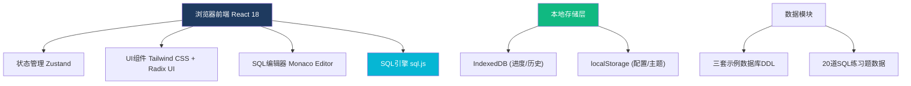

## 1. 架构设计



## 2. 技术栈说明

- **前端框架**: React 18 + TypeScript
- **构建工具**: Vite 5
- **样式方案**: Tailwind CSS 3 + class-variance-authority
- **组件库**: Radix UI (无样式组件) + Lucide React (图标)
- **代码编辑器**: @monaco-editor/react
- **SQL引擎**: sql.js (SQLite编译到WebAssembly)
- **状态管理**: Zustand
- **数据表格**: @tanstack/react-table
- **本地存储**: idb (IndexedDB封装) + localStorage

## 3. 目录结构

```
src/
├── components/
│   ├── SchemaTree/        # 数据库Schema树
│   ├── SqlEditor/         # SQL编辑器
│   ├── ResultTable/       # 查询结果表
│   ├── ProblemPanel/      # 练习题面板
│   ├── Toolbar/           # 工具栏
│   ├── ExecutionPlan/     # 执行计划
│   └── Settings/          # 设置面板
├── stores/
│   ├── useSqlStore.ts     # SQL引擎状态
│   ├── useEditorStore.ts  # 编辑器状态
│   └── useProgressStore.ts # 学习进度
├── data/
│   ├── databases/         # 示例数据库DDL + 数据
│   │   ├── northwind/     # 北风订单
│   │   ├── employee/      # 员工管理
│   │   └── bookstore/     # 在线书店
│   └── problems/          # 20道练习题
├── hooks/
│   ├── useSqlEngine.ts    # SQL引擎Hook
│   └── useIndexedDB.ts    # 本地存储Hook
├── utils/
│   ├── sqlFormatter.ts    # SQL格式化
│   ├── resultComparator.ts # 结果集比对
│   └── executionPlan.ts   # 执行计划解析
└── types/
    └── index.ts           # 类型定义
```

## 4. 核心类型定义

```typescript
// 数据库Schema
interface Database {
  id: string;
  name: string;
  tables: Table[];
}

interface Table {
  name: string;
  columns: Column[];
  foreignKeys: ForeignKey[];
}

interface Column {
  name: string;
  type: string;
  isPrimaryKey: boolean;
  isForeignKey: boolean;
  isNullable: boolean;
  hasIndex: boolean;
}

// SQL查询结果
interface QueryResult {
  columns: string[];
  rows: any[][];
  affectedRows?: number;
  error?: string;
  executionTime: number;
}

// 练习题
interface Problem {
  id: number;
  title: string;
  description: string;
  databaseId: string;
  difficulty: 'easy' | 'medium' | 'hard';
  category: string;
  expectedResult: QueryResult;
  hint?: string;
}

// 学习进度
interface Progress {
  completedProblems: number[];
  savedQueries: SavedQuery[];
  queryHistory: QueryHistoryItem[];
}
```

## 5. 数据模型

### 5.1 示例数据库

**北风订单 (Northwind)**
- Customers: 客户表
- Orders: 订单表
- OrderDetails: 订单明细
- Products: 产品表
- Categories: 分类表
- Suppliers: 供应商表
- Employees: 员工表
- Shippers: 运货商
- Regions: 地区
- Territories: 销售区域

**员工管理 (Employee)**
- departments: 部门
- employees: 员工
- salaries: 薪资
- titles: 职位
- dept_emp: 员工部门关系
- dept_manager: 部门经理
- projects: 项目
- project_assignments: 项目分配
- leave_records: 请假记录
- performance: 绩效

**在线书店 (Bookstore)**
- books: 书籍
- authors: 作者
- book_authors: 书籍作者关系
- categories: 分类
- publishers: 出版社
- customers: 客户
- orders: 订单
- order_items: 订单项
- reviews: 评论
- inventory: 库存

### 5.2 练习题分类 (20道)

1. **单表查询 (5题)**: SELECT, WHERE, ORDER BY, LIMIT
2. **聚合函数 (3题)**: COUNT, SUM, AVG, GROUP BY, HAVING
3. **多表连接 (4题)**: INNER JOIN, LEFT JOIN, RIGHT JOIN, 自连接
4. **子查询 (3题)**: 嵌套子查询, EXISTS, IN
5. **窗口函数 (3题)**: ROW_NUMBER, RANK, PARTITION BY
6. **CTE与高级 (2题)**: WITH 子句, 复杂逻辑
