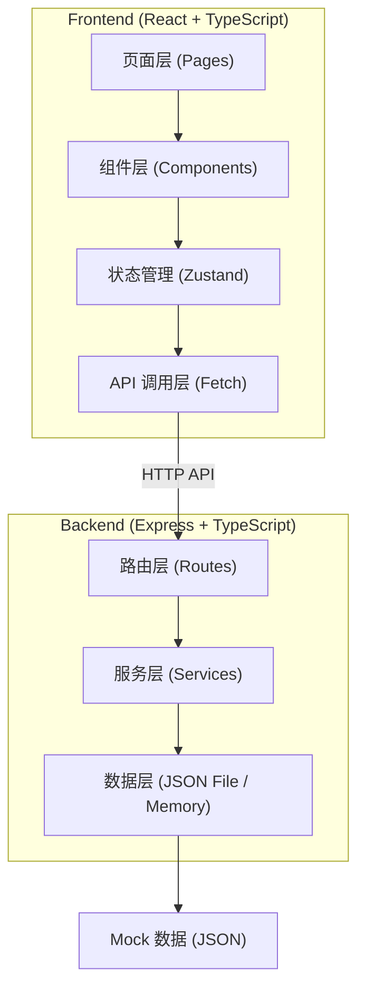
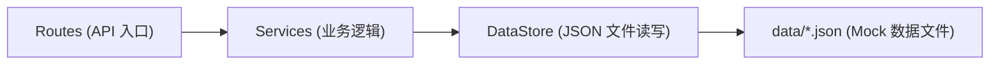
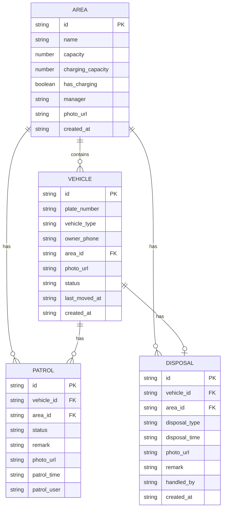

## 1. 架构设计



## 2. 技术描述

- 前端：React@18 + TypeScript + Vite + TailwindCSS@3 + Zustand + React Router DOM@6 + Lucide React
- 后端：Express@4 + TypeScript + CORS
- 数据存储：内存 + JSON 文件模拟（mock 数据），无需外部数据库
- 初始化工具：vite-init (react-express-ts 模板)

## 3. 路由定义

| 路由 | 页面 | 说明 |
|------|------|------|
| / | Dashboard | 数据看板（首页） |
| /areas | AreaList | 车棚区域管理 |
| /vehicles | VehicleList | 车辆登记管理 |
| /patrols | PatrolList | 巡查记录 |
| /disposals | DisposalList | 处理清单 |

后端 API 路由：

| Method | Route | 说明 |
|--------|-------|------|
| GET | /api/areas | 获取车棚区域列表 |
| POST | /api/areas | 新增车棚区域 |
| PUT | /api/areas/:id | 更新车棚区域 |
| DELETE | /api/areas/:id | 删除车棚区域 |
| GET | /api/vehicles | 获取车辆列表 |
| POST | /api/vehicles | 新增车辆 |
| PUT | /api/vehicles/:id | 更新车辆 |
| DELETE | /api/vehicles/:id | 删除车辆 |
| GET | /api/patrols | 获取巡查记录列表 |
| POST | /api/patrols | 新增巡查记录 |
| GET | /api/disposals | 获取处理清单（含待处理、已处理） |
| POST | /api/disposals | 新增处理记录 |
| PUT | /api/disposals/:id | 更新处理记录 |
| GET | /api/dashboard | 获取看板汇总数据 |

## 4. API 数据类型定义

```typescript
// 车棚区域
interface Area {
  id: string;
  name: string;
  capacity: number;
  chargingCapacity: number;
  hasCharging: boolean;
  manager: string;
  photoUrl: string;
  createdAt: string;
}

// 车辆
interface Vehicle {
  id: string;
  plateNumber: string;
  vehicleType: '电动车' | '自行车' | '摩托车' | '三轮车';
  ownerPhone: string;
  areaId: string;
  photoUrl: string;
  status: 'normal' | 'suspicious' | 'charging_occupied' | 'contacted';
  lastMovedAt: string;
  createdAt: string;
}

// 巡查记录
interface Patrol {
  id: string;
  vehicleId: string;
  areaId: string;
  status: 'normal' | 'suspicious' | 'charging_occupied' | 'contacted';
  remark: string;
  photoUrl: string;
  patrolTime: string;
  patrolUser: string;
}

// 处理记录
interface Disposal {
  id: string;
  vehicleId: string;
  areaId: string;
  disposalType: '车主挪走' | '清运' | '其他';
  disposalTime: string;
  photoUrl: string;
  remark: string;
  handledBy: string;
  createdAt: string;
}

// 看板数据
interface DashboardData {
  areas: {
    id: string;
    name: string;
    capacity: number;
    used: number;
    remaining: number;
    chargingUsed: number;
    chargingCapacity: number;
    suspiciousCount: number;
  }[];
  totalVehicles: number;
  totalSuspicious: number;
  pendingDisposals: number;
}
```

## 5. 服务端架构图



## 6. 数据模型

### 6.1 ER 图



### 6.2 项目目录结构

```
trae0601-2/
├── src/
│   ├── pages/              # 页面组件
│   │   ├── Dashboard.tsx
│   │   ├── AreaList.tsx
│   │   ├── VehicleList.tsx
│   │   ├── PatrolList.tsx
│   │   └── DisposalList.tsx
│   ├── components/         # 通用组件
│   │   ├── Layout.tsx
│   │   ├── Sidebar.tsx
│   │   ├── DataTable.tsx
│   │   ├── Drawer.tsx
│   │   └── StatusBadge.tsx
│   ├── store/              # Zustand 状态
│   │   └── index.ts
│   ├── utils/              # 工具函数
│   │   ├── api.ts
│   │   └── format.ts
│   ├── types/              # 类型定义
│   │   └── index.ts
│   ├── App.tsx
│   ├── main.tsx
│   └── index.css
├── api/                    # 后端 Express
│   ├── index.ts
│   ├── routes/
│   │   ├── areas.ts
│   │   ├── vehicles.ts
│   │   ├── patrols.ts
│   │   ├── disposals.ts
│   │   └── dashboard.ts
│   ├── services/
│   │   └── dataStore.ts
│   └── data/               # Mock 数据 JSON
│       ├── areas.json
│       ├── vehicles.json
│       ├── patrols.json
│       └── disposals.json
├── shared/                 # 共享类型
│   └── types.ts
├── package.json
├── vite.config.ts
├── tailwind.config.js
└── tsconfig.json
```
