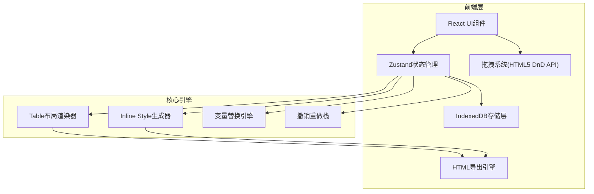

## 1. 架构设计



## 2. 技术说明

- 前端：React@18 + TypeScript + Tailwind CSS + Vite
- 状态管理：Zustand（含undo/redo中间件）
- 拖拽：HTML5 Drag and Drop API + 自定义拖拽指示器
- 存储：IndexedDB（通过idb库）
- 图标：lucide-react
- 无后端：纯前端应用

## 3. 路由定义

| 路由 | 用途 |
|-----|------|
| / | 编辑器主页面（含模板库抽屉、导出弹窗、发送弹窗） |

## 4. 核心数据模型

### 4.1 组件类型定义

```typescript
type ComponentType = 
  | 'heading' | 'paragraph' | 'button' | 'image' 
  | 'divider' | 'spacer' | 'two-column' | 'three-column'
  | 'social-icons' | 'footer';

interface EmailComponent {
  id: string;
  type: ComponentType;
  properties: Record<string, any>;
  children?: EmailComponent[][]; // 布局组件的列内子组件
}

interface EmailTemplate {
  id: string;
  name: string;
  backgroundColor: string;
  components: EmailComponent[];
  createdAt: number;
  updatedAt: number;
  thumbnail: string;
}
```

### 4.2 组件属性定义

| 组件类型 | 可编辑属性 |
|---------|-----------|
| heading | text, fontSize, fontFamily, color, align, lineHeight, padding, margin |
| paragraph | text, fontSize, fontFamily, color, align, lineHeight, padding, margin |
| button | text, url, fontSize, fontFamily, color, backgroundColor, align, padding, margin, borderRadius |
| image | src, alt, width, align, padding, margin, borderRadius, link |
| divider | color, thickness, style(solid/dashed/dotted), padding, margin, width |
| spacer | height, padding, margin |
| two-column | columnRatio, padding, gap | children[0], children[1] |
| three-column | columnRatio, padding, gap | children[0], children[1], children[2] |
| social-icons | platforms(icon+url+alt), iconSize, align, padding, margin |
| footer | text, fontSize, fontFamily, color, align, lineHeight, padding, margin |

### 4.3 IndexedDB存储结构

- 数据库名：email-designer-db
- 对象仓库：templates
- 索引：name, updatedAt
- 存储：EmailTemplate对象，含自动生成的canvas缩略图(base64)

## 5. 关键技术约束

1. **Inline Style核心约束**：所有样式必须以style属性写入每个HTML元素，不使用class和外部CSS
2. **Table布局**：使用table/tr/td嵌套实现所有布局，不使用div+flex/grid
3. **邮件兼容性**：使用cellpadding/cellspacing/border属性，避免CSS3特性，图片用绝对URL
4. **变量系统**：`{{name}}` `{{email}}` `{{date}}` 等占位符，预览时可切换显示原始占位符或示例值
5. **撤销重做**：基于状态快照栈，每次操作push新快照，最多保留50步

## 6. HTML导出引擎

导出时将组件树递归渲染为table嵌套的HTML字符串：

```
<table> (外层容器600px)
  <tr> (每个组件一行)
    <td> (组件内容)
      <!-- 两列布局示例 -->
      <table>
        <tr>
          <td width="50%">列1内容</td>
          <td width="50%">列2内容</td>
        </tr>
      </table>
    </td>
  </tr>
</table>
```

## 7. 预设模板列表

| 序号 | 模板名称 | 描述 |
|-----|---------|------|
| 1 | 营销活动 | 促销横幅+产品亮点+CTA按钮+页脚 |
| 2 | 产品发布 | 产品大图+功能介绍+下载按钮 |
| 3 | 订单确认 | 订单详情表+物流信息+客服链接 |
| 4 | 新闻简报 | 标题+摘要列表+阅读更多链接 |
| 5 | 欢迎邮件 | 欢迎标题+引导步骤+开始按钮 |
| 6 | 活动邀请 | 活动海报+时间地点+RSVP按钮 |
| 7 | 密码重置 | 提示文字+重置按钮+安全说明 |
| 8 | 客户回访 | 问候语+调查问卷+提交按钮 |
| 9 | 节日问候 | 节日主题图+祝福语+社交图标 |
| 10 | 周报摘要 | 周标题+数据指标+详情链接 |
