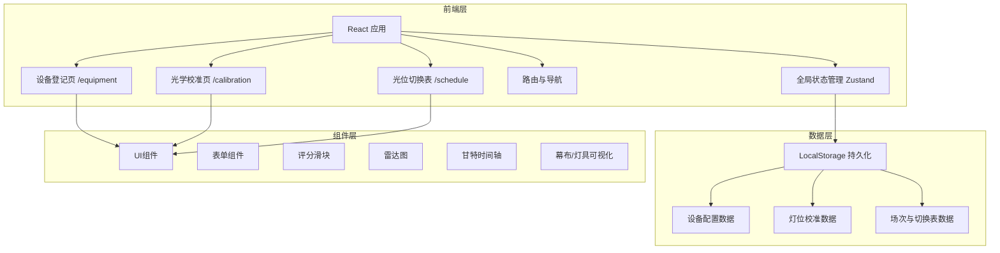

## 1. 架构设计



## 2. 技术描述
- **前端**：React@18 + TypeScript + Vite
- **样式**：Tailwind CSS 3
- **状态管理**：Zustand
- **路由**：React Router DOM
- **图表**：recharts（雷达图、甘特图）
- **图标**：lucide-react
- **数据持久化**：LocalStorage（前端纯应用，无后端）
- **初始化工具**：vite-init

## 3. 路由定义
| 路由 | 用途 |
|------|------|
| `/equipment` | 设备登记页（幕布、灯具、皮影、人员） |
| `/calibration` | 光学校准页（灯位管理、质量评分、可视化对比） |
| `/schedule` | 光位切换表（场次管理、角色出场序列、时间轴） |
| `/` | 重定向至 `/equipment` |

## 4. 数据模型

### 4.1 数据模型定义（ER图）

```mermaid
erDiagram
    SCREEN {
        string id PK
        number width_cm
        number height_cm
        string material
        number height_from_ground_cm
        string notes
    }
    LAMP {
        string id PK
        string model
        number position_distance_cm
        number position_angle_deg
        number position_height_cm
        number brightness_level
        string color_temp
    }
    PUPPET {
        string id PK
        string name
        string material
        number thickness_mm
        number rod_length_cm
    }
    ACTOR {
        string id PK
        string name
        string role
        string standing_zone
    }
    LIGHT_POSITION {
        string id PK
        string name
        string lamp_id FK
        number distance_cm
        number angle_deg
        number height_cm
        number brightness
    }
    CALIBRATION {
        string id PK
        string light_position_id FK
        number sharpness_score
        string ghost_level
        string occlusion_level
        string color_temp_bias
        string notes
        string created_at
    }
    SCENE {
        string id PK
        string name
        string act
        number duration_sec
    }
    CHARACTER_ENTRY {
        string id PK
        string scene_id FK
        string puppet_id FK
        string light_position_id FK
        number start_time_sec
        number end_time_sec
        string notes
    }
```



### 4.2 TypeScript 类型定义

```typescript
// 幕布
interface Screen {
  id: string;
  widthCm: number;
  heightCm: number;
  material: string;
  heightFromGroundCm: number;
  notes?: string;
}

// 灯具
interface Lamp {
  id: string;
  model: string;
  positionDistanceCm: number;
  positionAngleDeg: number;
  positionHeightCm: number;
  brightnessLevel: number;
  colorTemp: string;
}

// 皮影
interface Puppet {
  id: string;
  name: string;
  material: string;
  thicknessMm: number;
  rodLengthCm: number;
}

// 演员站位
interface Actor {
  id: string;
  name: string;
  role: string;
  standingZone: string;
}

// 灯位方案
interface LightPosition {
  id: string;
  name: string;
  lampId: string;
  distanceCm: number;
  angleDeg: number;
  heightCm: number;
  brightness: number;
}

// 校准记录
type GhostLevel = 'none' | 'light' | 'severe';
type OcclusionLevel = 'none' | 'partial' | 'full';
type ColorTempBias = 'cool' | 'normal' | 'warm';

interface Calibration {
  id: string;
  lightPositionId: string;
  sharpnessScore: number;
  ghostLevel: GhostLevel;
  occlusionLevel: OcclusionLevel;
  colorTempBias: ColorTempBias;
  notes?: string;
  createdAt: string;
}

// 场次
interface Scene {
  id: string;
  name: string;
  act: string;
  durationSec: number;
}

// 角色出场
interface CharacterEntry {
  id: string;
  sceneId: string;
  puppetId: string;
  lightPositionId: string;
  startTimeSec: number;
  endTimeSec: number;
  notes?: string;
}
```
