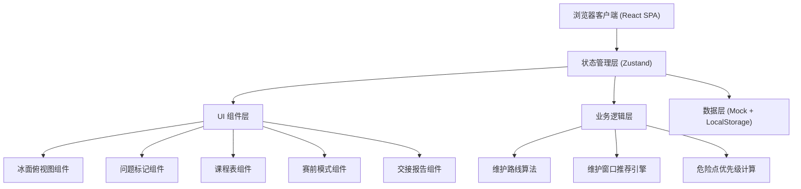
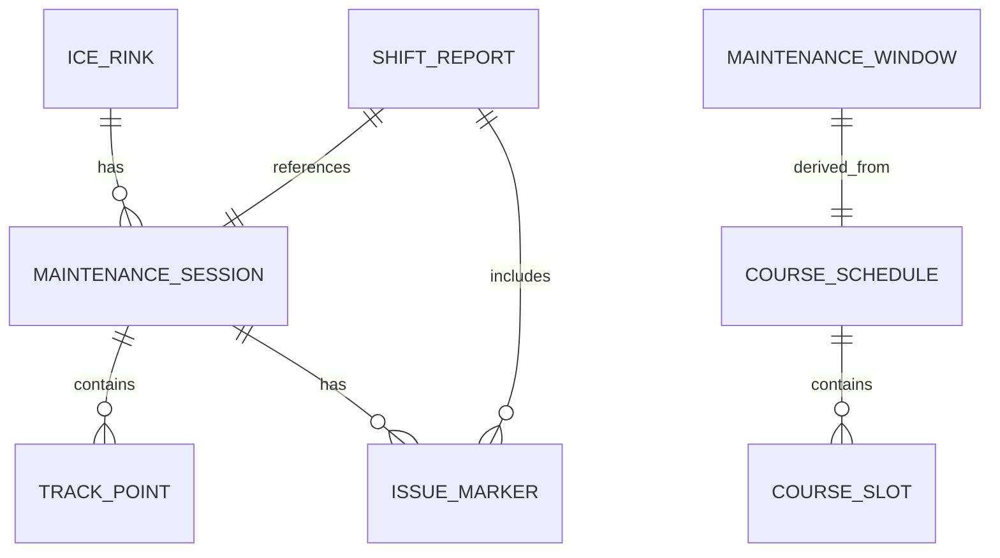

## 1. 架构设计



## 2. 技术描述

- 前端框架：React 18 + TypeScript
- 构建工具：Vite 5
- 样式方案：TailwindCSS 3 + CSS Variables
- 状态管理：Zustand
- 路由方案：React Router 6
- 图标库：Lucide React
- 图表/可视化：原生 SVG + CSS 动画
- 数据持久化：LocalStorage
- Mock 数据：内置模拟数据，无需后端服务

## 3. 路由定义

| 路由 | 页面 | 说明 |
|------|------|------|
| / | 主仪表盘 | 冰面俯视图 + 维护控制 + 问题标记 |
| /schedule | 课程表 | 课程时间轴 + 维护窗口推荐 |
| /pre-race | 赛前模式 | 危险点地图 + 检查清单 |
| /report | 交接报告 | 状态摘要 + 班次交接记录 |

## 4. 核心数据模型

### 4.1 数据实体关系



### 4.2 TypeScript 类型定义

```typescript
// 冰场配置
interface IceRink {
  id: string;
  name: string;
  width: number;      // 米
  height: number;     // 米
  doors: Door[];      // 门口位置
}

interface Door {
  id: string;
  name: string;
  x: number;
  y: number;
  width: number;
}

// 维护会话
interface MaintenanceSession {
  id: string;
  startTime: Date;
  endTime?: Date;
  status: 'idle' | 'running' | 'paused' | 'completed';
  bladeHeight: number;       // 刮刀高度 (mm)
  waterAmount: number;       // 补水量
  trackPoints: TrackPoint[];
  coveredArea: number;       // 已覆盖面积百分比
}

interface TrackPoint {
  timestamp: Date;
  x: number;
  y: number;
  bladeHeight: number;
  water: boolean;            // 是否喷水
}

// 问题标记
interface IssueMarker {
  id: string;
  type: 'groove' | 'water' | 'ice_debris' | 'closed_area';
  x: number;
  y: number;
  severity: 'low' | 'medium' | 'high';
  description: string;
  createdAt: Date;
  resolved: boolean;
  resolvedAt?: Date;
}

// 课程表
interface CourseSchedule {
  date: string;
  slots: CourseSlot[];
}

interface CourseSlot {
  id: string;
  startTime: string;    // HH:mm
  endTime: string;      // HH:mm
  type: 'training' | 'public' | 'private' | 'event';
  name: string;
  team?: string;
}

// 维护窗口
interface MaintenanceWindow {
  startTime: string;
  endTime: string;
  duration: number;     // 分钟
  type: 'recommended' | 'available' | 'short';
  reason?: string;
}

// 班次交接报告
interface ShiftReport {
  id: string;
  shift: 'morning' | 'afternoon' | 'evening';
  date: string;
  operatorName: string;
  iceConditionScore: number;    // 0-100
  issues: IssueMarker[];
  maintenanceCount: number;
  notes: string;
  nextShiftNotes: string;
}
```

## 5. 模块划分

```
src/
├── components/
│   ├── ice-rink/           # 冰面俯视图相关组件
│   │   ├── IceRinkView.tsx
│   │   ├── TrackPath.tsx
│   │   ├── IssueMarker.tsx
│   │   ├── WaterArea.tsx
│   │   └── BladeHeatmap.tsx
│   ├── schedule/           # 课程表相关组件
│   │   ├── ScheduleTimeline.tsx
│   │   └── WindowRecommendation.tsx
│   ├── pre-race/           # 赛前模式相关组件
│   │   ├── DangerMap.tsx
│   │   └── RaceChecklist.tsx
│   ├── report/             # 交接报告相关组件
│   │   ├── StatusSummary.tsx
│   │   └── ShiftHandover.tsx
│   ├── layout/             # 布局组件
│   │   ├── Sidebar.tsx
│   │   └── Header.tsx
│   └── ui/                 # 通用UI组件
├── stores/                 # Zustand 状态管理
│   ├── useMaintenanceStore.ts
│   ├── useIssueStore.ts
│   └── useScheduleStore.ts
├── utils/                  # 工具函数
│   ├── trackAlgorithm.ts
│   ├── windowCalculator.ts
│   └── severityCalc.ts
├── data/                   # Mock 数据
│   ├── mockSchedule.ts
│   └── mockIssues.ts
├── types/                  # 类型定义
│   └── index.ts
├── App.tsx
└── main.tsx
```

## 6. 核心算法

### 6.1 磨冰车轨迹模拟
- 基于标准冰场尺寸 (30m x 60m) 生成往返式磨冰路线
- 模拟真实磨冰车行驶速度（约 3-5 m/s）
- 计算每段轨迹的刮刀高度和补水状态

### 6.2 维护窗口推荐算法
- 输入：当日所有课程时段
- 输出：按可用时长排序的维护窗口列表
- 规则：避开所有课程时段，优先推荐距当前时间最近的窗口
- 分类：>45分钟为推荐窗口，20-45分钟为可用窗口，<20分钟为短暂窗口

### 6.3 危险点优先级计算
- 基于问题类型 + 严重程度 + 存在时长计算优先级
- 赛前模式下加倍权重，确保关键问题优先处理
