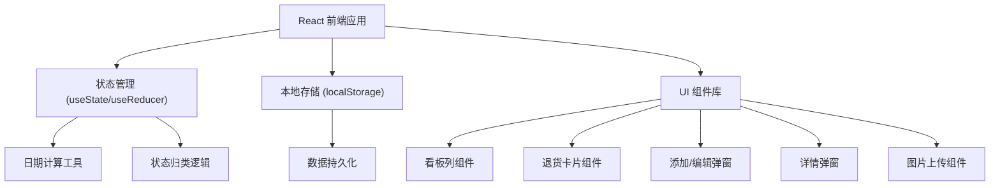
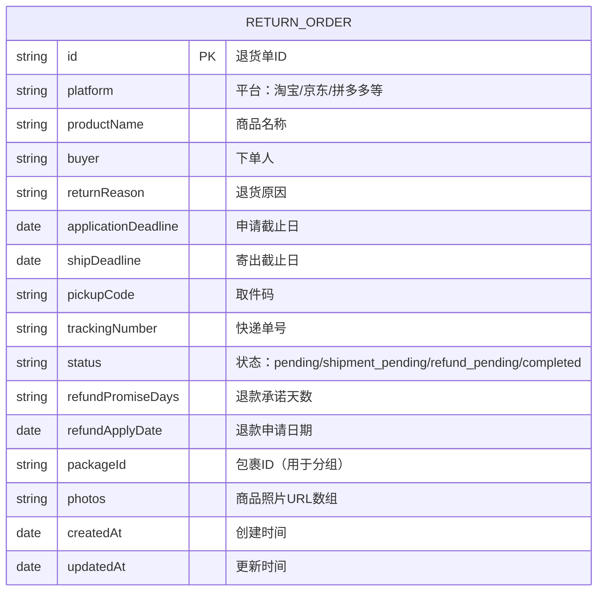

## 1. 架构设计



## 2. 技术描述

- **前端框架**：React@18 + TypeScript
- **构建工具**：Vite
- **样式方案**：TailwindCSS 3
- **状态管理**：React useState + useReducer (本地状态)
- **数据存储**：localStorage (本地持久化，无需后端)
- **拖拽功能**：@dnd-kit/core + @dnd-kit/sortable
- **日期处理**：date-fns
- **图标**：lucide-react

## 3. 路由定义

| 路由 | 用途 |
|------|------|
| / | 主页面（三栏看板） |

本应用为单页应用，所有功能在主页面完成，通过弹窗展示详情和表单。

## 4. 数据模型

### 4.1 数据模型定义



### 4.2 TypeScript 类型定义

```typescript
interface ReturnOrder {
  id: string;
  platform: string;
  productName: string;
  buyer: string;
  returnReason: string;
  applicationDeadline: string;
  shipDeadline: string;
  pickupCode: string;
  trackingNumber: string;
  status: 'pending' | 'shipment_pending' | 'refund_pending' | 'completed';
  refundPromiseDays: number;
  refundApplyDate?: string;
  packageId?: string;
  photos: string[];
  createdAt: string;
  updatedAt: string;
}

type ColumnStatus = 'today_must_handle' | 'need_tracking' | 'refund_followup';
```

### 4.3 状态归类规则

- **今天必须处理 (today_must_handle)**: 
  - 申请截止日为今天或已过期且未申请
  - 寄出截止日为今天或已过期且未寄出
  
- **还差快递单 (need_tracking)**:
  - 已申请退货但未填写快递单号
  - 状态为 shipment_pending 且 trackingNumber 为空

- **退款跟进 (refund_followup)**:
  - 已寄出但退款未到账
  - 状态为 refund_pending
  - 超过退款承诺天数未完成的显示红色提醒
