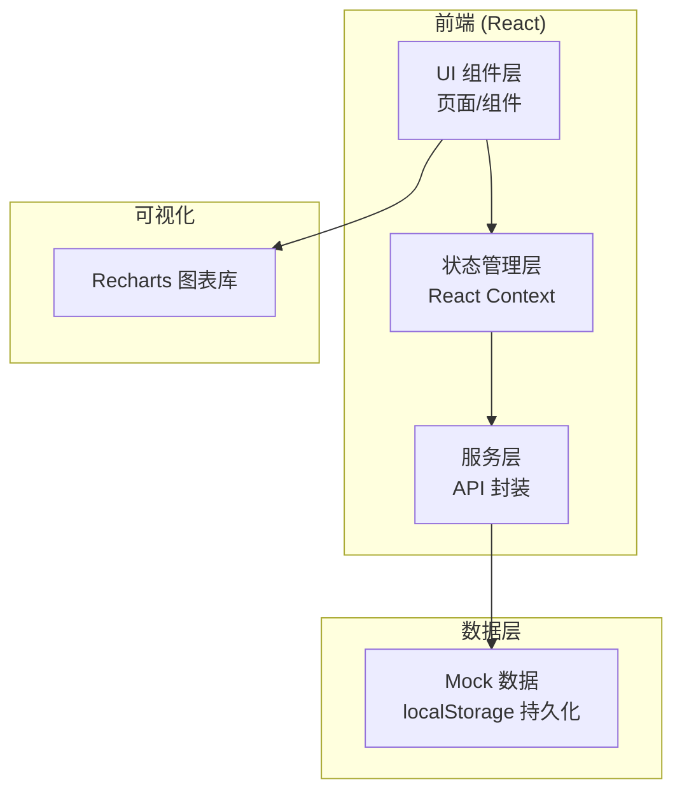
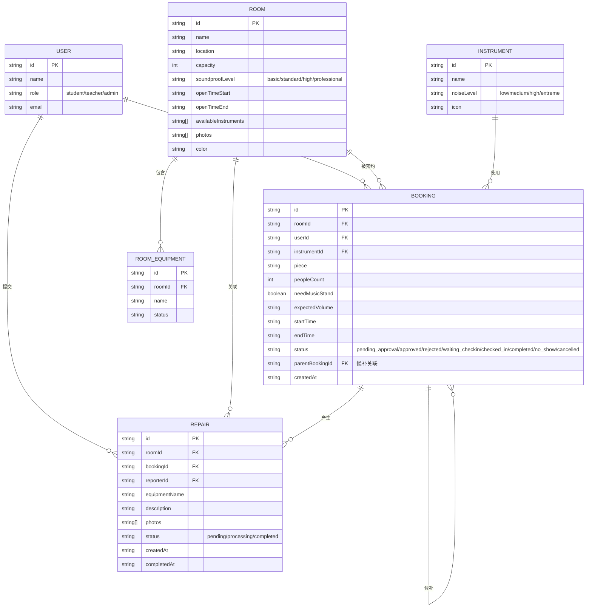

## 1. 架构设计

## 2. 技术说明

- **前端框架**：React@18 + TypeScript
- **构建工具**：Vite@5
- **样式方案**：TailwindCSS@3
- **状态管理**：React Context + useReducer
- **路由**：React Router@6
- **图表库**：Recharts
- **图标库**：Lucide React
- **后端**：无后端，使用 localStorage + Mock 数据
- **数据持久化**：浏览器 localStorage

## 3. 路由定义

| 路由 | 页面 | 说明 |
|------|------|------|
| / | Dashboard | 首页仪表板，统计概览和快速入口 |
| /rooms | RoomList | 房间列表，展示所有练习房 |
| /rooms/:id | RoomDetail | 房间详情，含预约时间轴 |
| /booking/new | BookingForm | 新建预约表单 |
| /calendar | Calendar | 日历视图，多房间时间轴 |
| /approvals | ApprovalList | 审批管理（老师/管理员） |
| /checkin | CheckIn | 签到管理 |
| /repairs | RepairList | 报修中心 |
| /statistics | Statistics | 统计分析 |

## 4. 数据模型

### 4.1 数据模型 ER 图

### 4.2 噪音等级映射规则

| 乐器噪音等级 | 所需房间隔音等级 |
|-------------|----------------|
| low (低) | basic 及以上 |
| medium (中) | standard 及以上 |
| high (高) | high 及以上 |
| extreme (极高) | professional (专业隔音房) |

### 4.3 初始数据

- **用户**：3 个示例用户（1 学生、1 老师、1 管理员）
- **房间**：6 间练习房（覆盖不同隔音等级）
- **乐器**：10 种常见乐器（钢琴、小提琴、吉他、架子鼓、电吉他等）
- **预约**：15 条预约记录（覆盖各状态）
- **报修**：5 条报修记录（覆盖各状态）

## 5. 核心业务规则实现

1. **噪音匹配**：预约时根据乐器 noiseLevel 过滤房间 soundproofLevel
2. **时间冲突检测**：校验同一房间时间段是否重叠
3. **审批触发**：预约时长 > 4 小时自动标记 pending_approval
4. **签到超时**：预约开始后 15 分钟未签到自动标记 no_show 并释放
5. **候补队列**：房间满员时可加入候补，按时间顺序补位
